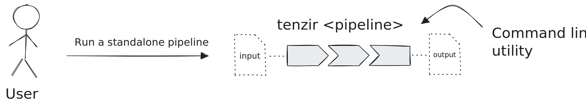
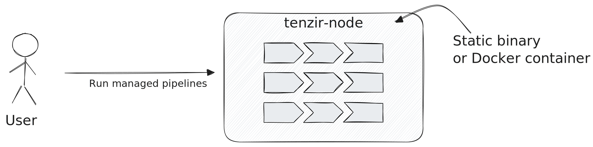

A **node** is a running process that manages and executes pipelines.

When a node starts, it will automatically attempt to connect to the
[platform](/explanations/architecture/platform), giving you a seamless way to manage and deploy
pipelines through a web interface. However, using the platform is optional—you
can also be manually manage pipelines via the node's [REST
API](/reference/node-api).

## Standalone vs. Managed Pipeline Execution

To understand the benefits of a node, let's first consider how you can run
pipelines without one. You run a single pipeline directly from the command line
using the `tenzir` binary:

This _standalone execution_ mode of a pipeline is ideal for ad-hoc data
transformations akin to how one would use `jq`, but with much broader data
handling capabilities.

For continuous and more dependable data processing, you will quickly realize
that you also need scheduled execution, automatic restarting, monitoring of
warnings/errors, and more advanced execution capabilities, like real-time
enrichment with contextual data or correlation with historical data.

This is where a node comes into play, offering a vehicle to execute one or more
pipelines in a managed fashion. You can spawn a node with the `tenzir-node`
binary or by running the Docker container that contains this binary:

