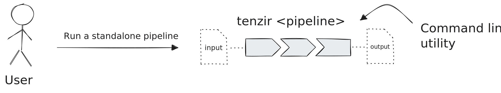
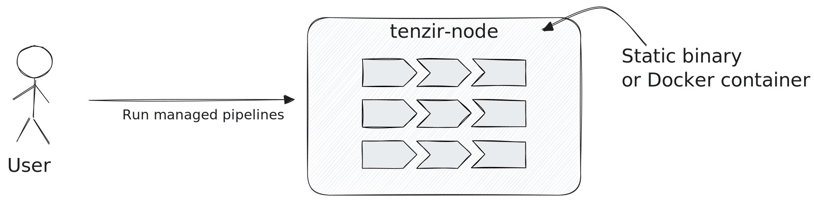

A **node** is a running process that manages and executes pipelines.

When a node starts, it will automatically attempt to connect to the
[platform](/explanations/architecture/platform), giving you a seamless way to manage and deploy
pipelines through a web interface. However, using the platform is optional—you
can also be manually manage pipelines via the node's [REST
API](/reference/node-api).

## Standalone vs. Managed Pipeline Execution

To understand the benefits of a node, let's first consider how you can run
pipelines without one. You run a single pipeline directly from the command line
using the `tenzir` binary:

This _standalone execution_ mode of a pipeline is ideal for ad-hoc data
transformations akin to how one would use `jq`, but with much broader data
handling capabilities.

For continuous and more dependable data processing, you will quickly realize
that you also need scheduled execution, automatic restarting, monitoring of
warnings/errors, and more advanced execution capabilities, like real-time
enrichment with contextual data or correlation with historical data.

This is where a node comes into play, offering a vehicle to execute one or more
pipelines in a managed fashion. You can spawn a node with the `tenzir-node`
binary or by running the Docker container that contains this binary:

## Forked Pipelines

A node can execute pipelines in two different modes: as forked processes or
within the same `tenzir-node` process. By default, pipelines run as forked
processes. Each approach offers distinct advantages and trade-offs.

When pipelines run as separate forked processes, they don't share fate with
each other. If one pipeline crashes, it won't affect other running pipelines,
which improves overall reliability. This isolation also enables better scaling
across available CPU cores since each pipeline can utilize cores independently.
Vertically scaling a node becomes more efficient as this approach reduces
pressure on the node's internal scheduler and improves overall system
responsiveness. However, forked execution comes with costs: each process
requires its own memory space and system resources, and the system must
serialize data when crossing process boundaries.

In contrast, when pipelines run within the same `tenzir-node` process, they
operate with less OS pressure due to running as a single process with a fixed
number of threads and efficient user-level task scheduling. Pipelines can pass
data directly without serialization at their boundaries, which significantly
lowers overall resource consumption. The trade-off here involves shared fate—a
critical error in one pipeline could potentially affect the entire node
process. Additionally, all pipelines must share the same process resources,
which can create bottlenecks under heavy load and limit parallelism.

Choose between forked and in-process execution based on your specific
requirements for reliability, performance, and resource efficiency. You can
[configure this behavior](/guides/node-setup/configure-a-node#configure-forked-pipelines)
in your node settings.
