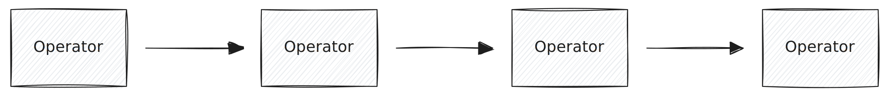
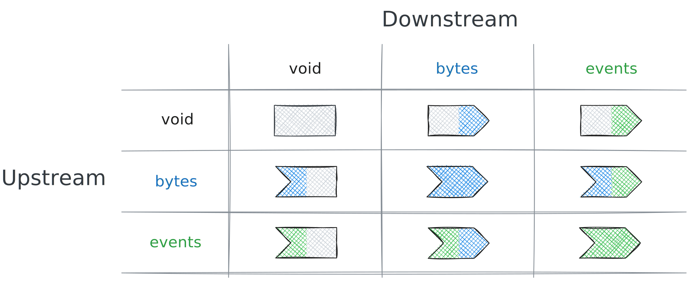
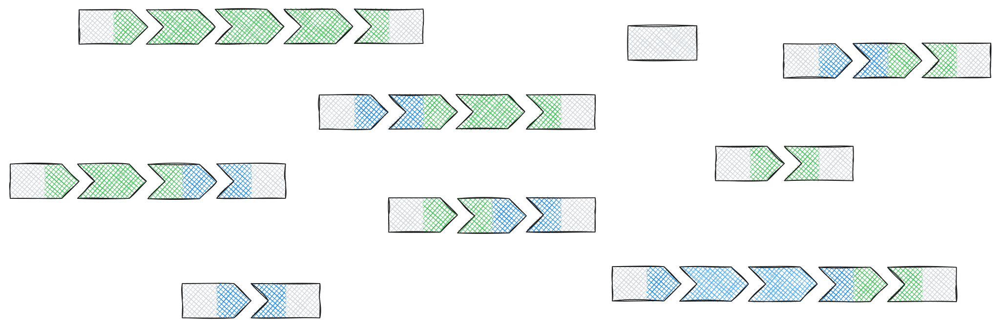
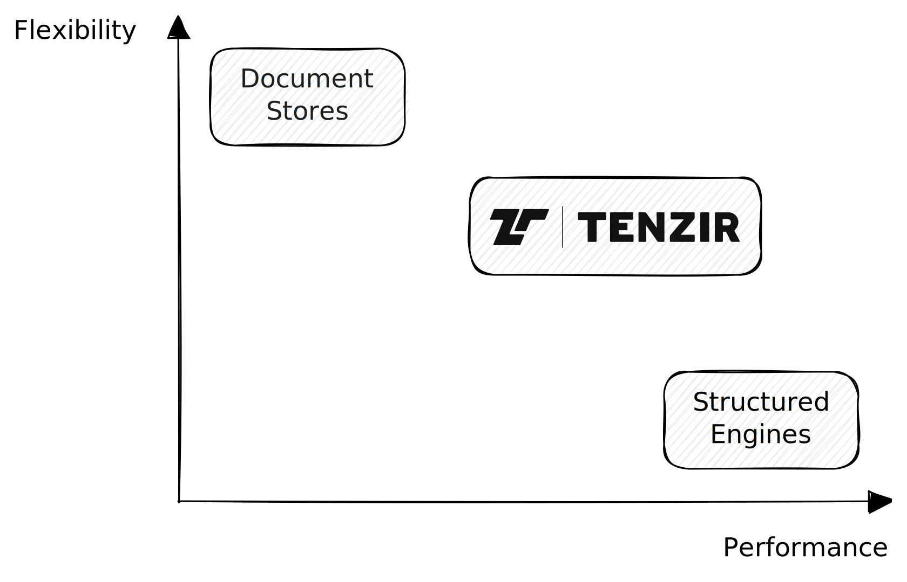
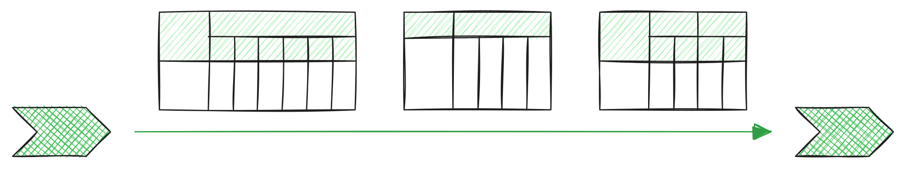
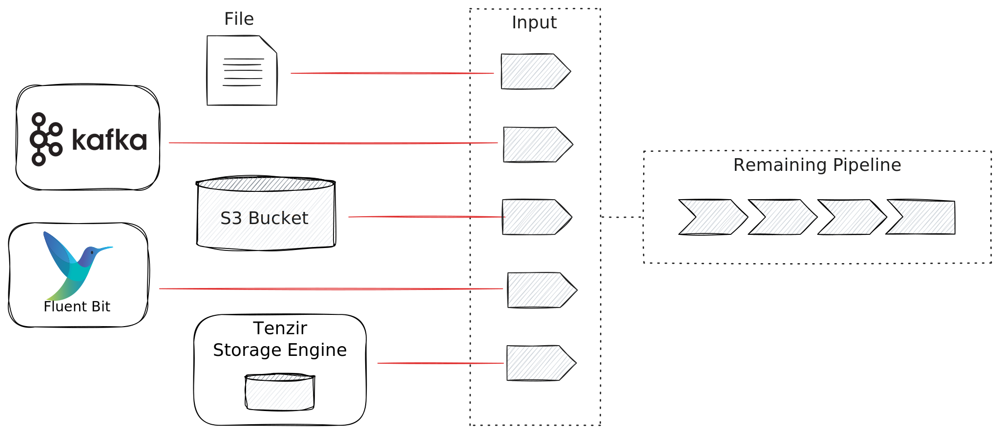
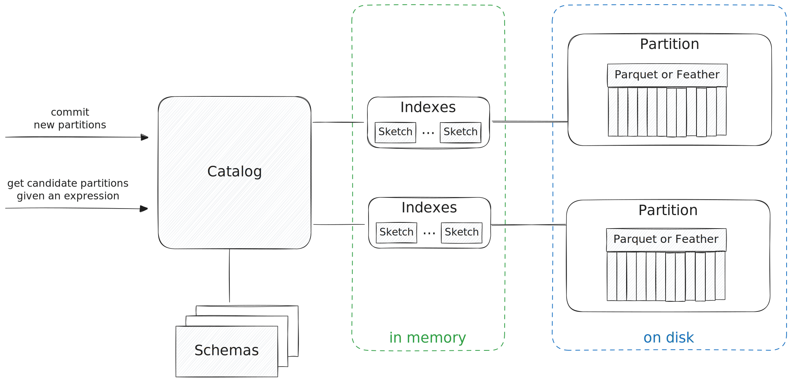
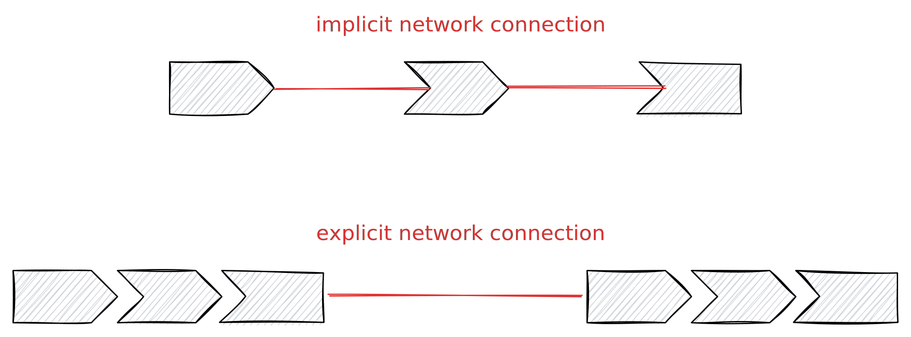
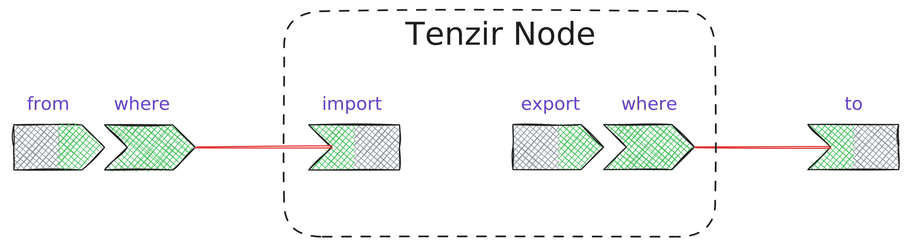
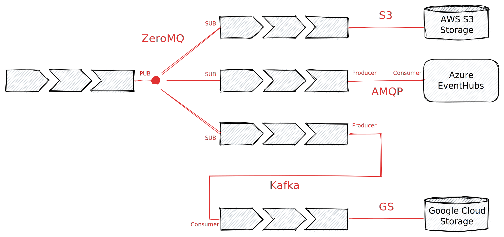

A Tenzir **pipeline** is a chain of **operators** that represents a dataflow.
Operators are the atomic building blocks that produce, transform, or consume
data. Think of them as Unix or Powershell commands where the result from one
command is feeding into the next:



Our pipelines have 3 types of operators: **inputs** that produce data,
**outputs** that consume data, and **transformations** that do both:


You write pipelines in the [Tenzir Query Language
(TQL)](/explanations/language), a language that we developed from the ground up
to concisely describe such dataflows.

:::tip[Learn TQL]
Head over to our [language documentation](/explanations/language) for an
in-depth explanation of how TQL works. We're continuing here with high-level
architectural aspects of the pipeline execution model.
:::

## Typed Operators

Tenzir pipelines operate on *typed* data streams. The execution model ensures
type safety while maintaining high performance through batching and parallel
processing.

An operator has an **upstream** and **downstream** type:



This type system ensures pipelines are well-formed. Adjacent operators must
have matching types: the downstream type of one operator must match the
upstream type of the next, i.e., upstream/downstream types of adjacent
operators have to match. Otherwise the pipeline is malformed.

We call any void-to-void operator sequence a **closed pipeline**. Only closed
pipelines can ultimately execute.

With these operators as building blocks, you can create all kinds of pipelines,
as long as they follow the two principal rules of (1) sequencing inputs,
transformations, and outputs, and (2) ensuring that operator upstream/downstream
types match. Here are examples of other valid pipeline variations:



:::note[Pipeline Auto-Completion]
When a pipeline is not closed, Tenzir attempts to *auto-complete* it. On the
[command line](/guides/basic-usage/run-pipelines/#on-the-command-line), it
suffices to write a sequence of transformations because Tenzir automatically
adds a JSON input operator at the beginning and TQL output operator at the end.
In the [web inteface](/guides/basic-usage/run-pipelines/#in-the-platform),
auto-completetion takes place with an output operator: The web app appends
[`serve`](/reference/operators/serve) to turn the dataflow into a REST API,
allowing your browser to access it by routing the data through the platform.
:::

## Multi-Schema Dataflows

As mentioned above, pipelines can transport both *bytes* and *events*. Let's go
deeper into the details of Tenzir represents events. Every event that flows
through a pipeline is part of a _data frame_ with a schema. Internally, these
data frames are represented as Apache Arrow record batches, encoding potentially
of tens of thousands of events in a single block of data. This innate batching
is the reason why the pipelines can achieve high throughput.

Unique about Tenzir's pipeline executor is that a single pipeline can process
events with _multiple schemas_. When you typically work with data frames, your
workload runs on input with a fixed schema, e.g., when you query a database
table. In Tenzir, schemas can change dynamically during the execution of a
pipeline, much like document-oriented engines that work on JSON or have
one-event-at-a-time processing semantics. Tenzir is unique in that it gives the
user the feeling of operating on a single event at a time while hiding the
structured data frame batching behind the scenes. Thus, Tenzir combines the
performance of structured query engines with the flexibility of
document-oriented engines, making it perfect fit for processing *semi-structured
data* at scale:



The schema variance begins early in the data flow, where parsers emit events
with changing schemas as they encounter changing fields. If an operator detects
a schema changes, it creates a new batch of events. In terms of performance, the
worst case for Tenzir is a ordered stream of schema-switching events, with every
event having a new schema than the previous one. But even for those scenarios
operators can efficiently build homogeneous batches when the inter-event order
does not matter. Similar to predicate pushdown, Tenzir operators support
*ordering pushdown* to signal to upstream operators that the event order only
matters intra-schema but not inter-schema. In this case the operator
transparently "demultiplex" a heterogeneous event stream into N homogeneous
streams. The [`sort`](/reference/operators/sort) operator is an example of such
an operator; it pushes its ordering requirements upstream, allowing parsers to
efficiently create multiple streams events in parallel.



Some operators only work with exactly one instance per schema internally, such
as [`write_csv`](/reference/operators/write_csv), which first writes a
header and then all subsequent rows have to adhere to the emitted schema. Such
operators cannot handle events with changing schemas.

It's important to mention that most of the time you don't have to worry about
schemas. They are there for you when you want to work with them, but it's often
enough to just specified the fields that you want to work with, e.g., `where
id.orig_h in 10.0.0.0/8`, or `select src_ip, dest_ip, proto`. Schemas are
inferred automatically in parsers, but you can also seed a parser with a schema
that you define explicitly.

## Unified Live Stream Processing and Historical Queries

Tenzir's execution engine transparently processes both historical data and
real-time event streams within a single, unified pipeline model.
[TQL](/explanations/language) empowers you to switch between these workloads by
simply changing the data source at the start of your pipeline.



This design lets you reuse the same logic for exploring existing data and for
deploying it on live streams, which streamlines the entire analytics workflow.

Each Tenzir Node includes a lightweight **edge storage** engine for efficient
local data persistence. You interact with this storage using two dedicated
operators: [`import`](/reference/operators/import) acts as an output to
write data into the edge storage, while [`export`](/reference/operators/export)
acts as a pipeline input to read data from it.

A naive interpretation would be that [`export`](/reference/operators/export)
first retrieves all its data, which subsequent operators then filter. However,
Tenzir actively optimizes this process using a technique called **predicate
pushdown**. Before a pipeline runs, Tenzir pushes filter conditions from later
stages down to the initial storage source. This allows the source to
intelligently fetch only the necessary data, often using fast index lookups and
avoiding costly full scans.

This powerful optimization relies on Tenzir's unique storage engine.



The engine is not a traditional database but a lightweight **catalog** that
maintains a thin indexing layer over immutable Apache Parquet and Feather
files. It maintains **sparse indexes**, such as min-max synopses and Bloom
filters, that act as a table of contents. These indexes allow the engine to
quickly rule out large chunks of data that do not match a query's filter,
avoiding unnecessary disk reads. The catalog also tracks evolving schemas and
provides a transactional interface for data operations.

Because the engine handles these optimizations automatically, the same pipeline
logic can be seamlessly repurposed. A pipeline developed for historical
analysis can be deployed on a live data stream by simply exchanging the
historical data source for a streaming one. This unified model streamlines the
path from interactive exploration to production deployment.


Our desired user experience for interacting with historical data looks like
this:

1. **Ingest**: to store data at a node, create a pipeline that ends with
   [`import`](/reference/operators/import).
2. **Query**: to run a historical query over data at the node, create a pipeline
   that begins with [`export`](/reference/operators/export).

For example, to ingest JSON from a Kafka, you write `from "kafka://topic |
import`. To query the stored data, you write `export | where file == 42`.

The example with `export` suggests that the pipeline _first_ exports everything,
and only _then_ starts filtering with `where`, performing a full scan over the
stored data. But this is not what's happening. Pipelines support **predicate
pushdown** for every operator. This means that `export` receives the filter
expression before it starts executing, enabling index lookups or other
optimizations to efficiently execute queries with high selectivity where scans
would be sub-optimal.

The key insight here is to realize that optimizations like predicate pushdown
extend to the storage engine and do not only apply to the streaming executor.

The Tenzir native storage engine is not a full-fledged database, but rather a
catalog with a thin indexing layer over a set of Parquet/Feather files. These
sparse indexes (sketch data structures, such as min-max synopses, Bloom filters,
etc.) avoid full scans for every query. The catalog tracks evolving schemas,
performs expression binding, and provides a transactional interface to add and
replace partitions during compaction.

The diagram below shows the main components of the storage engine:


Because of this transparent optimization, you can just exchange the input
operator of a pipeline and switch between historical and streaming execution
and everything works as expected. A typical use case begins some exploratory
data analysis involving a few `export` pipelines, but then would deploy the
pipeline on streaming data by exchanging the input with a Kafka stream.

## Built-in Networking to Create Data Fabrics

Tenzir pipelines have built-in network communication, allowing you to create a
distributed fabric of dataflows to express intricate use cases that go beyond
single-machine processing. There are two types of network connections:
_implicit_ and _explicit_ ones:



An implicit network connection exists, for example, when you use the `tenzir`
binary on the command line to run a pipeline that ends in
[`import`](/reference/operators/import):

```tql
from "/file/eve.json"
where tag != "foo"
import
```

Or one that begins with [`export`](/reference/operators/export):

```tql
export
where src_ip in 10.0.0.0/8
to "/tmp/result.json"
```

Tenzir pipelines are eschewing networking to minimize latency and maximize
throughput, which results in the following operator placement for the above examples:



The executor generally transfers ownership of operators between
processes as late as possible to prefer local, high-bandwidth communication. For
maximum control over placement of computation, you can override the automatic
operator location with the [`local`](/reference/operators/local) and
[`remote`](/reference/operators/remote) operators.

The above examples are implicit network connections because they're not visible
in the pipeline definition. An explicit network connection terminates a pipeline
as with an input or output operator:



This fictive data fabric above consists of a heterogeneous set of technologies,
interconnected by pipelines. Because you have full control over the location
where you run the pipeline, you can push it all the way to the "last mile." This
helps especially when there are compliance and data residency concerns that must
be properly addressed.
