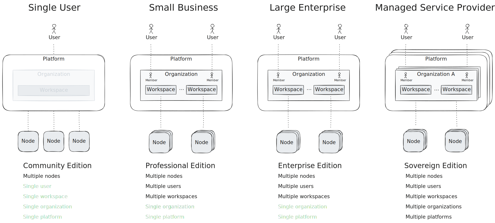

The **platform** provides *fleet management* for [nodes](../node). With an API
and web interface, the platform offers user and workspace administration,
authentication via external identity providers (IdP), and dashboards consisting
of pipeline-powered charts.

There exist three primary entities in the platform:

1. **Users**: Authenticated by an Identity Provider (IdP)
2. **Organizations**: Manage billing/licencse, members, and workspaces
3. **Workspace**: A logical grouping of nodes, secretes, and dashboards.

The diagram below illustrates their relationship.

A user inside an organization is called a **member**. The organization
configures what members have access to what workspaces.

:::note[Organizations]
Organizations are not available in the free **Community Edition**. Please see
[tenzir.com/pricing](https://tenzir.com/pricing) for a detailed
feature comparison.
:::

## Data Model

The following diagram visualizes the platform's data model (yellow) and how the
entities relate to each other with respect to their multiplicities.

It's important to note that every node can only be part of a single workspace.
There is no support for "multi-homing" as it would create non-trivial questions
about how to reconcile secrets and permissions from multiple workspaces.

## Deployment Modes

Based on the [edition](https://tenzir.com/pricing) of Tenzir, you have different
deployment modes of the platform. The below diagram illustrates the variants.

- **Community Edition**: geared towards single-user deployments, the Community
  Edition only associates a personal workspace with every user.
- **Professional Edition**: geared towards small-business deployments, the
  Professional Edition features organizations for allowing multiple users to
  collaborate.
- **Enterprise Edition**: geared towards large enterprise deployments, the
  Enterprise Edition supports multiple workspaces for managing what users have
  access to what nodes.
- **Sovereign Edition**: geared towards on-prem deployments, the Sovereign
  Edition allows for multiple platform instances and multiple organizations
  within each platform.

The Sovereign Edition is best suited for service providers that need strict data
segregation, either by deploying one platform instance per customer or by
instantiating one organization per customer. Dedicated platforms per customer
provide physical data separation at the cost of higher management overhead,
whereas an organization-based multi tenancy approach is a logical separation
method with shared underlying resources, yet easier to manage.
