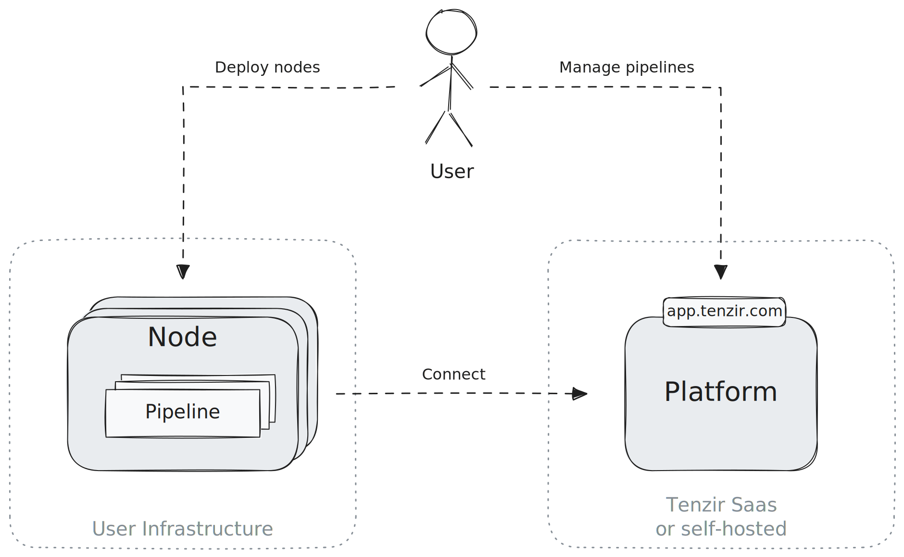
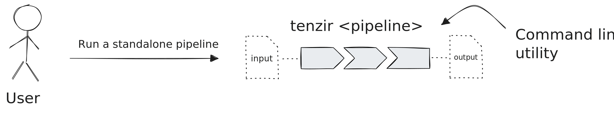
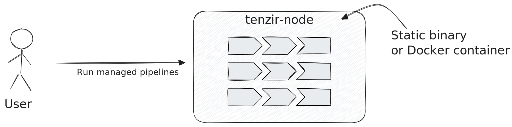
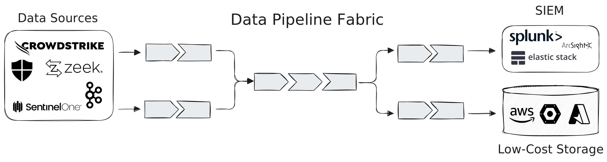

Tenzir consists three primary abstractions:

1. **Pipeline**: A sequence of operators responsible for loading, parsing,
  transforming, and routing data. Pipelines are the core mechanism for data
  processing.
2. **Node**: A running process that manages and executes pipelines.
3. **Platform**: A higher-level management layer that provides oversight and
  control over multiple nodes.

Here's how they relate schematically:

When a node starts, it will automatically attempt to connect to the platform,
giving you a seamless way to manage and deploy pipelines through a web interface.
However, using the platform is optional—pipelines can also be controlled directly
via the node's API with a CRUD-style approach.

The platform, beyond pipeline management, offers user and workspace
administration, authentication support via external identity providers (IdP),
and persistent storage for dashboards. These dashboards can be customized with
charts, which are themselves powered by pipelines.

We host one instance of the platform at
[app.tenzir.com](https://app.tenzir.com), but you can also [deploy the platform
on premises](../installation/deploy-the-platform.md).

## Executing Standalone and Managed Pipelines

You can run pipelines either standalone or managed. For **standalone
execution**, you run a single pipeline directly from the command line using the
`tenzir` binary:

This mode is ideal for ad-hoc data transformations akin to how one would use
`jq`, but with much broader data handling capabilities. For continuous and more
dependable dataflow processing, you will quickly realize that you also need
scheduled execution, automatic restarting, monitoring of warnings/errors, and
more advanced execution capabilities, like real-time enrichment with contextual
data or correlation with historical data.

This is where nodes come into play, offering **managed execution** of pipelines.
You can spawn a node with the `tenzir-node` binary or by running the Docker
container that wraps this binary:

## Composing Pipelines into Use Cases

Pipelines can be combined to form larger, more complex data fabrics. One common
example is **split-routing**: sending actionable data to a SIEM while archiving
low-fidelity data in a cheaper storage solution.

Nodes are just a means to end. The pipelines are peforming the actual work. You
can deploy them all on the same node or spread them out over multiple nodes,
depending on your use case.

Now it's your turn to create something powerful!