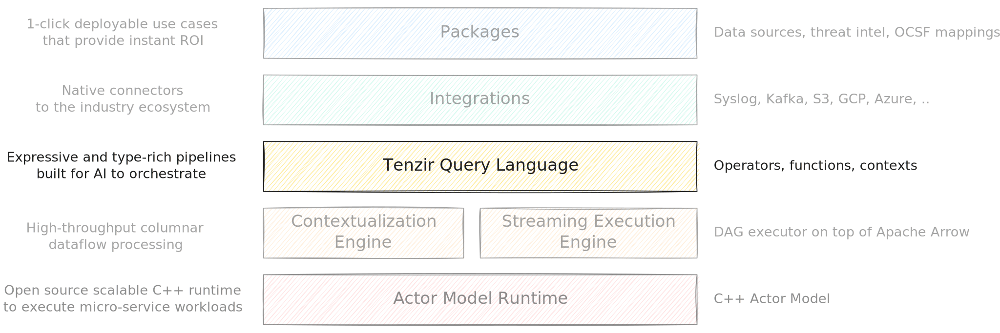

The **Tenzir Query Language (TQL)** is a dataflow language designed for
processing of unstructured byte-streams and semi-structured events.

TQL is built on a powerful streaming execution engine, but it shields you from
the complexity of low-level data processing. It provides a rich set of building
blocks to create intricate [pipelines](/explanations/architecture/pipeline)
that collect, transform, and route data. You can also embed your TQL programs
into reusable [packages](/explanations/packages) to create one-click
deployable use cases.



## Why TQL?

Security practitioners need to collect, transform, and analyze telemetry without
the complexity of general-purpose data engineering tools. We created TQL to meet
this need by synthesizing the best ideas from languages that security teams
already use:

- **Splunk SPL's familiarity**: Operators that security analysts recognize
- **Kusto's power**: Rich aggregation and time-series capabilities
- **Unix pipes' composability**: Small, focused operators that chain together
- **jq's flexibility**: Powerful transformations on semi-structured data

TQL combines the power of a streaming execution engine with an intuitive
pipeline syntax that mirrors how practitioners think about data processing. This
approach is validated by nearly every modern SIEM (Splunk SPL, Elastic ES|QL,
Microsoft KQL) and offers several advantages over traditional query languages
like SQL.

:::note[Why not SQL?]
While SQL is the standard for relational databases, its design creates friction
in security operations:

- **Inside-out thinking**: SQL's rigid `SELECT ... FROM ... WHERE` structure
  forces you to specify the output format before defining transformations,
  leading to complex nested subqueries.
- **Debugging complexity**: Tracing data flow through nested CTEs and subqueries
  is cumbersome when investigating incidents under time pressure.
- **Schema rigidity**: SQL assumes uniform, predefined schemas—a poor fit for
  the heterogeneous mix of logs, alerts, and telemetry that security teams
  process daily.

The pipeline model offers a more natural workflow:

- **Sequential reasoning**: Data flows top-to-bottom, matching your mental model.
- **Incremental construction**: Build queries step-by-step, testing at each stage.
- **Isolated debugging**: Inspect intermediate results by commenting out downstream operators.
- **Composability**: Combine simple operators into sophisticated workflows.
  :::

## Core Concepts

### Unified streaming and batch processing

TQL seamlessly handles both real-time and historical analysis. Unlike
traditional tools that require separate codebases for streaming and batch
workflows, TQL uses the same pipeline logic for both.

Process archived data from a data lake:

```tql
from "s3://bucket/logs/2024-01/*.parquet"
where timestamp > 2024-01-15T00:00:00
```

Or monitor a live stream from a message bus:

```tql
from "kafka://topic:9092"
where timestamp > now() - 1h
```

TQL draws inspiration from Unix pipes, where data flows through a sequence of
transformations. But unlike shell pipelines that primarily work on text, TQL
operates on both unstructured data (bytes) and structured data (events).

### Multi-schema philosophy

Unlike traditional databases that require strict schemas, TQL embraces
**heterogeneous data** as a first-class concept. Real-world data pipelines
process multiple event types simultaneously—firewall logs, DNS queries,
authentication events—each with different schemas.

TQL's operators are **polymorphic**, adapting to different schemas at runtime:

```tql
// Single pipeline processing multiple event types
from "mixed_security_logs.json"
where timestamp > now() - 1h
where severity? == "high" or risk_score? > 0.8
select \
  timestamp,
  event_type=@name,            // Capture the schema name
  message,                     // Common field
  src_ip?,                     // Present in network events
  username?,                   // Present in auth events
  dns_query?                   // Present in DNS events
```

This philosophy enables powerful patterns:

- **Type-aware aggregation**: Group and aggregate across different schemas
- **Unified processing**: Apply common transformations to diverse data
- **Schema evolution**: Handle changing schemas without pipeline updates
- **Mixed-source correlation**: Join events from different systems

## Language Structure

The language documentation is organized into four main sections:

- [**Types**](/explanations/language/types): TQL's type system with domain-specific types for security and network data
- [**Expressions**](/explanations/language/expressions): The computational core of TQL, from literals to complex evaluations
- [**Statements**](/explanations/language/statements): Control and structure with bindings, operators, and control flow
- [**Programs**](/explanations/language/programs): Complete data processing workflows and execution model

:::tip[Learn Idiomatic TQL]
Ready to get hands-on? Read the [tutorial on learning idiomatic
TQL](/tutorials/learn-idiomatic-tql), with concrete examples and best practices.
:::
