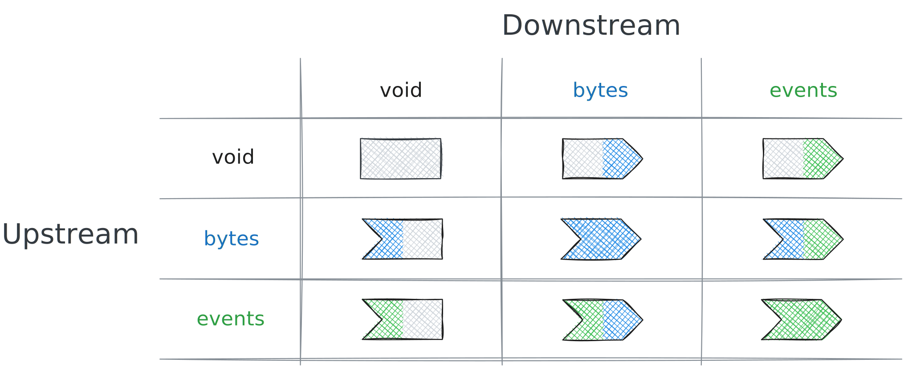
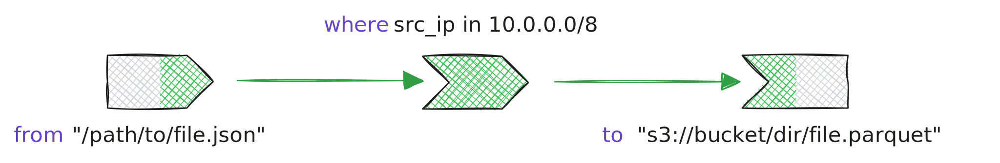

The **Tenzir Query Language (TQL)** is a dataflow language designed specifically
for security data analysis. This page explains how TQL works as a complete
language system, from its foundational concepts to advanced composition
patterns.

:::tip[Pipeline Basics]
Make sure that you have a rough understanding of [how pipelines
work](/explanations/architecture/pipelines) in general before diving deeper.
:::

## Introduction: A pipeline language for security data

TQL draws inspiration from Unix pipes, where data flows through a sequence of
transformations. But unlike traditional shell pipelines that only work with
text, TQL operates on both **unstructured data (bytes)** and **structured data
(events)**, with native support for security and network concepts.

Every operator in TQL has an upstream and downstream type, which can be:

- **void**: No data (used at pipeline boundaries)
- **bytes**: Unstructured binary data (files, network streams)
- **events**: Structured, typed records (the primary data model)

Adjacent operators must have identical types.

The key insight: **TQL is a superset of JSON**. Every valid JSON document is
valid TQL data, but TQL extends JSON with domain-specific types like IP
addresses, subnets, durations, and timestamps. This design leverages existing
knowledge while adding the precision needed for security analytics.

Consider the evolution from simple filtering to complex analysis:

```tql title="Working with events (structured data)"
from {severity: "high", bytes: 150Ki, src_ip: 192.168.1.10}
where severity == "high"
```

```tql
{severity: "high", bytes: 153600, src_ip: 192.168.1.10}
```

As data complexity grows, so does the pipeline. Adding field selection narrows
the output to just what's needed:

```tql title="Intermediate: Filter and transform"
from {
  severity: "high",
  bytes: 150Ki,
  src_ip: 192.168.1.10,
  timestamp: 2024-01-15T10:30:00,
  alert_type: "intrusion"
}
where severity == "high" and bytes > 100Ki
select timestamp, src_ip, alert_type
```

```tql
{timestamp: 2024-01-15T10:30:00, src_ip: 192.168.1.10, alert_type: "intrusion"}
```

For analytics across multiple events, TQL's aggregation operators combined with
conditional logic enable sophisticated analysis:

```tql title="Complex: Full analytics pipeline with multiple events"
from
  {severity: "high", bytes: 150Ki, src_ip: 10.0.0.5},
  {severity: "high", bytes: 200Ki, src_ip: 192.168.1.10},
  {severity: "high", bytes: 175Ki, src_ip: 10.0.0.8}
where severity == "high" and bytes > 100Ki
if src_ip in 10.0.0.0/8 {
  zone = "internal"
} else {
  zone = "external"
}
summarize zone, total=sum(bytes), unique_sources=count_distinct(src_ip)
```

```tql
{zone: "internal", total: 332800, unique_sources: 2}
{zone: "external", total: 204800, unique_sources: 1}
```

TQL can also process unstructured bytes, parsing them into events:

```tql title="Starting with bytes (e.g., from a file or network)"
load_file "/var/log/app.json"     // void → bytes
read_json                         // bytes → events
where severity == "critical"
write_csv                         // events → bytes
save_file "critical_events.csv"   // bytes → void
```

Each step builds naturally on the previous, demonstrating TQL's philosophy of
gradual complexity.

## The core mental model

### TQL as a JSON superset

At its heart, TQL embraces JSON's simplicity while extending it for
domain-specific needs:

Valid JSON is valid TQL:

```tql
from {
  "name": "alert",
  "count": 42,
  "tags": ["critical", "network"],
}
```

TQL adds domain-specific types:

```tql
from {
  src_ip: 192.168.1.1,      // IP address type
  subnet: 10.0.0.0/8,       // Subnet type
  duration: 5min,           // Duration type
  timestamp: 2024-01-01,    // Time type
}
```

This design means you can start with familiar JSON patterns and gradually adopt
TQL's richer type system as needed.

### Pipeline structure: Vertical clarity

While TQL supports both pipe symbols (`|`) and newlines as operator separators,
**vertical structuring with newlines is strongly preferred** for readability.

✅ Preferred: Clear vertical structure:

```tql
from "logs.json"
where port == 443
select src_ip, dst_ip, bytes
summarize src_ip, total=sum(bytes)
```

Using pipe operators inline:

```tql
from "logs.json" | where port == 443 | select src_ip, dst_ip, bytes | summarize src_ip, total=sum(bytes)
```

While the vertical approach (similar to languages like PRQL) is preferred for readability in files and documentation, the pipe operator style has important value in specific contexts:

- **Command-line usage**: When running quick ad-hoc queries directly in the terminal
- **API requests**: When submitting pipelines as single-line strings in JSON payloads
- **Shell scripts**: When embedding TQL in bash scripts or other single-line contexts
- **Interactive exploration**: When iteratively building pipelines in a REPL environment

The vertical approach offers several benefits for multi-line contexts:

- **Readability**: Easy to scan and understand data flow
- **Debugging**: Simple to comment out individual operators
- **Modification**: Easy to insert or remove pipeline stages
- **Version Control**: Clear diffs when pipelines change

### Programs, pipelines, and operators

TQL organizes code into three levels:

1. **Program**: The complete TQL script, containing pipelines and declarations
2. **Pipeline**: A chain of operators that process data
3. **Operator**: An individual transformation unit

### Comments

TQL uses C-style comments:

- Single-line comments: `// This is a comment`
- Multi-line comments: `/* This is a
multi-line comment */`

:::tip
Use comments sparingly in production pipelines. Well-named fields and clear pipeline structure often communicate intent better than comments.
:::

```tql title="A complete TQL program"
let $threshold = 1Ki          // Program-level declaration

from                          // Pipeline starts here
  {src_ip: 192.168.1.10, bytes: 2Ki},
  {src_ip: 192.168.1.11, bytes: 512},
  {src_ip: 192.168.1.12, bytes: 3Ki}
where bytes > $threshold      // Individual operator
select src_ip, bytes          // Another operator
```

## The three-layer architecture

TQL's design separates concerns into three distinct layers, each with its own
responsibility.

### Layer 1: Expressions - computational building blocks

Expressions are the atoms of computation in TQL. They evaluate to values and
can be composed to build complex transformations:

- **Evaluate once per event**: Each expression sees the current event as `this`
- **Pure transformations**: Same input always produces same output
- **Rich composition**: Build complex expressions from simple parts

Simple expression:

```tql
bytes > 1000
```

Composite expression:

```tql
bytes > 1000 and port in [80, 443]
```

Complex expression with conditionals:

```tql
risk = "high" if bytes > 1Mi and port == 22 else "normal"
```

### Layer 2: Statements - control and structure

Statements provide structure and control flow:

- **Operator statements**: Transform data streams ([`where`](/reference/operators/where), [`select`](/reference/operators/select), [`summarize`](/reference/operators/summarize))
- **Assignments**: Modify fields (using the implied [`set`](/reference/operators/set) operator)
- **Control flow**: Route data conditionally (`if` statements)
- **Bindings**: Define constants (`let` statements)

Operator statement:

```tql
where severity == "high"
```

Assignment (implied set operator):

```tql
risk_score = bytes / 1Ki * severity_weight
```

Control flow:

```tql
if src_ip.is_private() {
  zone = "internal"
} else {
  zone = "external"
}
```

Binding:

```tql
let $critical_ports = [22, 3389, 5432]
```

### Layer 3: Programs - composition and execution

Programs compose statements into complete data processing workflows:

- **Sequential composition**: Operators chain through newlines
- **Nested composition**: Subpipelines for complex logic
- **Network-transparent**: Can span multiple nodes seamlessly

## The pipeline model

### Dataflow types

TQL operators fall into three categories based on their input/output behavior (see the [Operators Reference](/reference/operators) for details on each operator):

```
Input Operators              Transformations              Output Operators
void → events/bytes         events → events              events/bytes → void
                            bytes → bytes
                            bytes → events (parsers)
                            events → bytes (formatters)

Examples:
from (void → events)        where (events → events)      to (events → void)
export (void → events)      select (events → events)     import (events → void)
load_file (void → bytes)    read_json (bytes → events)   save_file (bytes → void)
                            write_json (events → bytes)
```

This type system ensures pipelines are well-formed. Adjacent operators must
have matching types: the downstream type of one operator must match the
upstream type of the next.



### Pipeline composition

Each operator on a new line creates a clear data transformation flow:

```tql title="Data flows top to bottom"
from "security_logs.json"       // Input: void → events
where severity == "high"        // Transform: events → events
select timestamp, src_ip, alert // Transform: events → events
to "high_priority.json"         // Output: events → void
```

The vertical structure makes the dataflow visually apparent, with data
"flowing" from top to bottom.

### Operator composition examples

Here's how operators compose to form complete pipelines:

```tql
from "/path/to/file.json"
where src_ip in 10.0.0.0/8
to "s3://bucket/dir/file.parquet"
```

This pipeline consists of three operators:



The operator [`from`](/reference/operators/from) is a void-to-events
input operator, [`where`](/reference/operators/where) an
events-to-events transformation operator, and
[`to`](/reference/operators/to) an events-to-void output operator.

Other inputs provide bytes first and you need to interpret them in order to
transform them as events:

```tql
load_kafka "topic"
read_ndjson
select host, message
write_yaml
save_zmq "tcp://1.2.3.4"
```


### The implied `set` operator

TQL reduces verbosity through implied operators. When you write an assignment
outside an explicit operator context, it implicitly uses the [`set`](/reference/operators/set) operator:

```tql title="Implicit set operator"
severity = "high"

// ...is actually shorthand for:
set severity = "high"
```

This design keeps pipelines concise while maintaining clarity about what's
happening.

### Streaming vs blocking

Understanding operator behavior helps write efficient pipelines:

- **Streaming operators** process events incrementally:
  - `where`: Filters one event at a time
  - `select`: Transforms fields immediately
  - `drop`: Removes fields as events flow

- **Blocking operators** need all input before producing output:
  - `sort`: Must see all events to order them
  - `summarize`: Aggregates across the entire stream
  - `reverse`: Needs complete input to reverse order

✅ Efficient: streaming operations first:

```tql
from "large_file.json"
where severity == "critical"    // Streaming: reduces data early
select relevant_fields          // Streaming: drops unnecessary data
sort timestamp                  // Blocking: but on reduced dataset
```

❌ Less efficient: blocking operation on full data:

```tql
from "large_file.json"
sort timestamp                  // Blocking: processes everything
where severity == "critical"    // Then filters
```

## Expressions in detail

### Expression evaluation model

Expressions form the computational core of TQL:

- **Context**: Expressions evaluate relative to the current event (`this`)
- **Composition**: Complex expressions build from simple ones
- **Type-aware**: Operations respect TQL's type system

Literal value:

```tql
42
```

Field access (implicitly: this.src_ip):

```tql
src_ip
```

Operation:

```tql
bytes > 1Ki
```

Function call:

```tql
round(bytes / 1Ki)
```

Method chain (UFCS):

```tql
message.trim().to_upper()
```

Complex composition:

```tql
f"Alert: {'HIGH' if bytes > 1Mi else 'LOW'} from {src_ip}"
```

### Data quality through diagnostics

TQL's diagnostic system is designed around a core principle: **every warning
should matter**. The system distinguishes between expected data variance and
actual quality issues.

#### The philosophy

Use the optional field access operator (`?`) to declare which variance is
normal, so warnings only fire for actual data quality issues:

```tql title="Processing login events that SHOULD have username"
from "auth_logs.json"
where event_type == "login"
where username != null      // Warning if missing - data quality issue!

// Scenario: Processing mixed logs where region is optional
from "mixed_logs.json"
where region? == "us-east-1"   // No warning - region is naturally optional
```

#### Diagnostic types

- **Errors**: Stop pipeline execution immediately (critical failures)
- **Warnings**: Signal data quality issues but continue processing
- **The `?` operator**: Suppresses warnings for expected variance
- **The `else` keyword**: Provides fallback values when used with `?`

#### Intentional data quality management

```tql title="Processing security events with strict and optional fields"
from "security_events.json"

// These fields MUST exist - warnings help catch data problems
where event_id != null          // Warning if missing = data quality issue
where timestamp > now() - 1h    // Warning if missing = data quality issue

// These fields are naturally optional
where severity? == "critical"   // No warning - not all events have severity
select
  event_id,                     // Required field
  timestamp,                    // Required field
  severity?,                    // Optional field
  enrichment?.geo?.country?     // Deep optional path - enrichment may fail

// Monitor data quality
fork {
  diagnostics
  where level == "warning"
  to "data_quality_issues.json"
}
```

#### The `else` keyword for fallback values

The `else` keyword works with the `?` operator to provide default values:

```tql title="Using else for graceful fallbacks"
// Basic field fallback
severity_level = severity? else "unknown"
priority = priority? else 3

// Array index fallback (prevents out-of-bounds errors)
let $ports = [80, 443, 8080]
first_port = $ports[0]? else 80
tenth_port = $ports[9]? else 0   // Fallback when index doesn't exist

// Record key fallback
let $status_codes = {
  success: 200,
  not_found: 404,
  error: 500,
}
response_code = $status_codes[status]? else 500

// Nested field fallback
country = geo?.location?.country? else "unknown"

// Complex expression fallback
risk_score = (base_score * severity_multiplier)? else 0.5
```

Without `else`, the `?` operator returns `null` when the field/key/index doesn't exist. With `else`, you get a sensible default value instead of `null`.

The `?` operator expresses your data contract: use it to distinguish between
"this field should exist" and "this field naturally varies."

#### The standalone `if` keyword

The `if` keyword can be used independently as a conditional guard, evaluating an expression only when a condition is true:

```tql title="Using if for conditional evaluation"
// Conditional field access
result = x.y.z if $threshold > 100
value = expensive_function() if should_compute

// Conditional assignment with variables
metric = bytes * 1.5 if is_premium_user
bonus = salary * 0.1 if years > 5

// Works with method chaining
formatted = text.trim().upper() if needs_formatting

// Conditional nested field access
detail = response.data.items[0].name if response.status == 200

// Returns null when condition is false
score = calculate_score() if has_data  // null if has_data is false
```

:::note[if vs else]

- `if` alone: Returns the expression value when true, `null` when false
- `field? else default`: Provides a fallback when field doesn't exist
- `expression if condition else fallback`: Full ternary expression
- Combine them: `field? else default if condition` for complex logic
  :::

### Progressive expression examples

TQL expressions range from simple literals to complex computations:

```tql title="Expression levels"
42
"text"
192.168.1.1        // IP literal
5min               // Duration literal

// Level 2: Field access with intent
src_ip             // Should exist - warning if missing
metadata?          // May not exist - that's normal

// Level 3: Operations
bytes > 1Ki        // Note: Ki = 1024 (binary prefix)
port in [80, 443, 8080]

// Level 4: Function calls
round(bytes / 1Ki)
src_ip.is_private()

// Level 5: Method chains (UFCS)
message.trim().to_upper().length()

// Level 6: Safe navigation for optional paths
user?.profile?.settings?.theme?

// Level 7: Ternary conditional (Python-style)
alert_level = "HIGH" if bytes > 1Mi else "LOW"

// Level 8: Complex expressions with format strings
f"Alert: {'HIGH' if bytes > 1Mi else 'LOW'} volume from {src_ip}"
```

### Conditional expressions

TQL uses Python-style conditionals, not ternary `?:` operators:

```tql title="Conditional expression syntax (Python-style)"
// Basic form: value_if_true if condition else value_if_false
risk = "high" if port in [22, 3389] else "medium"

// Can be chained for multiple conditions
priority = 1 if severity == "critical" else 2 if severity == "high" else 3

// Works in format strings
message = f"Status: {'OK' if status == 200 else 'ERROR'}"

// The else clause can be omitted (returns null if false)
bonus = 1000 if performance == "excellent"

// The if keyword can also be used for conditional field access
value = x.y.z if $a == 42   // Access x.y.z only if $a equals 42
result = field.method() if condition  // Call method only if condition is true

// ❌ TQL does NOT have ternary ? operator
// risk = port in [22, 3389] ? "high" : "medium"  // INVALID
```

:::tip[Expression vs. statement]
The distinction between `if` expression and `if` statement is important:

- **`if` expression**: Returns a value (`x = "high" if condition else "low"`)
- **`if` statement**: Controls flow (covered in Control Flow section)
  :::

### The `move` expression

The `move` expression transfers a field's value and removes the original field in one operation:

```tql title="Using move to avoid separate drop operations"
// ✅ Clean: move expression
ocsf.src_ip = move original.source_address
ocsf.dst_port = move original.destination.port
ocsf.severity = move alert.level

// ❌ Verbose: copy then drop
ocsf.src_ip = original.source_address
ocsf.dst_port = original.destination.port
ocsf.severity = alert.level
drop original.source_address, original.destination.port, alert.level
```

```tql title="move in data normalization"
// Normalizing incoming data to OCSF format
from {
  original: {
    source_address: 192.168.1.10,
    destination: {port: 443},
  },
  alert: {level: "high"},
  metadata: "extra",
}

// Move fields to new structure
ocsf = {
  src_ip: move original.source_address,
  dst_port: move original.destination.port,
  severity: move alert.level,
}

// Result: original fields are gone, values moved to ocsf
```

Key points about `move`:

- **Expression only**: `move` can only be used in expression position (right side of `=`)
- **Field required**: Can only move fields, not arbitrary expressions
- **Atomic operation**: Combines read and delete in one step
- **Prevents duplication**: Ensures data doesn't appear in both old and new locations

:::note[Keyword vs. operator]
Don't confuse the `move` expression with the [`move` operator](/reference/operators/move), which renames fields at the top level.
:::

## Operators: The pipeline components

For a complete list of available operators, see the [Operators Reference](/reference/operators).

### Common operator patterns

Each operator gets its own line for maximum clarity:

```tql title="Common operators"
where port == 443 and proto == "tcp"

// Selection and transformation
select src_ip, dst_ip, volume=bytes/1Ki

// Aggregation (note: no 'by' keyword - grouping fields listed first)
summarize src_ip, total=sum(bytes), count()

// Conditional routing - maintains vertical structure
if severity == "critical" {
  alert_type = "immediate"
} else {
  alert_type = "normal"
}
```

### Building complex pipelines

The vertical structure makes it easy to build and modify pipelines
incrementally:

Start with a basic filter to understand your data:

```tql title="Step 1: Start simple"
from
  {status: 404, url: "/missing", response_time: 1.5s},
  {status: 200, url: "/home", response_time: 0.1s},
  {status: 404, url: "/broken", response_time: 2s}
where status == 404
```

```tql
{status: 404, url: "/missing", response_time: 1.5s}
{status: 404, url: "/broken", response_time: 2s}
```

Layer additional conditions to refine your results:

```tql title="Step 2: Add more filtering"
from
  {status: 404, url: "/missing", response_time: 1.5s, user_agent: "Mozilla/5.0"},
  {status: 200, url: "/home", response_time: 0.1s, user_agent: "curl/7.68"},
  {status: 404, url: "/broken", response_time: 2s, user_agent: "bot/1.0"}
where status == 404
where response_time > 1s
```

```tql
{status: 404, url: "/missing", response_time: 1.5s, user_agent: "Mozilla/5.0"}
{status: 404, url: "/broken", response_time: 2s, user_agent: "bot/1.0"}
```

Transform the output to include only relevant fields:

```tql title="Step 3: Add transformation"
from
  {status: 404, url: "/missing", response_time: 1.5s, user_agent: "Mozilla/5.0"},
  {status: 200, url: "/home", response_time: 0.1s, user_agent: "curl/7.68"},
  {status: 404, url: "/broken", response_time: 2s, user_agent: "bot/1.0"}
where status == 404
where response_time > 1s
select url, response_time, user_agent
```

```tql
{url: "/missing", response_time: 1.5s, user_agent: "Mozilla/5.0"}
{url: "/broken", response_time: 2s, user_agent: "bot/1.0"}
```

Finally, aggregate to gain insights:

```tql title="Step 4: Add aggregation"
from
  {status: 404, url: "/missing", response_time: 1.5s, user_agent: "Mozilla/5.0"},
  {status: 404, url: "/missing", response_time: 1.8s, user_agent: "curl/7.68"},
  {status: 404, url: "/broken", response_time: 2s, user_agent: "bot/1.0"}
where status == 404
where response_time > 1s
summarize url, count(), avg_time=mean(response_time)
```

```tql
{url: "/missing", count: 2, avg_time: 1.65s}
{url: "/broken", count: 1, avg_time: 2s}
```

This incremental approach helps during development: start with basic
functionality, then add complexity as needed.

## Functions: Reusable transformations

### Uniform function call syntax (UFCS)

TQL supports both traditional function calls and method syntax, enabling
natural expression chaining:

```tql title="Free function style"
from {text: "  hello  "}
result = capitalize(trim(text))
```

```tql
{
  result: "Hello",
}
```

```tql title="Method style (UFCS)"
from {text: "  hello  "}
result = text.trim().capitalize()
```

```tql
{
  result: "Hello",
}
```

UFCS particularly shines with function chaining:

```tql title="Method chaining for readability"
from {message: "  HELLO world  "}
message = message
  .trim()                       // Remove whitespace
  .to_lower()                   // Normalize case
  .replace(" ", "_")            // Replace spaces
```

```tql
{
  message: "hello_world",
}
```

Compare with the nested function call style:

```tql title="Nested function calls (harder to read)"
from {message: "  HELLO world  "}
message = replace(to_lower(trim(message)), " ", "_")
```

```tql
{
  message: "hello_world",
}
```

:::tip[Prefer method style]
While both styles are valid, method chaining (UFCS) is generally preferred for:

- **Readability**: Left-to-right data flow is easier to follow
- **Discoverability**: IDEs can better suggest available methods
- **Consistency**: Aligns with common programming patterns
- **Chaining**: Natural for multi-step transformations
  :::

### Function categories

Functions in TQL serve different purposes. See the [Functions Reference](/reference/functions) for the complete list:

- **Aggregation**: Reduce streams to summary values
  - `sum()`, `count()`, `mean()`, `max()`, `min()`
  - `count_distinct()`, `collect()`, `variance()`

- **Transformation**: Modify values
  - `round()`, `trim()`, `to_upper()`, `to_lower()`
  - `parse_json()`, `format()`, `replace()`

- **Type Conversion**: Change data types
  - `string()`, `int()`, `double()`, `time()`
  - `ip()`, `subnet()`, `duration()`

- **Domain-Specific**: Security and network operations
  - `is_private()`, `is_loopback()`, `is_multicast()`
  - `community_id()`, `hash()`, `encrypt()`

## Type system: Why JSON plus?

### The motivation behind TQL's type system

:::note
TQL extends JSON's type system because **security and network data has specific
patterns** that generic JSON cannot express efficiently or safely.
:::

#### Why IP address types?

IP addresses aren't just strings—they have structure and semantics:

✅ Native IP type operations:

```tql
where src_ip in 10.0.0.0/8      // Clear, type-safe subnet check
where src_ip.is_private()       // Built-in IP operations
where src_ip > 192.168.1.1      // Ordered comparison
```

❌ Without IP type (plain strings):

```tql
where src_ip.starts_with("10.") // Error-prone, doesn't handle all cases
where regex_match(src_ip, "^(10\\.|192\\.168\\.|...)")  // Complex and slow
// No way to do proper IP comparisons or subnet matching
```

#### Why duration and time types?

Time calculations are fundamental to log analysis:

✅ Native time type operations:

```tql
where timestamp > now() - 1h    // Intuitive time arithmetic
where response_time > 500ms     // Clear units
let $window = 5min              // Self-documenting
```

❌ Without time types (using milliseconds):

```tql
where timestamp_ms > current_time_ms - 3600000  // What unit is this?
where response_time_ms > 500    // Milliseconds? Seconds?
let $window = 300000            // Five minutes... or is it?
```

#### Why subnet types?

Network segmentation is core to security analysis:

✅ Subnet type operations:

```tql
let $internal = 10.0.0.0/8
let $dmz = 192.168.100.0/24
where src_ip in $internal and dst_ip not in $internal  // Outbound traffic
```

❌ Without subnet type:

```tql
// Would need complex IP range calculations and bit manipulation
// Error-prone and hard to maintain
```

### The complete type hierarchy

```
JSON Types              TQL Extensions           Why Added
----------              --------------           ---------
null                    duration                 Time calculations
bool                    time                     Timestamp operations
number → int64          ip                       Network analysis
         uint64         subnet                   CIDR operations
         double         blob                     Binary data
string                  secret                   Secure credentials
array → list            enum                     Low-cardinality fields
object → record
```

### Type examples in context

```tql
from {
  // JSON-compatible types
  event_id: 42,                      // number → int64
  is_alert: true,                    // bool
  message: "Connection established", // string
  tags: ["network", "established"],  // array → list
  metadata: {                        // object → record
    source: "firewall",
    version: 2
  },

  // TQL-specific types for security/network data
  src_ip: 192.168.1.100,            // IP address
  network: 192.168.1.0/24,          // subnet
  timestamp: 2024-01-15T10:30:00,   // time point
  duration: 250ms,                  // duration
  api_key: secret("sk_live_..."),   // secret (never logged)
  severity: enum("low", "medium", "high"), // enumeration
  packet_data: b"\x00\x01\x02"      // blob (binary data)
}
```

### Multi-schema dataflows

Real-world data isn't uniform. TQL handles heterogeneous data gracefully:

```tql title="Single pipeline, multiple event types"
from "mixed_logs.json"
where severity? == "high"        // Some events have severity
where timestamp > now() - 1h     // All events have timestamp
select
  timestamp,
  message,
  type=@name,                    // Capture event type
  severity?                      // Include if present
```

### Type safety with flexibility

TQL balances type safety with practical flexibility:

- **Strong typing prevents errors**: Can't accidentally compare IPs as strings
- **Automatic inference**: Types detected from data, no declarations needed
- **Null semantics**: Every type is nullable (real data has gaps)
- **Domain operations**: Types come with relevant methods

```tql title="Type safety in action"
where src_ip in 10.0.0.0/8          // Type-checked subnet membership
where duration > 5min                // Type-checked duration comparison
where timestamp.hour() >= 9         // Extract hour from timestamp
where severity?.to_upper() == "HIGH" // Safe navigation with type conversion
```

## Control flow and composition

### Conditional execution

The `if` statement routes data through different transformation paths:

```tql title="Basic conditional routing"
if src_ip in 10.0.0.0/8 {
  zone = "internal"
  drop sensitive_field          // Remove before logging
} else {
  zone = "external"
  context::update "external_ips", key=src_ip
}

// Chained conditions
if severity == "critical" {
  priority = 1
  alert = true
} else if severity == "high" {
  priority = 2
  alert = false
} else {
  priority = 3
  alert = false
}

// Conditional aggregation
if bytes > 1Mi {
  // High-volume connections
  summarize src_ip, total=sum(bytes), count()
} else {
  // Normal traffic - more detailed
  select timestamp, src_ip, dst_ip, bytes
}
```

### Pipeline nesting

Operators can contain entire subpipelines:

```tql title="Periodic execution"
every 1h {
  from "metrics.json"
  summarize host, avg_cpu=mean(cpu)
  where avg_cpu > 80
  to "alerts.json"
}

// Scoped operations
local {
  from "local_cache.json"
  where timestamp > now() - 5min
}

// Remote execution
remote {
  export
  where severity == "high"
  select timestamp, message
}
```

### Parallel processing

Fork pipelines for parallel processing paths:

```tql title="Split processing"
fork {
  // Branch 1: Critical alerts
  where severity == "critical"
  to "urgent_alerts.json"
}
fork {
  // Branch 2: Metrics
  summarize severity, count()
  to "metrics.json"
}
// Main pipeline continues
select timestamp, message
to "all_events.json"

// Load balancing across workers
load_balance {
  // Each worker processes a subset
  where hash(src_ip) % 4 == worker_id
  expensive_enrichment()
}
```

## Advanced concepts

### Data quality monitoring

Maintain data quality through intentional warning management:

```tql title="Production pipeline with quality monitoring"
from "production_logs.json"

// Required fields - warnings indicate problems
where transaction_id != null
where timestamp != null
where amount > 0

// Expected optional fields
where region? in ["us-east", "eu-west"]
where customer_tier? == "premium"

// Process data
summarize
  region?,
  total=sum(amount),
  count()

// Parallel quality monitoring
fork {
  // Capture all diagnostics
  diagnostics
  summarize
    level,
    field,
    count()
  // Alert if warnings spike
  where level == "warning" and count > 100
  to "quality_alerts.json"
}
```

:::tip[Data quality strategy]

- Start strict (no `?`) and add optionality as you learn the data
- Monitor warning trends to detect schema drift
- Use diagnostics to track pipeline health
  :::

### Constant vs runtime evaluation

Understanding when expressions evaluate helps write efficient pipelines:

```tql title="Constants: evaluated once at pipeline start"
let $threshold = 1Ki
let $start_time = 2024-01-15T09:00:00  // Would be now() - 1h in real usage
let $config = {
  ports: [80, 443, 8080],
  networks: [10.0.0.0/8, 192.168.0.0/16],
}

// Runtime: evaluated per event
from
  {bytes: 2Ki, timestamp: 2024-01-15T09:30:00},
  {bytes: 512, timestamp: 2024-01-15T09:45:00},
  {bytes: 3Ki, timestamp: 2024-01-15T10:00:00}
where bytes > $threshold            // Constant comparison
where timestamp > $start_time       // Constant comparison
current_time = 2024-01-15T10:30:00  // Would be now() in real usage
age = current_time - timestamp      // Runtime calculation
```

### Network transparency

TQL pipelines can span network boundaries seamlessly:

```tql title="Implicit networking"
from "local.json"
where severity == "high"
import                           // Sends to configured node

// Explicit networking with remote execution
remote {
  export                         // Fetch from remote node
  where severity == "high"
  select timestamp, message
}

// Bidirectional flow
from "local_source.json"
where needs_enrichment
remote {
  context::enrich "reputation", key=ip
}
where reputation?.score? > 0.8
to "high_risk.json"
```

## Best practices and idiomatic TQL

### Pipeline structure

#### Always use newlines to separate operators, never pipes

✅ Idiomatic: Clear vertical data flow:

```tql
from "logs.json"
where severity == "high"
select timestamp, message
summarize count()
```

❌ Avoid: Pipe operators make pipelines harder to maintain:

```tql
from "logs.json" | where severity == "high" | select timestamp, message | summarize count()
```

Vertical structure with newlines:

- Improves readability and scanning
- Simplifies debugging (easy to comment out individual operators)
- Produces cleaner version control diffs
- Makes pipeline modification easier
- Is the standard TQL style

:::caution
The pipe operator (`|`) exists primarily for command-line one-liners and API requests where single-line format is necessary. In all other contexts, use newlines.
:::

### Expression clarity

#### Use meaningful names for computed fields

✅ Clear intent:

```tql
summarize
  src_ip,
  total_traffic=sum(bytes),
  avg_response=mean(response_time),
  error_rate=count(status >= 400) / count()
```

❌ Unclear:

```tql
summarize src_ip, sum(bytes), mean(response_time)
```

### Field management

#### Use `move` expressions to prevent field duplication

✅ Clean field transfers with move:

```tql
// Moving fields during transformation
normalized.src_ip = move raw.source_address
normalized.dst_port = move raw.destination.port
normalized.severity = move alert.level
```

❌ Avoid copy-then-drop pattern:

```tql
normalized.src_ip = raw.source_address
normalized.dst_port = raw.destination.port
normalized.severity = alert.level
drop raw.source_address, raw.destination.port, alert.level
```

#### Be intentional about field preservation

✅ Move fields that are transformed:

```tql
ocsf.activity_id = move http_methods[method]? else 99
```

✅ Drop only static metadata fields:

```tql
drop event_kind  // Same across all events
```

❌ Don't leave transformed data in original location:

```tql
ocsf.src_ip = original.ip  // Bad: original.ip still exists
```

When normalizing data (e.g., to OCSF format):

- Use `move` for fields being transformed to prevent duplication
- Ensure transformed values don't appear in both old and new locations
- Only drop fields you're certain are constant across events
- Verify no critical data ends up in `unmapped` fields
- Treat all input-derived values as dynamic, not constants
- Don't hardcode field values based on example data

### Trailing commas

#### Use trailing commas in vertical contexts for better maintainability

✅ Use trailing commas in vertical lists (except after the last event in `from`):

❌ Event lists - NO trailing comma after last event:

```tql
from
  {status: 200, path: "/api", bytes: 1024},
  {status: 404, path: "/missing", bytes: 512}  // No comma here
```

✅ Field lists - trailing comma recommended:

```tql
select
  timestamp,
  src_ip,
  dst_ip,
  bytes,
```

✅ Aggregations - trailing comma recommended:

```tql
summarize
  src_ip,
  total=sum(bytes),
  count=count(),
```

✅ Vertical lists - trailing comma recommended:

```tql
let $ports = [
  22,
  80,
  443,
  3306,
]
```

✅ Vertical records - trailing comma recommended:

```tql
let $config = {
  threshold: 100,
  timeout: 30s,
  enabled: true,
}
```

❌ Don't use trailing commas in horizontal contexts:

✅ Correct - no trailing comma in horizontal lists:

```tql
let $ports = [22, 80, 443, 3306]
let $weekend = ["Saturday", "Sunday"]
```

❌ Incorrect - trailing comma in horizontal list:

```tql
let $ports = [22, 80, 443, 3306,]  // Wrong!
```

✅ Correct - no trailing comma in horizontal records:

```tql
let $config = {threshold: 100, timeout: 30s}
```

❌ Incorrect - trailing comma in horizontal record:

```tql
let $config = {threshold: 100, timeout: 30s,}  // Wrong!
```

Trailing commas in vertical contexts make it easier to:

- Add new items without modifying existing lines
- Reorder items without worrying about comma placement
- Get cleaner diffs in version control
- Avoid syntax errors when adding/removing items

### Type awareness

#### Leverage TQL's domain-specific types

✅ Use native types:

```tql
where src_ip in 10.0.0.0/8
where duration > 5min
let $weekend = timestamp.day_of_week() in ["Saturday", "Sunday"]
```

⚠️ Less expressive and error-prone:

```tql
where src_ip.string().starts_with("10.")
where duration_ms > 300000
let $weekend = timestamp_day in [0, 6]  // What do 0 and 6 mean?
```

### Performance considerations

#### Place filters early in pipelines

✅ Filter first, reduce data volume:

```tql
from "large_dataset.json"
where severity == "critical"     // Reduce early
where timestamp > now() - 1h     // Further reduction
select relevant_fields           // Drop unnecessary data
summarize ...                    // Aggregate reduced dataset
```

❌ Process everything, then filter:

```tql
from "large_dataset.json"
select all_fields
summarize ...
where result > threshold        // Filter after expensive operation
```

### Composition patterns

#### Use constants for reusable values

✅ Maintainable and self-documenting:

```tql
let $internal_net = 10.0.0.0/8
let $critical_ports = [22, 3389, 5432]  // SSH, RDP, PostgreSQL
let $high_risk_threshold = 0.8

where src_ip in $internal_net
where dst_port in $critical_ports
where risk_score > $high_risk_threshold
```

❌ Magic numbers scattered throughout:

```tql
where src_ip in 10.0.0.0/8
where dst_port in [22, 3389, 5432]
where risk_score > 0.8          // What does 0.8 mean?
```

### Record constants and mappings

#### Use record constants for mappings instead of complex if-else chains

✅ Clean record-based mappings with else fallback:

```tql
let $http_methods = {
  CONNECT: 1,
  DELETE: 2,
  GET: 3,
  HEAD: 4,
  OPTIONS: 5,
  POST: 6,
  PUT: 7,
  TRACE: 8,
  PATCH: 9,
}

let $activity_names = [
  "Unknown",
  "Connect",
  "Delete",
  "Get",
  "Head",
  "Options",
  "Post",
  "Put",
  "Trace",
  "Patch",
]

let $dispositions = {
  OBSERVED: {id: 15, name: "Detected"},
  LOGGED: {id: 17, name: "Logged"},
  ALLOWED: {id: 1, name: "Allowed"},
  BLOCKED: {id: 2, name: "Blocked"},
  DENIED: {id: 2, name: "Blocked"},
}

// Use record indexing with else for fallback values
activity_id = $http_methods[method]? else 99
activity_name = $activity_names[activity_id]? else "Other"
disposition = $dispositions[action]? else {id: 0, name: "Unknown"}
```

❌ Complex if-else chains:

```tql
// Hard to maintain and extend
if method == "GET" {
  activity_id = 3
} else if method == "POST" {
  activity_id = 6
} else if method == "PUT" {
  activity_id = 7
} else if method == "DELETE" {
  activity_id = 2
} else {
  activity_id = 99
}

// Error-prone string building
if activity_id == 1 {
  activity_name = "Connect"
} else if activity_id == 2 {
  activity_name = "Delete"
} else if activity_id == 3 {
  activity_name = "Get"
} // ... many more conditions
```

The `else` keyword provides a fallback value when:

- A field doesn't exist (`field? else default`)
- An array index is out of bounds (`array[index]? else default`)
- A record key doesn't exist (`record[key]? else default`)

This pattern is particularly powerful for:

- Normalizing data to standard formats (like OCSF)
- Mapping between different naming conventions
- Providing sensible defaults for missing data
- Creating reusable transformation logic

### Data quality through intentional warnings

#### Be deliberate about optional field access

✅ Clear data expectations:

```tql title="Core fields that MUST exist"
where event_id != null         // Warning = data quality issue
where timestamp != null         // Warning = data quality issue
```

```tql title="Naturally variable fields"
where customer_id? != null     // Optional - B2B events may not have it
where geo?.country? == "US"    // Optional - enrichment may fail
```

❌ Suppressing all warnings blindly:

```tql
where event_id? != null        // Hides missing required da:w
ta
where timestamp? != null       // Masks data quality problems
```

:::tip
The `?` operator expresses your data contract. Use it to distinguish between
"this field should exist" and "this field naturally varies."
:::

### Incremental development

Build pipelines incrementally:

Start by examining your raw data:

```tql title="Step 1: Get the data"
from
  {url: "/api/users", status: 404, response_time: 1.2s},
  {url: "/api/login", status: 200, response_time: 0.3s},
  {url: "/api/data", status: 500, response_time: 2.1s}
```

```tql
{url: "/api/users", status: 404, response_time: 1.2s}
{url: "/api/login", status: 200, response_time: 0.3s}
{url: "/api/data", status: 500, response_time: 2.1s}
```

Focus on errors by filtering for status codes >= 400:

```tql title="Step 2: Add basic filtering"
from
  {url: "/api/users", status: 404, response_time: 1.2s},
  {url: "/api/login", status: 200, response_time: 0.3s},
  {url: "/api/data", status: 500, response_time: 2.1s}
where status >= 400
```

```tql
{url: "/api/users", status: 404, response_time: 1.2s}
{url: "/api/data", status: 500, response_time: 2.1s}
```

Refine further to find slow errors and select relevant fields:

```tql title="Step 3: Refine and transform"
from
  {url: "/api/users", status: 404, response_time: 1.2s, user_agent: "Mozilla/5.0"},
  {url: "/api/login", status: 200, response_time: 0.3s, user_agent: "curl/7.68"},
  {url: "/api/data", status: 500, response_time: 2.1s, user_agent: "bot/1.0"}
where status >= 400
where response_time > 1s
select url, status, response_time
```

```tql
{url: "/api/users", status: 404, response_time: 1.2s}
{url: "/api/data", status: 500, response_time: 2.1s}
```

Aggregate to understand patterns:

```tql title="Step 4: Add analysis"
from
  {url: "/api/users", status: 404, response_time: 1.2s},
  {url: "/api/users", status: 404, response_time: 1.5s},
  {url: "/api/data", status: 500, response_time: 2.1s}
where status >= 400
where response_time > 1s
summarize url, count(), avg_time=mean(response_time)
```

```tql
{url: "/api/users", count: 2, avg_time: 1.35s}
{url: "/api/data", count: 1, avg_time: 2.1s}
```

## Complete example: Security log analysis

This comprehensive example demonstrates all TQL concepts working together:

```tql title="Complete example: Security event analysis"
let $internal_net = 10.0.0.0/8
let $dmz = 192.168.100.0/24
let $threshold = 100Ki
let $critical_ports = [22, 3389, 5985]  // SSH, RDP, WinRM
let $time_window = 5min

// Start pipeline - vertical flow for clarity
from "firewall_logs.json"

// Data quality: required fields
where action != null             // Must exist
where bytes != null              // Must exist
where src_ip != null            // Must exist
where dst_ip != null            // Must exist
where timestamp != null         // Must exist

// Early filtering for performance
where action == "allow"
where bytes > $threshold
where timestamp > now() - 1h

// Traffic classification with native types
if src_ip in $internal_net {
  if dst_ip in $internal_net {
    direction = "internal"
    zone = "trusted"
  } else if dst_ip in $dmz {
    direction = "outbound-dmz"
    zone = "controlled"
  } else {
    direction = "outbound"
    zone = "internet"
  }
  // Risk assessment using ternary conditional
  risk = "high" if dst_port in $critical_ports else "medium"
} else {
  direction = "inbound"
  zone = "external"
  risk = "high"

  // Enrichment - naturally optional
  context::enrich "geoip", key=src_ip
  country = geo?.country?       // May not resolve
  asn = geo?.asn?               // May not resolve

  // Threat intelligence - also optional
  context::enrich "threatintel", key=src_ip
  threat_score = threat?.score? else 0
  threat_category = threat?.category?
}

// Time-based grouping
time_bucket = round(timestamp, $time_window)

// Connection metrics
session_duration = session_end? - session_start? else 0s
packets_per_second = packet_count? / session_duration.seconds() else 0

// Meaningful aggregation
summarize
  time_bucket,
  direction,
  zone,
  risk,
  total_bytes=sum(bytes),
  avg_bytes=mean(bytes),
  unique_sources=count_distinct(src_ip),
  unique_destinations=count_distinct(dst_ip),
  max_threat=max(threat_score),
  countries=collect(country?),          // Collect non-null countries
  high_risk_ports=collect(dst_port) if dst_port in $critical_ports else null

// Multi-level alerting based on risk and volume
if risk == "high" and total_bytes > 500Ki {
  severity = "critical"
  alert = "Critical security event detected"
} else if risk == "high" or total_bytes > 300Ki {
  severity = "high"
  alert = "High priority security event"
} else if unique_sources > 2 {
  severity = "medium"
  alert = "Anomaly detected: multiple sources"
} else {
  severity = "low"
  alert = "Standard traffic pattern"
}

// Final output shows enriched events
select time_bucket, direction, zone, risk, severity, alert, total_bytes, unique_sources
```

## Language philosophy

### Design principles

TQL's design reflects several core principles:

1. **Vertical Clarity**: Each operator on its own line for readability
2. **JSON Compatibility**: Familiar data model with purpose-built extensions
3. **Domain-Specific Types**: Purpose-built for security and network analysis
4. **Composability**: Small operators that combine powerfully
5. **Type Safety**: Strong typing without ceremony
6. **Gradual Complexity**: Simple tasks stay simple
7. **Intentional Data Quality**: Every warning should matter

### The TQL mental model

Think of TQL through multiple lenses:

- **Functional** for pure transformations (expressions and functions)
- **Imperative** for control flow (if statements and routing)
- **Declarative** for intent (describe what, not how)
- **Quality-focused** through intentional diagnostics

All unified through the vertical pipeline structure that makes data flow visible.

### Why TQL works this way

Every design decision in TQL has a purpose:

- **Vertical structure**: Natural for data flow visualization
- **JSON superset**: Leverages existing knowledge while adding domain types
- **Native network types**: Security data needs IP addresses, not strings
- **Time arithmetic**: Log analysis needs duration math, not millisecond integers
- **Python-style conditionals**: Familiar syntax reduces cognitive load
- **Optional field access**: Express natural data variance vs quality issues
- **Warning philosophy**: Every warning should indicate a real problem
- **Implied operators**: Reduces noise without sacrificing clarity
- **UFCS**: Enables intuitive method chaining
- **Multi-schema support**: Real-world data is heterogeneous

These choices create a language that's both powerful for experts and accessible
for beginners, with a clear path from simple queries to complex analytics.

## Summary

TQL combines the simplicity of JSON with the power of domain-specific types,
the clarity of vertical pipeline structure, and the flexibility of functional
and imperative paradigms. By understanding its three-layer architecture,
type system motivations, and composition patterns, you can write pipelines
that are both powerful and maintainable.

The key to mastering TQL is to:

1. Start with simple pipelines and build incrementally
2. Use the type system to express domain concepts clearly
3. Be intentional about data quality through proper use of `?`
4. Leverage vertical structure for readability
5. Compose small operators into complex workflows

Whether you're filtering logs, aggregating metrics, or building complex
security analytics, TQL provides the tools to express your intent clearly
and efficiently.
