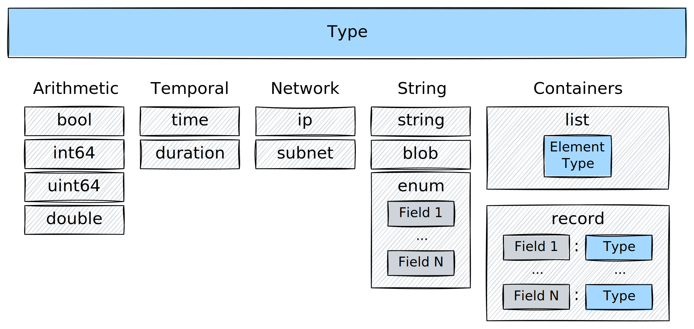

The **Tenzir Query Language (TQL)** is a dataflow language designed for
processing of unstructured byte-streams and semi-structured events.

## Introduction

Security practitioners need to collect, transform, and analyze telemetry without
the complexity of general-purpose data engineering tools. We created the Tenzir
Query Language (TQL) to meet this need. TQL synthesizes the best ideas from
languages that security teams already use:

- **Splunk SPL's familiarity**: Operators that security analysts recognize
- **Kusto's power**: Rich aggregation and time-series capabilities
- **Unix pipes' composability**: Small, focused operators that chain together
- **jq's flexibility**: Powerful transformations on semi-structured data

TQL combines the power of a streaming execution engine with an intuitive
pipeline syntax that mirrors how practitioners think about data processing. This
approach is validated by nearly every modern SIEM (Splunk SPL, Elastic ES|QL,
Microsoft KQL) and offers several advantages over traditional query languages
like SQL.

:::note[Why not SQL?]
While SQL is the standard for relational databases, its design creates friction
in security operations:

- **Inside-out thinking**: SQL's rigid `SELECT ... FROM ... WHERE` structure
  forces you to specify the output format before defining transformations,
  leading to complex nested subqueries.
- **Debugging complexity**: Tracing data flow through nested CTEs and subqueries
  is cumbersome when investigating incidents under time pressure.
- **Schema rigidity**: SQL assumes uniform, predefined schemas—a poor fit for
  the heterogeneous mix of logs, alerts, and telemetry that security teams
  process daily.

The pipeline model offers a more natural workflow:

- **Sequential reasoning**: Data flows top-to-bottom, matching your mental model.
- **Incremental construction**: Build queries step-by-step, testing at each stage.
- **Isolated debugging**: Inspect intermediate results by commenting out downstream operators.
- **Composability**: Combine simple operators into sophisticated workflows.
:::

### Unified streaming and batch processing

TQL seamlessly handles both real-time and historical analysis. Unlike
traditional tools that require separate codebases for streaming and batch
workflows, TQL uses the same pipeline logic for both.

You can process archived data from a data lake:

```tql
from "s3://bucket/logs/2024-01/*.parquet"
where timestamp > 2024-01-15T00:00:00
```

Or monitor a live stream from a message bus:

```tql
from "kafka://topic:9092"
where timestamp > now() - 1h
```

TQL draws inspiration from Unix pipes, where data flows through a sequence of
transformations. But unlike shell pipelines that primarily work on text, TQL
operates on both unstructured data (bytes) and structured data (events).

### Core abstractions

TQL is built on a powerful streaming execution engine, but it shields you from
the complexity of low-level data processing. It provides a rich set of building
blocks to create intricate [pipelines](/explanations/architecture/pipeline)
that collect, transform, and route data. You can also embed your TQL programs
into reusable [packages](/explanations/packages) to create one-click
deployable use cases.


TQL organizes data processing into three levels of abstraction:

1.  [Expressions](/explanations/language/#expressions) are the atoms of
    computation. They evaluate to values and can be composed to build complex
    transformations.
2.  [Statements](/explanations/language/#statements) provide structure with
    bindings, operators, assignments, and control-flow primitives.
3.  [Programs](/explanations/language/#programs) compose statements into
    complete, executable data processing workflows.

## Type System

TQL balances type safety with practical flexibility:

- **Strong typing prevents errors**: Can't accidentally compare IPs as strings
- **Automatic inference**: Types detected from data, no declarations needed
- **Null semantics**: Every type is nullable (real data has gaps)
- **Domain operations**: Types come with relevant methods

```tql title="Type safety in action"
where src_ip in 10.0.0.0/8           // Type-checked subnet membership
where duration > 5min                // Type-checked duration comparison
where timestamp.hour() >= 9          // Extract hour from timestamp
where severity?.to_upper() == "HIGH" // Safe navigation with type conversion
```

### Available Types

The diagram below illustrates the type system at a glance:



See the [type reference](/reference/language/types) for a terse overview of all
types.

### Why TQL has more types

TQL extends JSON's type system because **security and network data has specific
patterns** that generic JSON cannot express efficiently or safely.

Example:

```tql
from {
  // JSON-compatible types
  event_id: 42,                      // number → int64
  is_alert: true,                    // bool
  message: "Connection established", // string
  tags: ["network", "established"],  // array → list
  metadata: {                        // object → record
    source: "firewall",
    version: 2
  },

  // TQL-specific types for security/network data
  src_ip: 192.168.1.100,                   // IP address
  network: 192.168.1.0/24,                 // subnet
  timestamp: 2024-01-15T10:30:00,          // time point
  duration: 250ms,                         // duration
  api_key: secret("sk_live_..."),          // secret (never logged)
  packet_data: b"\x00\x01\x02"             // blob (binary data)
}
```

#### Why IP address types?

IP addresses aren't just strings—they have structure and semantics:

✅ Native IP type operations:

```tql
where src_ip in 10.0.0.0/8      // Clear, type-safe subnet check
where src_ip.is_private()       // Built-in IP operations
where src_ip > 192.168.1.1      // Ordered comparison
```

❌ Without IP type (plain strings):

```tql
where src_ip.starts_with("10.") // Error-prone, doesn't handle all cases
where regex_match(src_ip, "^(10\\.|192\\.168\\.|...)")  // Complex and slow
// No way to do proper IP comparisons or subnet matching
```

#### Why duration and time types?

Time calculations are fundamental to log analysis:

✅ Native time type operations:

```tql
where timestamp > now() - 1h    // Intuitive time arithmetic
where response_time > 500ms     // Clear units
let $window = 5min              // Self-documenting
```

❌ Without time types (using milliseconds):

```tql
where timestamp_ms > current_time_ms - 3600000  // What unit is this?
where response_time_ms > 500    // Milliseconds? Seconds?
let $window = 300000            // Five minutes... or is it?
```

#### Why subnet types?

Network segmentation is core to security analysis:

✅ Subnet type operations:

```tql
let $internal = 10.0.0.0/8
let $dmz = 192.168.100.0/24
where src_ip in $internal and dst_ip not in $internal  // Outbound traffic
```

❌ Without subnet type:

```tql
// Would need complex IP range calculations and bit manipulation
// Error-prone and hard to maintain
```

#### Why binary blob types?

Security and network data often contains raw binary content that needs special
handling:

✅ Blob type for binary data:

```tql
// Handle packet captures, certificates, encrypted payloads
packet_data = b"\x00\x01\x02\x03"
cert_der = decode_base64(certificate_base64)  // Returns blob
payload_hex = encode_hex(packet_data)         // blob → hex string
hash = hash_sha256(packet_data)               // Direct hashing of binary
```

❌ Without blob type (using strings):

```tql
// Binary data corrupts when treated as text
packet_data = "\x00\x01\x02\x03"  // May lose null bytes
// No safe way to handle non-UTF8 sequences
// Length calculations are wrong for multi-byte encodings
```

Blobs preserve exact byte sequences for forensics, packet analysis, and
cryptographic operations.

#### Why secret types?

Credentials and sensitive data need protection from accidental exposure:

✅ Secret type for sensitive values:

```tql
// Secrets are never logged or displayed
let $api_key = secret("sk_live_abc123...")
auth_header = f"Bearer {secret(env("API_TOKEN"))}"

// Use secrets without exposing them
http "api.example.com", headers={Auth: $api_key}  // Use secret safely
```

❌ Without secret type (using strings):

```tql
// Dangerous: credentials visible in logs
api_key = "sk_live_abc123..."   // Shows up in debug output

// No protection against exposure
to "debug.json"  // Oops, secret written to file
```

The secret type ensures sensitive data is never accidentally exposed in logs, outputs, or debugging.

### Multi-schema philosophy

Unlike traditional databases that require strict schemas, TQL embraces
**heterogeneous data** as a first-class concept. Real-world data pipelines
process multiple event types simultaneously—firewall logs, DNS queries,
authentication events—each with different schemas.

TQL's operators are **polymorphic**, adapting to different schemas at runtime:

```tql
// Single pipeline processing multiple event types
from "mixed_security_logs.json"
where timestamp > now() - 1h
where severity? == "high" or risk_score? > 0.8
select \
  timestamp,
  event_type=@name,            // Capture the schema name
  message,                     // Common field
  src_ip?,                     // Present in network events
  username?,                   // Present in auth events
  dns_query?                   // Present in DNS events
```

This philosophy enables powerful patterns:

- **Type-aware aggregation**: Group and aggregate across different schemas
- **Unified processing**: Apply common transformations to diverse data
- **Schema evolution**: Handle changing schemas without pipeline updates
- **Mixed-source correlation**: Join events from different systems

### Comparison to Arrow

All Tenzir types have a lossless mapping to [Arrow](http://arrow.apache.org)
types, however, not all Arrow types have a Tenzir equivalent. As a result, it is
currently not yet possible to import arbitrary Arrow data. In the future, we
plan to extend our support for Arrow-native types and also offer conversion
options for seamless data handover.

Tenzir has a few domain-specific types that map to Arrow [extension
types](https://arrow.apache.org/docs/format/Columnar.html#extension-types).
These are currently `enum`, `ip`, and `subnet`. Tenzir and Arrow attach type
metadata to different entities: Tenzir attaches metadata to a type instance,
whereas Arrow attaches metadata to a schema or record field.

## Expressions

Expressions form the computational core of TQL. They range from simple literals
to complex evaluations.

Level 1: Simple literals:

```tql
42
"text"
192.168.1.1        // IP literal
5min               // Duration literal
```

Level 2: Field access with intent:

```tql
src_ip             // Should exist - warning if missing
metadata?          // May not exist - that's normal
```

Level 3: Operations:

```tql
bytes > 1Ki        // Note: Ki = 1024 (binary prefix)
port in [80, 443, 8080]
```

Level 4: Function calls:

```tql
round(bytes / 1Ki)
src_ip.is_private()
```

Level 5: Method chains:

```tql
message.trim().to_upper().length()
```

Level 6: Navigation for optional paths:

```tql
user?.profile?.settings?.theme?
```

Level 7: Ternary conditional (Python-style):

```tql
alert_level = "HIGH" if bytes > 1Mi else "LOW"
```

Level 8: Complex expressions with format strings:

```tql
f"Alert: {'HIGH' if bytes > 1Mi else 'LOW'} volume from {src_ip}"
```

### Optional field access with `?`

Use the optional field access operator (`?`) to suppress warnings when accessing
non-existant fields. This is useful when you want to treat optional fields as
normal and not a data quality issue that elicits a warning.

```tql title="Processing login events that should have username"
from {event: "logon", user: {id: 123, name: "John Doe"}},
     {event: "logon", user: {id: 456}},
     {event: "logoff", user: {id: 123}}
select event, user_id=user.id, name=user.name?
```

```tql
{event: "logon", user_id:123, name:"John Doe"}
{event: "logon", user_id:456, name:null}  // null instead of a warning
{event: "logoff", user_id:123, name:null} // null instead of a warning
```

Optional field access also works on nested records:

```tql
from {event: "logon", user: {id: 123, name: "John Doe", address: {city: "New York"}}},
     {event: "logon", user: {id: 456, address: {city: "Hamburg", country: "Germany"}}},
     {event: "logoff", user: {id: 123, name: "Jane Doe", address: {country: "USA"}}}
select city=user.address?.city?
```

```tql
{user: {address: {city: "New York"}}}
{user: {address: {city: "Hamburg"}}}
{user: {address: {city: null}}} // null instead of a warning
```

### Fallback values with `else`

The `else` keyword often works with the `?` operator to provide default values,
e.g. to provide graceful fallback values:

```tql
severity_level = severity? else "unknown"
priority = priority? else 3
```

Prevent out-of-bounds errors with array index fallback:

```tql
let $ports = [80, 443, 8080]
first_port = $ports[0]? else 80
tenth_port = $ports[9]? else 0   // Fallback when index doesn't exist
```

Provide a record key fallback:

```tql
let $status_codes = {
  success: 200,
  not_found: 404,
  error: 500,
}
response_code = $status_codes[status]? else 500
```

:::tip[`else` vs `?`]
Without `else`, the `?` operator returns `null` when the field/key/index doesn't
exist. With `else`, you get a sensible default value instead of `null`.

The `?` operator expresses your data contract: use it to distinguish between
"this field should exist" and "this field naturally varies."
:::

### Conditional `if` standalone

The `if` keyword can be used independently as a conditional guard, evaluating an
expression only when a condition is true, and returning `null` otherwise:

```tql
result = x.y.z if $threshold > 100
```

Guard against expensive computations:

```tql
result = expensive_function() if $should_compute
formatted = text.trim().upper() if $needs_formatting
```

:::tip[`if` vs `else`]

- `if` alone: Returns the expression value when true, `null` when false
- `field? else default`: Provides a fallback when field doesn't exist
- `expression if condition else fallback`: see below
- Combine all of them: `field? else default if condition` for complex logic
  :::

### Conditional `if`-`else`

TQL uses Python-style conditionals, not ternary `?:` operators, with the basic
form being:

```tql
value_if_true if condition else value_if_false
```

Conditionally assign a value:

```tql
risk = "high" if port in [22, 3389] else "medium"
```

Discouraged due to potential confusion, but chaining is allowed:

```tql
priority = 1 if severity == "critical" else 2 if severity == "high" else 3
```

Conditionals also work in format strings:

```tql
message = f"Status: {'OK' if status == 200 else 'ERROR'}"
```

You can omit the `else` clause (returns null if `false`):

```tql
bonus = 1000 if performance == "excellent"
```

You can also use the `if` keyword for conditional field access:

```tql
value = x.y.z if $a == 42   // Access x.y.z only if $a equals 42
```

:::tip[Expression vs. statement]
The distinction between `if` expression and `if` statement is important:

- **`if` expression**: Returns a value (`x = "high" if condition else "low"`)
- **`if` statement**: Controls flow (covered in Control Flow section)
  :::

### The `move` expression

The `move` expression transfers a field's value and removes the original field in one operation:

✅ Clean: Using `move` to avoid separate drop operations:

```tql
ocsf.src_endpoint.ip = move original.source_address
ocsf.severity = move alert.level
```

❌ Verbose: copy then drop:

```tql
ocsf.src_ip = original.source_address
ocsf.severity = alert.level
drop original.source_address, alert.level
```

Key points about `move`:

- **Expression only**: `move` can only be used in expression position (right side of `=`)
- **Field required**: Can only move fields, not arbitrary expressions
- **Atomic operation**: Combines read and delete in one step
- **Prevents duplication**: Ensures data doesn't appear in both old and new locations

:::note[Keyword vs. operator]
Don't confuse the `move` expression with the [`move`
operator](/reference/operators/move), which renames fields at the top-level event.
:::

### Functions

Functions appear in [expressions](/reference/language/expressions) and take
positional and/or named arguments, producing a value as a result of their
computation.

TQL supports the [uniform function call syntax
(UFCS)](https://en.wikipedia.org/wiki/Uniform_Function_Call_Syntax), which
allows you to interchangeably call a function with at least one argument either
as _free function_ or _method_. For example, `length(str)` and `str.length()`
resolve to the identical function call. The latter syntax is particularly
suitable for function chaining, e.g., `x.f().g().h()` reads left-to-right as
"start with `x`, apply `f()`, then `g()` and then `h()`," compared to
`h(g(f(x)))`, which reads "inside out."

import { Tabs, TabItem } from '@astrojs/starlight/components';

<Tabs syncKey="function-style">
<TabItem label="Free function">

```tql
from {input: "  hello  "}
output = capitalize(trim(input))
```

```tql
{
  input: "  hello  ",
  output: "Hello",
}
```

</TabItem>
<TabItem label="Method">

```tql
from {input: "  hello  "}
output = input.trim().capitalize()
```

```tql
{
  input: "  hello  ",
  output: "Hello",
}
```

</TabItem>
</Tabs>

Note the improved readability of function chaining:

<Tabs syncKey="function-style">
<TabItem label="Free function">

```tql
from {message: "  HELLO world  "}
message = replace(to_lower(trim(message)), " ", "_")
```

```tql
{
  message: "hello_world",
}
```

</TabItem>
<TabItem label="Method">

```tql
from {message: "  HELLO world  "}
message = message
  .trim()                       // Remove whitespace
  .to_lower()                   // Normalize case
  .replace(" ", "_")            // Replace spaces
```

```tql
{
  message: "hello_world",
}
```

</TabItem>
</Tabs>

:::tip[Prefer method style]
While both styles are valid, we prefer the method syntax for:

- **Readability**: Left-to-right data flow is easier to follow
- **Discoverability**: IDEs can better suggest available methods
- **Consistency**: Aligns with common programming patterns
- **Chaining**: Natural for multi-step transformations
  :::

For a comprehensive list of functions, see the [functions
reference](/reference/functions).

## Statements

[Statements](/reference/language/statements) provide control and structure with
bindings, operators, assignments, and control-flow primitives.

### Bindings

Bindings define constants with the `let` statement:

```tql
let $critical_ports = [22, 3389, 5432]
```

### Operators

Operators read, transform, and writ data:

```tql
where src_endpoint.port in $critical_ports
```

Operators have an _upstream_ and _downstream_ type, which can be:

- **void**: No data (used at pipeline boundaries)
- **bytes**: Unstructured binary data (files, network streams)
- **events**: Structured, typed records (the primary data model)

The diagram below illustrates the cross-product of upstream and downstream
types:


Here are visual examples that illustrate the upstream and downstream operator
types.

```tql
from "/path/to/file.json"
where src_ip in 10.0.0.0/8
to "s3://bucket/dir/file.parquet"
```

This pipeline consists of three operators:


Let's break it down:

1. [`from`](/reference/operators/from): A void-to-events input operator that
   reads events from a URI.
2. [`where`](/reference/operators/where): An events-to-events transformation
   operator that filters events matching a predicate.
3. [`to`](/reference/operators/to): An events-to-void output operator the writes
   to the specified URI.

The [`from`](/reference/operators/from) and [`to`](/reference/operators/to)
operators perform a bit "magic" in that they also infer the format of the data
being read or written, i.e., JSON due to the `*.json` extension and Parquet due
to the `*.parquet` extension. You can also bypass this magic by explicitly
specifying the format:

```tql
load_kafka "topic"
read_ndjson
select host, message
write_yaml
save_zmq "tcp://1.2.3.4"
```


Here, we use a separate set of operators that go through bytes explicitly. Let's
break it down as well:

1. [`load_kafka`](/reference/operators/load_kafka): A void-to-events input
   operator that reads from a Kafka topic.
2. [`read_ndjson`](/reference/operators/read_ndjson): An bytes-to-events
   transformation operator (aka. _parser_) that reads newline-delimited JSON.
3. [`select`](/reference/operators/select): An events-to-events transformation
   operator that selects specific fields from events.
4. [`write_yaml`](/reference/operators/write_yaml): An events-to-bytes
   transformation operator that turns events to YAML foramt.
5. [`save_zmq`](/reference/operators/save_zmq): A bytes-to-void output
   operator that writes bytes to a ZeroMQ socket.

### Assignments

Assignments modify fields:

```tql
risk_score = bytes / 1Ki * severity_weight
```

When you write an assignment outside an explicit operator context, it implicitly
uses the [`set`](/reference/operators/set) operator:

```tql
severity = "high"
// ...is actually shorthand for:
set severity = "high"
```

This design keeps pipelines concise while maintaining clarity about what's
happening.

### Control flow

The `if` statement allows for branching into different statements:

```tql
if src_ip.is_private() {
  zone = "internal"
} else {
  zone = "external"
}
```

## Programs

TQL **programs** compose [statements](/reference/language/statements) into
complete data processing workflows that can execute. Valid TQL programs adhere
to the following rules:

1. Adjacent operators must have identical types.
2. A pipeline must be **closed**, i.e., begin with void input and end with void
   output.

:::note[Pipeline Auto-Completion]
When a pipeline is not closed, Tenzir attempts to _auto-complete_ it. On the
[command line](/guides/basic-usage/run-pipelines/#on-the-command-line), it
suffices to write a sequence of transformations because Tenzir automatically
adds a JSON input operator at the beginning and TQL output operator at the end.
In the [web inteface](/guides/basic-usage/run-pipelines/#in-the-platform),
auto-completetion takes place with an output operator: The web app appends
[`serve`](/reference/operators/serve) to turn the dataflow into a REST API,
allowing your browser to access it by routing the data through the platform.
:::

### Chaining statements

You chain statements with either a newline (`\n`) or pipe symbol (`|`). We
purposefully offer choice to cater to two primary styles:

1. Vertical structuring with newlines for full-text editing
2. Horizontal inline pipe composition for command-line usage

Prefer the vertical approach for readability in files and documentation.
Throughout this documentation, we only use the vertical style for clarity and
consistency.

Let's juxtapose the two styles. Here's a vertical TQL program:

```tql
let $ports = [22, 443]

from_file "/tmp/logs.json"
where port in $ports
select src_ip, dst_ip, bytes
summarize src_ip, total=sum(bytes)
```

And here a horziontal one:

```tql
let $ports = [22, 443] | from "/tmp/logs.json" | where port in $ports | select src_ip, dst_ip, bytes | summarize src_ip, total=sum(bytes)
```

In theory, you can combine pipes and newlines to write programs that resemble
Kusto and similar languages. However, we discourage this practice because it can
make the code harder to read and maintain—especially when adding nested
pipelines that increase the level of indentation.

### Diagnostics

TQL's diagnostic system is designed to give you insights into what happens
during data processing. There exist two types of diagnostics:

1. **Errors**: Stop pipeline execution immediately (critical failures)
2. **Warnings**: Signal data quality issues but continue processing

When a pipeline emits an error, it stops execution. Unless you configured the
pipeline to restart on error, it now requires human intervention to resolve the
issue and resume execution.

Warnings do not cause a screeching halt of the pipeline. They are useful for
identifying potential issues that may impact the quality of the processed data,
such as missing or unexpected values.

:::tip[Best Practices]
We have a dedicated [section on warnings and
errors](/tutorials/learn-idiomatic-tql/#data-quality) in our [learning idiomatic
TQL tutorial](/tutorials/learn-idiomatic-tql).
:::

### Pipeline nesting

Operators can contain entire subpipelines:

```tql title="Periodic execution"
every 1h {
  from "metrics.json"
  summarize host, avg_cpu=mean(cpu)
  where avg_cpu > 80
  to "alerts.json"
}

// Scoped operations
local {
  from "local_cache.json"
  where timestamp > now() - 5min
}

// Remote execution
remote {
  export
  where severity == "high"
  select timestamp, message
}
```

### Parallel processing

Fork pipelines for parallel processing paths:

```tql title="Split processing"
fork {
  // Branch 1: Critical alerts
  where severity == "critical"
  to "urgent_alerts.json"
}
fork {
  // Branch 2: Metrics
  summarize severity, count()
  to "metrics.json"
}
// Main pipeline continues
select timestamp, message
to "all_events.json"

// Load balancing across workers
load_balance {
  // Each worker processes a subset
  where hash(src_ip) % 4 == worker_id
  expensive_enrichment()
}
```

### Comments

Comments make implicit choices and assumptions explicit. They have no semantic
effect and the compiler ignores them during parsing.

TQL features C-style comments, both single and multi-line.

#### Single-line comments

Use a double slash (`//`) to comment until the end of the line.

Here's an example where a comment spans a full line:

```tql
// the app only supports lower-case user names
let $user = "jane"
```

Here's an example where a comment starts in the middle of a line:

```tql
let $users = [
  "jane", // NB: also admin!
  "john", // Been here since day 1.
]
```

#### Multi-line comments

Use a slash-star (`/*`) to start a multi-line comment and a star-slash (`*/`)
to end it.

Here's an example where a comment spans multiple lines:

```tql
/*
 * User validation logic
 * ---------------------
 * Validate user input against a set of rules.
 * If any rule fails, the user is rejected.
 * If all rules pass, the user is accepted.
 */
let $user = "jane"
```

## Execution Model

TQL pipelines execute on a streaming engine that processes data incrementally.
Understanding the execution model helps you write efficient pipelines and
predict performance characteristics.

Key execution principles:

- **Stream processing by default**: Data flows through operators as it arrives
- **Lazy evaluation**: Operations execute only when data flows through them
- **Back-pressure handling**: Automatic flow control prevents memory exhaustion
- **Network transparency**: Pipelines can span multiple nodes seamlessly

### Streaming vs blocking

Understanding operator behavior helps write efficient pipelines:

**Streaming operators** process events incrementally:

- [`where`](/reference/operators/where): Filters one event at a time
- [`select`](/reference/operators/select): Transforms fields immediately
- [`drop`](/reference/operators/drop): Removes fields as events flow

**Blocking operators** need all input before producing output:

- [`sort`](/reference/operators/sort): Must see all events to order them
- [`summarize`](/reference/operators/summarize): Aggregates across the entire
  stream
- [`reverse`](/reference/operators/reverse): Needs complete input to reverse
  order

✅ Efficient: streaming operations first:

```tql
from "large_file.json"
where severity == "critical"    // Streaming: reduces data early
select relevant_fields          // Streaming: drops unnecessary data
sort timestamp                  // Blocking: but on reduced dataset
```

❌ Less efficient: blocking operation on full data:

```tql
from "large_file.json"
sort timestamp                  // Blocking: processes everything
where severity == "critical"    // Then filters
```

### Constant vs runtime evaluation

Understanding when expressions evaluate helps write efficient pipelines:

```tql title="Constants: evaluated once at pipeline start"
let $threshold = 1Ki
let $start_time = 2024-01-15T09:00:00  // Would be now() - 1h in real usage
let $config = {
  ports: [80, 443, 8080],
  networks: [10.0.0.0/8, 192.168.0.0/16],
}

// Runtime: evaluated per event
from
  {bytes: 2Ki, timestamp: 2024-01-15T09:30:00},
  {bytes: 512, timestamp: 2024-01-15T09:45:00},
  {bytes: 3Ki, timestamp: 2024-01-15T10:00:00}
where bytes > $threshold            // Constant comparison
where timestamp > $start_time       // Constant comparison
current_time = 2024-01-15T10:30:00  // Would be now() in real usage
age = current_time - timestamp      // Runtime calculation
```

### Network transparency

TQL pipelines can span network boundaries seamlessly:

```tql title="Implicit networking"
from "local.json"
where severity == "high"
import                           // Sends to configured node

// Explicit networking with remote execution
remote {
  export                         // Fetch from remote node
  where severity == "high"
  select timestamp, message
}

// Bidirectional flow
from "local_source.json"
where needs_enrichment
remote {
  context::enrich "reputation", key=ip
}
where reputation?.score? > 0.8
to "high_risk.json"
```

## Summary

TQL's design is guided by core principles that make it both powerful for complex
security analytics and accessible for everyday data processing. It combines the
simplicity of a JSON-compatible data model with the flexibility of functional
and imperative paradigms.

The key design choices in TQL serve specific purposes:

- **Clarity and Composability**: TQL prioritizes readability. The vertical
  structure, where each operator occupies its own line, visualizes the data flow
  naturally. Small, single-purpose operators are designed to be composed into
  powerful and maintainable workflows. Syntactic choices like Python-style
  conditionals, Uniform Function Call Syntax (UFCS) for method chaining, and
  implicit operators for common assignments reduce boilerplate without
  sacrificing clarity.

- **Domain-Specific Data Model**: TQL extends the familiar JSON data model with
  types crucial for security and network analysis. Native types for IP
  addresses, subnets, timestamps, and durations enable type-safe, intuitive
  operations that are clumsy or error-prone with generic types. The language
  also embraces heterogeneous, multi-schema data streams, reflecting the reality
  of modern data sources.

- **Type Safety and Intentional Data Quality**: The language enforces strong
  typing without verbose declarations, preventing common errors while inferring
  types automatically. This philosophy extends to handling missing data. The
  optional access operator (`?`) allows users to explicitly distinguish between
  fields that are expected to exist (raising a warning if absent) and those that
  may naturally vary, making every diagnostic warning meaningful.

Mastering TQL involves starting with simple pipelines and building
incrementally. By composing operators, using the type system to express domain
concepts, and manage data quality explicitly, you can write pipelines that are
both robust and maintainable.

:::tip[Learn Idiomatic TQL]
Ready to get hands-on? Read the [tutorial on learning idiomatic
TQL](/tutorials/learn-idiomatic-tql), with concrete examples and best practices.
:::
