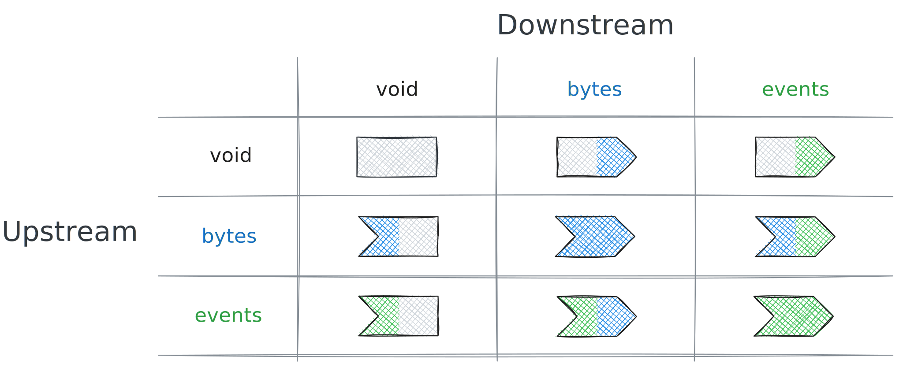
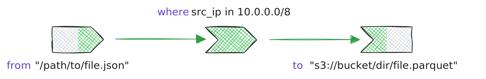
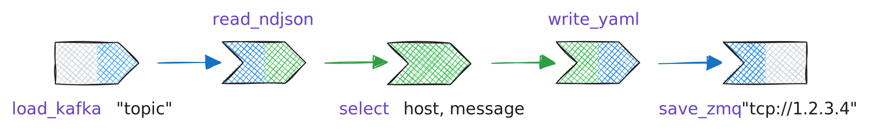

TQL programs are structured as a sequence of operators that perform various
functions on data streams. Each operator can be thought of as a modular unit
that processes data and can be combined with other operators to create complex
workflows.

[Statements](/explanations/language/statements) provide control and structure with
bindings, operators, assignments, and control-flow primitives.

## Operator

Operator statements consist of the operator name, followed by an arbitrary
number of arguments. Arguments are delimited by commas and may optionally be
enclosed in parentheses. If the last argument is a pipeline expression, the
preceding comma can be omitted for brevity.

Arguments can be specified in two ways: they can be positional, where the order
matters, or named, where each argument is explicitly associated with a parameter
name. Furthermore, arguments can be classified as required or optional. Some
operators expect constant values, while others are designed to accept runtime
values.

```tql
select foo, bar.baz
drop qux
head 42
sort abs(x)
```

Operators read, transform, and write data:

```tql
where src_endpoint.port in $critical_ports
```

Operators have an _upstream_ and _downstream_ type, which can be:

- **void**: No data (used at pipeline boundaries)
- **bytes**: Unstructured binary data (files, network streams)
- **events**: Structured, typed records (the primary data model)

The diagram below illustrates the cross-product of upstream and downstream
types:



Here are visual examples that illustrate the upstream and downstream operator
types.

```tql
from "/path/to/file.json"
where src_ip in 10.0.0.0/8
to "s3://bucket/dir/file.parquet"
```

This pipeline consists of three operators:



Let's break it down:

1. [`from`](/reference/operators/from): A void-to-events input operator that
   reads events from a URI.
2. [`where`](/reference/operators/where): An events-to-events transformation
   operator that filters events matching a predicate.
3. [`to`](/reference/operators/to): An events-to-void output operator the writes
   to the specified URI.

The [`from`](/reference/operators/from) and [`to`](/reference/operators/to)
operators perform a bit "magic" in that they also infer the format of the data
being read or written, i.e., JSON due to the `*.json` extension and Parquet due
to the `*.parquet` extension. You can also bypass this magic by explicitly
specifying the format:

```tql
load_kafka "topic"
read_ndjson
select host, message
write_yaml
save_zmq "tcp://1.2.3.4"
```



Here, we use a separate set of operators that go through bytes explicitly. Let's
break it down as well:

1. [`load_kafka`](/reference/operators/load_kafka): A void-to-events input
   operator that reads from a Kafka topic.
2. [`read_ndjson`](/reference/operators/read_ndjson): An bytes-to-events
   transformation operator (aka. _parser_) that reads newline-delimited JSON.
3. [`select`](/reference/operators/select): An events-to-events transformation
   operator that selects specific fields from events.
4. [`write_yaml`](/reference/operators/write_yaml): An events-to-bytes
   transformation operator that turns events to YAML foramt.
5. [`save_zmq`](/reference/operators/save_zmq): A bytes-to-void output
   operator that writes bytes to a ZeroMQ socket.

## Assignment

An assignment statement in TQL is structured as `<place> = <expression>`, where
`<place>` typically refers to a field or item of a list. If the specified place
already exists, the assignment will overwrite its current value. If it does not
exist, a new field will be created.

The `<place>` can also reference a field path. For example, the statement
`foo.bar = 42` assigns the value 42 to the field `bar` within the record `foo`.
If `foo` is not a record or does not exist before, it will be set to a record
containing just the field `bar`.

```tql
category_name = "Network Activity"
type_uid = class_uid * 100 + activity_id
traffic.bytes_out = event.sent_bytes
```

Assignments modify fields:

```tql
risk_score = bytes / 1Ki * severity_weight
```

When you write an assignment outside an explicit operator context, it implicitly
uses the [`set`](/reference/operators/set) operator:

```tql
severity = "high"
// ...is actually shorthand for:
set severity = "high"
```

This design keeps pipelines concise while maintaining clarity about what's
happening.

## `let`

The `let` statement binds a constant to a specific name within the pipeline's
scope. The syntax for a `let` statement is `let $<identifier> = <expression>`.
For instance, `let $meaning = 42` creates a constant `$meaning` that holds the
value 42.

More complex expressions can also be assigned, such as `let $start = now() -
1h`, which binds `$start` to a value representing one hour before the pipeline
was started. Constants defined with `let` can be referenced in subsequent
statements, including other `let` statements. For example, `let $end = $start +
30min` can be used to define `$end` depending on the value of `$start`.

```tql
let $meaning = 42
let $start = now() - 1h
let $end = $start + 30min
```

Bindings define constants with the `let` statement:

```tql
let $critical_ports = [22, 3389, 5432]
```

## `if`

The `if` statement is a primitive designed to route data based on a predicate.
Its typical usage follows the syntax `if <expression> { … } else { … }`, where
two subpipelines are specified within the braces. When its expression evaluates
to `true`, the first pipeline processes the event. Conversely, when it evaluates
to `false`, it is routed through the second one.

After the `if` statement the event flow from both pipelines is joined together.
The `else` clause can be omitted, resulting in the syntax `if <expression> { …
}`, which has the same behavior as `if <expression> { … } else {}`.
Additionally, the `else` keyword can be followed by another `if` statement,
allowing for chained `if` statements. This chaining can be repeated, enabling
complex conditional logic to be implemented.

```tql
if score < 100 {
  severity = "low"
  drop details
} else if score < 200 {
  severity = "medium"
} else {
  severity = "high"
}
```

The `if` statement allows for branching into different statements:

```tql
if src_ip.is_private() {
  zone = "internal"
} else {
  zone = "external"
}
```
