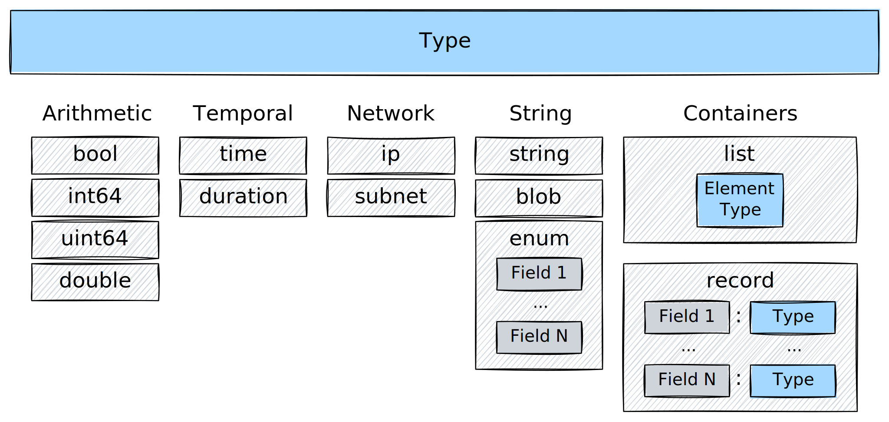

TQL balances type safety with practical flexibility:

- **Strong typing prevents errors**: Can't accidentally compare IPs as strings
- **Automatic inference**: Types detected from data, no declarations needed
- **Null semantics**: Every type is nullable (real data has gaps)
- **Domain operations**: Types come with relevant methods

```tql title="Type safety in action"
where src_ip in 10.0.0.0/8           // Type-checked subnet membership
where duration > 5min                // Type-checked duration comparison
where timestamp.hour() >= 9          // Extract hour from timestamp
where severity?.to_upper() == "HIGH" // Safe navigation with type conversion
```

## Available Types

The diagram below illustrates the type system at a glance:



Tenzir's type system is a superset of JSON: Every valid JSON object is a valid
Tenzir value, but there also additional types available, such as `ip` and
`subnet`.

### Basic Types

Basic types are stateless types with a static structure. The following basic
types exist:

| Type       | Description                           | Example Expression Literal             |
| ---------- | ------------------------------------- | -------------------------------------- |
| `null`     | Denotes an absent or invalid value    | `null`                                 |
| `bool`     | A boolean value                       | `true`, `false`                        |
| `int64`    | A 64-bit signed integer               | `42`, `-100`, `1k`, `2Ki`              |
| `uint64`   | A 64-bit unsigned integer             | `42`, `100`, `1M`, `2Gi`               |
| `double`   | A 64-bit double (IEEE 754)            | `3.14`, `-0.5`, `1.23e-4`, `2.5k`      |
| `duration` | A time span (nanosecond granularity)  | `5s`, `10min`, `1h`, `2d`, `100ms`     |
| `time`     | A time point (nanosecond granularity) | `2024-01-15T10:30:00`, `2024-01-15`    |
| `string`   | A UTF-8 encoded string                | `"hello"`, `"world"`, `r"C:\path"`     |
| `blob`     | An arbitrary sequence of bytes        | `b"\x00\x01\x02"`, `b"raw bytes"`      |
| `ip`       | An IPv4 or IPv6 address               | `192.168.1.1`, `::1`, `fe80::1`        |
| `subnet`   | An IPv4 or IPv6 subnet                | `10.0.0.0/8`, `192.168.0.0/16`, `::/0` |
| `secret`   | A secret value                        | `secret("API_KEY")`                    |

#### Secrets

The `secret` type is a special type created by the [`secret`](/reference/functions/secret)
function. Secrets can only be used as arguments for operators that accept them
and only support a limited set of operations, such as concatenation.

See the [explanation page for secrets](/explanations/secrets) for more details.

### Complex Types

Complex types are stateful types that carry additional runtime information.

#### List

The `list` type is an ordered sequence of values with a fixed element type.

Lists have zero or more elements.

#### Record

The `record` type consists of an ordered sequence _fields_, each of which have a
name and type. Records must have at least one field.

The field name is an arbitrary UTF-8 string.

The field type is any Tenzir type.

## Optionality

All types are optional in that there exists an additional `null` data point in
every value domain. Consequently, Tenzir does not have a special type to
indicate optionality.

## Attributes

Every type has zero or more **attributes** that are free-form key-value pairs to
enrich types with custom semantics.

## Why TQL has more types

TQL extends JSON's type system because **security and network data has specific
patterns** that generic JSON cannot express efficiently or safely.

Example:

```tql
from {
  // JSON-compatible types
  event_id: 42,                      // number → int64
  is_alert: true,                    // bool
  message: "Connection established", // string
  tags: ["network", "established"],  // array → list
  metadata: {                        // object → record
    source: "firewall",
    version: 2
  },

  // TQL-specific types for security/network data
  src_ip: 192.168.1.100,                   // IP address
  network: 192.168.1.0/24,                 // subnet
  timestamp: 2024-01-15T10:30:00,          // time point
  duration: 250ms,                         // duration
  api_key: secret("sk_live_..."),          // secret (never logged)
  packet_data: b"\x00\x01\x02"             // blob (binary data)
}
```

### Why IP address types?

IP addresses aren't just strings—they have structure and semantics:

✅ Native IP type operations:

```tql
where src_ip in 10.0.0.0/8      // Clear, type-safe subnet check
where src_ip.is_private()       // Built-in IP operations
where src_ip > 192.168.1.1      // Ordered comparison
```

❌ Without IP type (plain strings):

```tql
where src_ip.starts_with("10.") // Error-prone, doesn't handle all cases
where regex_match(src_ip, "^(10\\.|192\\.168\\.|...)")  // Complex and slow
// No way to do proper IP comparisons or subnet matching
```

### Why duration and time types?

Time calculations are fundamental to log analysis:

✅ Native time type operations:

```tql
where timestamp > now() - 1h    // Intuitive time arithmetic
where response_time > 500ms     // Clear units
let $window = 5min              // Self-documenting
```

❌ Without time types (using milliseconds):

```tql
where timestamp_ms > current_time_ms - 3600000  // What unit is this?
where response_time_ms > 500    // Milliseconds? Seconds?
let $window = 300000            // Five minutes... or is it?
```

### Why subnet types?

Network segmentation is core to security analysis:

✅ Subnet type operations:

```tql
let $internal = 10.0.0.0/8
let $dmz = 192.168.100.0/24
where src_ip in $internal and dst_ip not in $internal  // Outbound traffic
```

❌ Without subnet type:

```tql
// Would need complex IP range calculations and bit manipulation
// Error-prone and hard to maintain
```

### Why binary blob types?

Security and network data often contains raw binary content that needs special
handling:

✅ Blob type for binary data:

```tql
// Handle packet captures, certificates, encrypted payloads
let $open_packet = b"\x00\x01\x02\x03"      // Blob literals
packet_data = decode_base64(encoded_packet) // Returns blob
where packet_data != $open_packet           // Comparing bytes directly
payload_hex = encode_hex(packet_data)       // blob → hex string
hash = hash_sha256(packet_data)             // Direct hashing of binary
```

❌ Without blob type (using strings):

```tql
// Binary data corrupts when treated as text
packet_data = "\xFF\xFE\x00\x00"  // Invalid UTF-8 sequence
// No safe way to handle non-UTF8 sequences
// Length calculations are wrong for multi-byte encodings
```

Blobs preserve exact byte sequences for forensics, packet analysis, and
cryptographic operations.

### Why secret types?

Credentials and sensitive data need protection from accidental exposure:

✅ Secret type for sensitive values:

```tql
// Secrets are never logged or displayed
let $api_key = secret("API_TOKEN")
auth_header = f"Bearer {$api_key}"

// Use secrets without exposing them
http "api.example.com", headers={Auth: $api_key}  // Use secret safely
to "debug.json"  // Secret value is not written to file
```

❌ Without secret type (using strings):

```tql
// Dangerous: credentials visible in logs
api_key = "sk_live_abc123..."   // Shows up in debug output

// No protection against exposure
to "debug.json"  // Oops, secret written to file
```

The secret type ensures sensitive data is never accidentally exposed in logs, outputs, or debugging.

## Comparison to Arrow

All Tenzir types have a lossless mapping to [Arrow](http://arrow.apache.org)
types, however, not all Arrow types have a Tenzir equivalent. As a result, it is
currently not yet possible to import arbitrary Arrow data. In the future, we
plan to extend our support for Arrow-native types and also offer conversion
options for seamless data handover.

Tenzir has a few domain-specific types that map to Arrow [extension
types](https://arrow.apache.org/docs/format/Columnar.html#extension-types).
These are currently `enum`, `ip`, and `subnet`. Tenzir and Arrow attach type
metadata to different entities: Tenzir attaches metadata to a type instance,
whereas Arrow attaches metadata to a schema or record field.
