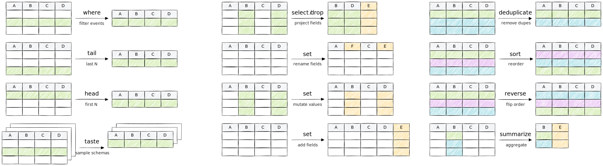

TQL comes with numerous transformation [operators](/reference/operators) that
change the shape of events, as well as [functions](/reference/functions) that
work on values within a single event.

This guide provides an overview of data shaping capabilities in TQL, showcasing
the operators and functions that you need for day-to-day data transformation
tasks.

## Understanding operators vs functions

Before diving into specific operations, it's important to understand a key
distinction in TQL:

- **Operators** work on streams of events and can keep state between multiple
  events (e.g., [`where`](/reference/operators/where),
  [`select`](/reference/operators/select), [`summarize`](/reference/operators/summarize))
- **Functions** work on individual values within a single event (e.g.,
  [`starts_with()`](/reference/functions/starts_with), [`round()`](/reference/functions/round), [`merge()`](/reference/functions/merge))

Here is a visual overview of transformations that you can perform over a stream
of events:



## Common data shaping tasks

Here are the most common data shaping operations organized by use case:

### Filter and select data

The fundamental operations for controlling which events and fields flow through
your pipeline. See the [Filter and select data](/guides/data-shaping/filter-and-select-data)
guide for detailed examples of:

- Filtering events with [`where`](/reference/operators/where)
- Selecting fields with [`select`](/reference/operators/select)
- Removing fields with [`drop`](/reference/operators/drop)
- Adding fields with [`set`](/reference/operators/set)

### Control event flow

Manage how many events pass through your pipeline and in what order. See the
[Slice and sample data](/guides/data-shaping/slice-and-sample-data) guide for:

- Getting first/last events with [`head`](/reference/operators/head) and [`tail`](/reference/operators/tail)
- Slicing ranges with [`slice`](/reference/operators/slice)
- Sampling by schema with [`taste`](/reference/operators/taste)
- Reversing order with [`reverse`](/reference/operators/reverse)

### Transform values

Convert and manipulate individual values within events. See the
[Transform basic values](/guides/data-shaping/transform-basic-values) guide for:

- Type conversions ([`int()`](/reference/functions/int), [`float()`](/reference/functions/float), [`string()`](/reference/functions/string), [`time()`](/reference/functions/time))
- String operations ([`to_upper()`](/reference/functions/to_upper), [`trim()`](/reference/functions/trim), [`capitalize()`](/reference/functions/capitalize))
- Mathematical operations ([`round()`](/reference/functions/round), [`abs()`](/reference/functions/abs), [`sqrt()`](/reference/functions/sqrt))
- Handling null values with the `else` keyword

### Work with complex structures

#### Relocate fields with `move`

Use the [`move`](/reference/operators/move) operator to rename and relocate
fields in one operation:

```tql
from {old: 42}
move new = old
```

```tql
{new: 42}
```

Moving multiple fields:

```tql
from {foo: 1, bar: 2}
move foo=bar, qux=foo
```

```tql
{
  foo: 2,
  qux: 1,
}
```

#### Aggregate events with `summarize`

Use [`summarize`](/reference/operators/summarize) to group and aggregate data. This
example groups events by the `y` field and sums up the `x` values for each group:

```tql
from {x: 0, y: 0, z: 1},
     {x: 1, y: 1, z: 2},
     {x: 1, y: 1, z: 3}
summarize y, x=sum(x)
```

```tql
{y: 0, x: 0}
{y: 1, x: 2}
```

In this example:

- Events are grouped by the value of `y` (0 or 1)
- For `y=0`, there's one event with `x=0`, so `sum(x)=0`
- For `y=1`, there are two events with `x=1` each, so `sum(x)=2`

See the [aggregation functions](/reference/functions#aggregation) reference for
all available aggregation functions like `count()`, `mean()`, `max()`, etc.

#### Reorder events with `sort`

Use [`sort`](/reference/operators/sort) to arrange events by field values:

```tql
from {x: 2, y: "bar"},
     {x: 3, y: "baz"},
     {x: 1, y: "foo"}
sort -x
```

```tql
{x: 3, y: "baz"}
{x: 2, y: "bar"}
{x: 1, y: "foo"}
```

Prepending the field with `-` reverses the sort order.

#### Break up lists with `unroll`

Use [`unroll`](/reference/operators/unroll) to expand lists into separate events:

```tql
from {
  xs: [{a: 1}, {a: 2}],
  y: "foo",
}
unroll xs
```

```tql
{
  xs: {
    a: 1,
  },
  y: "foo",
}
{
  xs: {
    a: 2,
  },
  y: "foo",
}
```

### Manipulate records and lists

#### Combine records with `merge`

Use the [`merge`](/reference/functions/merge) function to combine records. This is
useful when you need to consolidate data from multiple sources:

```tql
from {
  foo: {
    bar: 1,
    baz: 2,
  },
  qux: {
    fred: 3,
    george: 4,
    bar: 5,
  }
}
set this = merge(foo, qux)
```

```tql
{
  bar: 5,
  baz: 2,
  fred: 3,
  george: 4
}
```

Note that the field `bar` appears in both records. The value from the second
argument (`qux.bar = 5`) overwrites the value from the first (`foo.bar = 1`).

You can also use the spread expression as shorthand:

```tql
set this = {...foo, ...qux}
```

#### Combine lists with `concatenate`

Use [`concatenate`](/reference/functions/concatenate) to join lists:

```tql
from {
  xs: [1,2,3],
  ys: [4,5,6],
}
select result = concatenate(xs, ys)
```

```tql
{
  result: [
    1,
    2,
    3,
    4,
    5,
    6,
  ],
}
```

Or use the spread expression:

```tql
select result = [...xs, ...ys]
```

#### Add values to lists

Use [`append`](/reference/functions/append) and [`prepend`](/reference/functions/prepend):

```tql
from {
  xs: [2],
}
set xs = append(xs, 3)
set xs = prepend(xs, 1)
```

```tql
{
  xs: [
    1,
    2,
    3,
  ],
}
```

### Specialized operations

#### Perform bitwise operations

TQL provides bitwise functions for low-level data manipulation using [`bit_and()`](/reference/functions/bit_and),
[`bit_or()`](/reference/functions/bit_or), [`bit_xor()`](/reference/functions/bit_xor),
[`bit_not()`](/reference/functions/bit_not), [`shift_left()`](/reference/functions/shift_left),
and [`shift_right()`](/reference/functions/shift_right):

```tql
from {
  band: bit_and(5, 3),
  bor: bit_or(5, 3),
  bxor: bit_xor(5, 3),
  bnot: bit_not(5),
  shl: shift_left(5, 2),
  shr: shift_right(5, 1),
}
```

```tql
{
  band: 1,  // (0101 & 0011 = 0001)
  bor: 7,   // (0101 | 0011 = 0111)
  bxor: 6,  // (0101 ^ 0011 = 0110)
  bnot: -6, // (~0101 = 1010)
  shl: 20,  // (0101 << 2 = 10100)
  shr: 2,   // (0101 >> 1 = 0010)
}
```

## Best practices

1. **Understand the operator/function distinction**: Use operators for
   stream-level operations and functions for value-level transformations.

2. **Filter early**: Apply [`where`](/reference/operators/where) conditions as
   early as possible to reduce data volume.

3. **Select only what you need**: Use [`select`](/reference/operators/select) to
   keep only necessary fields, especially with large events.

4. **Choose the right tool**:
   - Use [`select`](/reference/operators/select) to keep specific fields
   - Use [`drop`](/reference/operators/drop) to remove a few fields from many
   - Use [`set`](/reference/operators/set) to add fields without changing existing ones
   - Use [`move`](/reference/operators/move) to rename fields efficiently

5. **Be mindful of performance**: Some operators like [`tail`](/reference/operators/tail)
   and [`reverse`](/reference/operators/reverse) must buffer all input before
   producing output.

## Where to go from here

Explore these specialized guides for deeper coverage of specific topics:

- [Filter and select data](/guides/data-shaping/filter-and-select-data) - Master filtering and field selection
- [Transform basic values](/guides/data-shaping/transform-basic-values) - Type conversions and value manipulation
- [Manipulate strings](/guides/data-shaping/manipulate-strings) - Text processing and formatting
- [Work with time](/guides/data-shaping/work-with-time) - Parse, format, and calculate with timestamps
- [Transform collections](/guides/data-shaping/transform-collections) - Work with lists and records
- [Aggregate and summarize](/guides/data-shaping/aggregate-and-summarize) - Statistical operations and grouping
- [Slice and sample data](/guides/data-shaping/slice-and-sample-data) - Control event flow
- [Extract structured data from text](/guides/data-shaping/extract-structured-data-from-text) - Parse complex text formats
- [Convert data formats](/guides/data-shaping/convert-data-formats) - Transform between JSON, CSV, YAML, and more
- [Reshape complex data](/guides/data-shaping/reshape-complex-data) - Advanced structural transformations
- [Deduplicate events](/guides/data-shaping/deduplicate-events) - Remove duplicate events

For a complete list of available operators and functions, see the
[operators](/reference/operators) and [functions](/reference/functions)
reference documentation.
