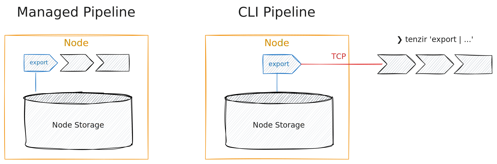

Exporting (or _querying_) data can be done by [running a
pipeline](/guides/basic-usage/run-pipelines) that begins with the
[`export`](/reference/operators/export) input operator. When managing a
pipeline through the app or the API, all pipeline operators run within the node.
When using the CLI, at least the `export` operator runs within the node.



Let's bring back a sample of historical data we [imported in the previous
section](/guides/edge-storage/import-into-a-node):

```tql
export
head
```

Think of `export` being the entire data at a node. As this can grow quickly, you
may query only subsets of it, e.g., by filtering using
[`where`](/reference/operators/where):

```tql
export
where orig_bytes < 1 KiB
```

Logically, this query would _first_ export the entire historical data, and
_then_ begin filtering the data. But since Tenzir does _predicate pushdown_, the
pipeline executor will analyze the query and push the expression in `where` with
the predicate `orig_bytes < 1 KiB` "down" to the `export` operator. Tenzir's
storage engine then asks its catalog to identify the relevant subset of
partitions that the query should execute on. This dramatically improves the
query performance for selective workloads, such as point queries for single
values or specific time ranges.

To figure out the shape of the data to query, you can [show available
schemas](/reference/operators/schemas).
