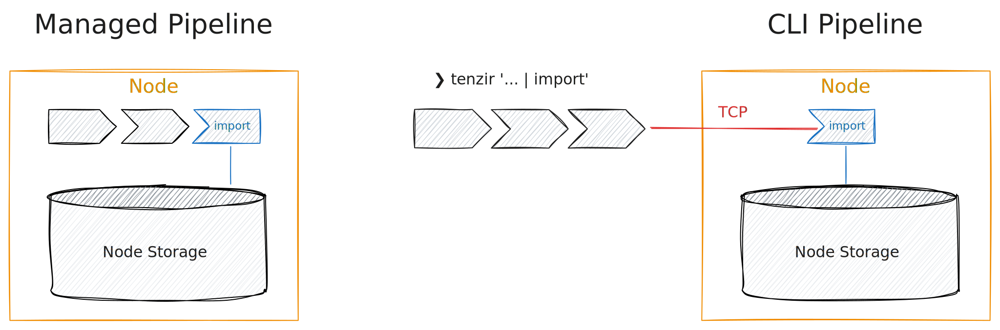

Importing (or _ingesting_) data can be done by [running a
pipeline](/guides/basic-usage/run-pipelines) that ends with the
[`import`](/reference/operators/import) output operator. When managing a
pipeline through the app or the API, all pipeline operators run within the node.
When using the CLI, at least the `import` operator runs within the node.



Consider this example that takes a Zeek conn.log from our M57 dataset:

```tql
from_file "Zeek/conn.log" { read_zeek_tsv }
select id.orig_h, id.resp_h, orig_bytes, resp_bytes
where orig_bytes > 1 Mi
import
```

The [`import`](/reference/operators/import) operator requires a
running node. To run the above pipeline successfully, you need to first [setup a
node](/guides/node-setup/provision-a-node).
