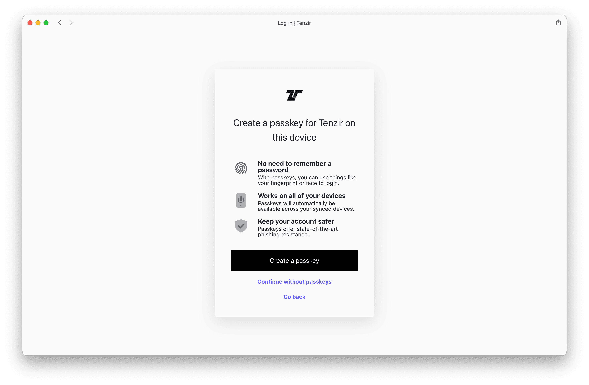

import { Steps } from '@astrojs/starlight/components';

The [Tenzir Platform](https://app.tenzir.com) is a web interface for managing
pipelines and nodes. Create an account to get started:

:::tip[Prefer the command line?]
You don't need an account to run pipelines locally. See [Install
Tenzir](/guides/installation) to get started with the CLI.
:::

<Steps>

1. Go to [app.tenzir.com](https://app.tenzir.com).
   

2. Log in with your identity provider. This creates an account implicitly.
   

3. Can't use an identity provider? Click **Sign up** below the **Continue**
   button. We recommend using a
   [passkey](https://www.passkeys.com/what-are-passkeys.html) as a safer
   alternative to traditional passwords.
   

4. If you created an account with us, you'll receive an email with a link to
   verify your email address. Click the link to complete the registration process.

</Steps>

Congratulations, you now have an account and can can freely use the Tenzir
[Community Edition](https://tenzir.com/pricing).

## Delete an Account

Delete your account as follows:

<Steps>

1. Go to the [Account](https://app.tenzir.com/account) page.
2. Click _Delete Account_.
3. (Optionally) Leave a note explaining why you delete your account.

</Steps>

:::caution
Deleting your account will remove all data about you from our cloud platform.
You will also lose the ability to manage pipelines on your node.
:::

If you decide to come back, just re-create an account as described
above.
