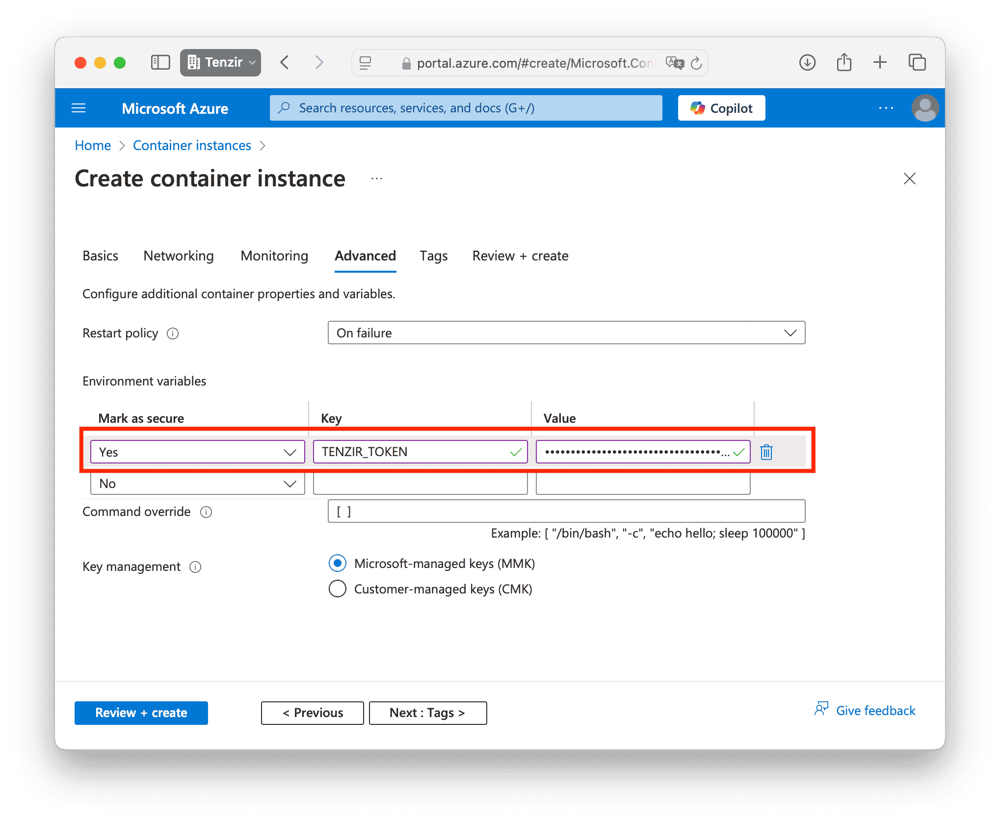

To run a node in Azure, we recommend using [Azure Container Instances
(ACI)](https://azure.microsoft.com/en-us/products/container-instances), which
allows you to run Docker containers without having to setup VMs.

## Azure Container Instances (ACI)

Prior to getting started, you need a valid `TENZIR_TOKEN` that you can obtain
after [provisioning a node](/guides/node-setup/provision-a-node) and downloading the Docker
Compose configuraiton file.

### Create a new container instance

import { Steps } from "@astrojs/starlight/components";

<Steps>

1. Open https://portal.azure.com/.
1. Navigate to the _Container instances_.
1. Click the _Create_ button.

</Steps>

### Basics

In the _Basics_ tab, perform the following action:

<Steps>

1. Choose a container name.
1. For _Image source_, select _Other registry_.
1. For _Image_, enter `tenzir/tenzir-node`.

</Steps>

### Networking

In the _Networking_ tab, configure the ports you plan to use for pipeliens that
receive incoming connections.

### Advanced

In the _Advanced_ tab, enter the `TENZIR_TOKEN` environment variable from your
Docker Compose file.

### Create

Once you've completed the configuration, click the _Create_ button. Your node is
now up and running.
