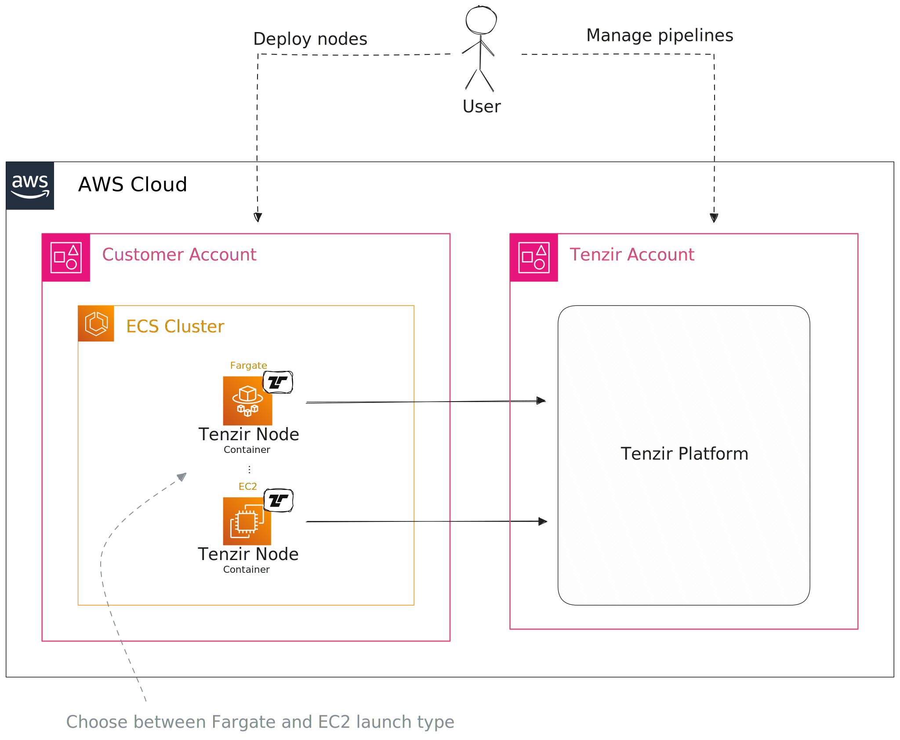
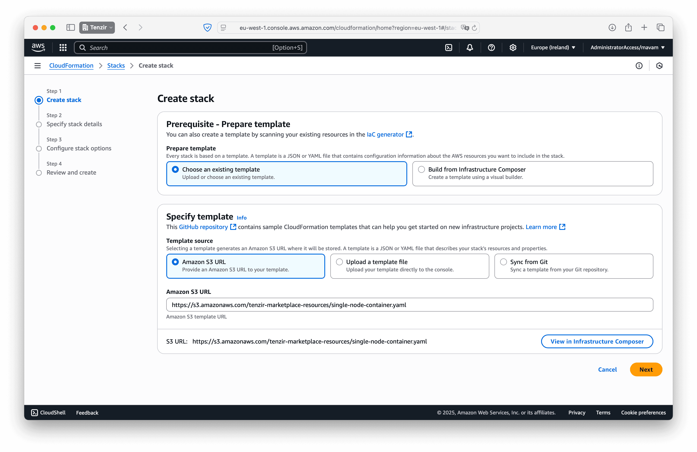
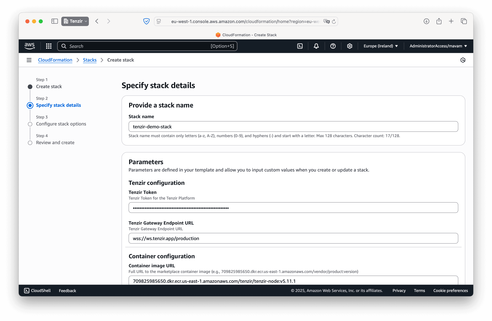
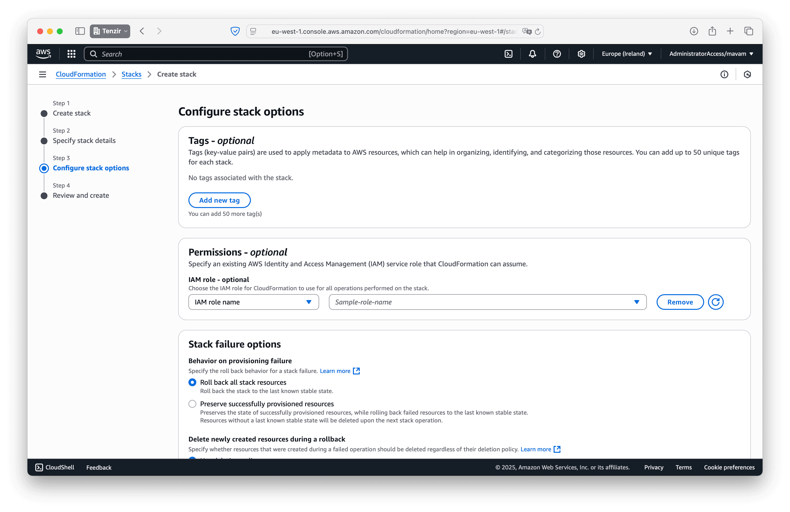
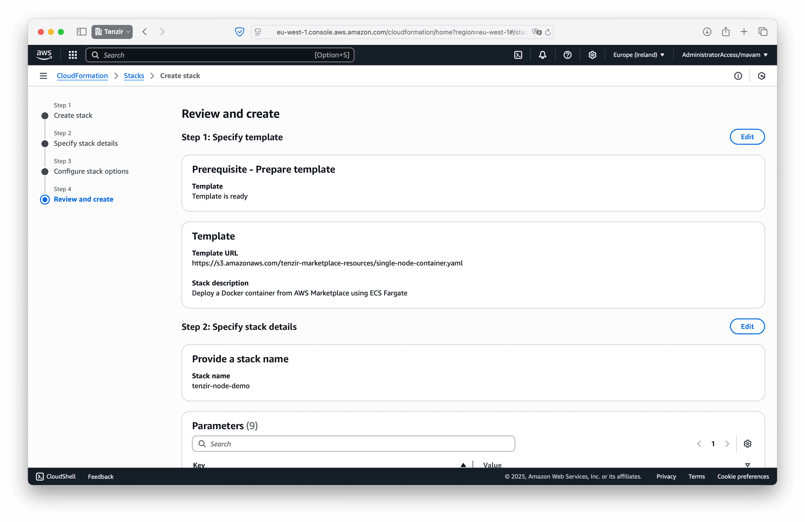

Deploying a node means spinning it up in one of the supported runtimes. The
primary choice is between a containerized with Docker or a native deployment
with our static binary that runs on amd64 and arm64 architectures.

## Docker

We recommend using Docker to deploy a Tenzir node, as it's the easiest way to
get started.

After [provisioning a node](/guides/node-setup/provision-a-node), proceed as
follows:

import { Steps, LinkButton } from "@astrojs/starlight/components";

<Steps>

1. Select the Docker tab and click the download button to obtain the
   `docker-compose.NODE.yaml` configuration file, where `NODE` is the name you
   entered for your node.
2. Run

   ```bash
   docker compose -f docker-compose.NODE.yaml up --detach
   ```

</Steps>

Edit the Docker Compose file and change [environment
variables](/explanations/configuration) to adjust your configuration.

### Stop a node

Stop a node via the `down` command:

```bash
docker compose -f docker-compose.NODE.yaml down
```

Stop a node and delete its persistent state by adding `--volumes`:

```bash
docker compose -f docker-compose.NODE.yaml down --volumes
```

### Update a node

Run the following commands to update a Docker Compose deployment with a
configuration file `docker-compose.NODE.yaml`:

```bash
docker compose -f docker-compose.NODE.yaml pull
docker compose -f docker-compose.NODE.yaml down
docker compose -f docker-compose.NODE.yaml up --detach
```

Note that we `pull` first so that the subsequent downtime between `down` and
`up` is minimal.

## Linux

We offer a static binary package on various Linux distributions.

### Install a node

Second, choose the Linux tab and proceed as follows:

<Steps>

1. [Provision the node](/guides/node-setup/provision-a-node) and download its config.
2. Create a directory for the platform configuration.

   ```bash
   mkdir -p /opt/tenzir/etc/tenzir/plugin
   ```

3. Move the downloaded `platform.yaml` configuration file to the directory so
   that the node can find it during startup:

   ```bash
   mv platform.yaml /opt/tenzir/etc/tenzir/plugin
   ```

4. Run the installer and follow the instructions to download and start the node:

   ```bash
   curl https://get.tenzir.app | sh
   ```

</Steps>

The installer script asks for confirmation before performing the installation.
If you prefer a manual installation you can also perform the installer steps
yourself. See the [configuration files
documentation](/explanations/configuration) for details on how the node loads
config files at startup.

import { Tabs, TabItem } from "@astrojs/starlight/components";

<Tabs>
<TabItem value="debian" label="Debian">

Download the latest [Debian package][tenzir-debian-package] and install it via
`dpkg`:

```bash
dpkg -i tenzir-static-amd64-linux.deb
```

You can uninstall the Tenzir package via `apt-get remove tenzir`. Use `purge`
instead of `remove` if you also want to delete the state directory and leave no
trace.

[tenzir-debian-package]: https://github.com/tenzir/tenzir/releases/latest/download/tenzir-static-amd64-linux.deb

</TabItem>
<TabItem value="rpm_based" label="RPM-based (RedHat, OpenSUSE, Fedora)">

Download the latest [RPM package][tenzir-rpm-package] and install it via
`rpm`:

```bash
rpm -i tenzir-static-amd64-linux.rpm
```

[tenzir-rpm-package]: https://github.com/tenzir/tenzir/releases/latest/download/tenzir-static-amd64-linux.rpm

</TabItem>
<TabItem value="nix" label="Nix" icon="nix">

Use our `flake.nix` to run an ad-hoc `tenzir` pipeline:

```bash
nix run github:tenzir/tenzir/latest
```

Or run a node without installing:

```bash
nix shell github:tenzir/tenzir/latest -c tenzir-node
```

Install a Tenzir Node by adding `github:tenzir/tenzir/latest` to your flake
inputs, or use your preferred method to include third-party modules on classic
NixOS.

:::note[Pre-built only!]
The default attributes of the flake contain some closed source plugins and will
fail to download locally. The flake is only for public consumption together with
the [Tenzir cachix cache](https://tenzir.cachix.org).
:::

</TabItem>
<TabItem value="any" label="Any" icon="linux">

Download a tarball with our [static binary][tenzir-tarball] for all Linux
distributions and unpack it into `/opt/tenzir`:

```bash
tar xzf tenzir-static-x86_64-linux.tar.gz -C /
```

[tenzir-tarball]: https://github.com/tenzir/tenzir/releases/latest/download/tenzir-static-x86_64-linux.tar.gz

We also offer prebuilt statically linked binaries for every Git commit to the
`main` branch.

```bash
curl -O https://storage.googleapis.com/tenzir-dist-public/packages/main/tarball/tenzir-static-main.gz
```

</TabItem>
</Tabs>

### Start a node manually

The installer script uses the package manager of your Linux distribution to
install the Tenzir package. This typically also creates a
[systemd](https://systemd.io) unit and starts the node automatically.

For testing, development, our troubleshooting, run the `tenzir-node` executable
to start a node manually:

```bash
tenzir-node
```

```
      _____ _____ _   _ ________ ____
     |_   _| ____| \ | |__  /_ _|  _ \
       | | |  _| |  \| | / / | || |_) |
       | | | |___| |\  |/ /_ | ||  _ <
       |_| |_____|_| \_/____|___|_| \_\

          v4.0.0-rc6-0-gf193b51f1f
Visit https://app.tenzir.com to get started.

[16:50:26.741] node listens for node-to-node connections on tcp://127.0.0.1:5158
[16:50:26.982] node connected to platform via wss://ws.tenzir.app:443/production
```

### Stop a node

There exist two ways stop a server:

<Steps>

1. Hit CTRL+C in the same TTY where you ran `tenzir-node`.
2. Send the process a SIGINT or SIGTERM signal, e.g., via
   `pkill -2 tenzir-node`.

</Steps>

Hitting CTRL+C is equivalent to manually sending a SIGTERM signal.

## AWS

The recommended way to run a Tenzir node in AWS is with [Elastic Container Service
(ECS)](https://aws.amazon.com/ecs/). The diagram below shows the high-level
architecture of an AWS deployment.

:::note[Prerequisites]
Before you begin, you'll need a valid `TENZIR_TOKEN` for your node. Obtain one by
[provisioning a node](/guides/node-setup/provision-a-node), select the
_other_ tab, and click on the text box to copy the shown token.
:::



You can deploy a Tenzir node using either
[CloudFormation](https://aws.amazon.com/cloudformation/) for automated setup or
manually through the AWS console. Both methods support deploying as many nodes
as you need.

### Subscribe to Tenzir Node on AWS Marketplace

Before deploying with either method, you need to subscribe to the Tenzir Node product:

<Steps>

1. Go to [AWS Marketplace](https://console.aws.amazon.com/marketplace/) and
   subscribe to the free [Tenzir
   Node](https://console.aws.amazon.com/marketplace/search/listing/prodview-gsofc3z6f3vsu)
   product.

   

2. Accept the terms to subscribe to the offering.

   

</Steps>

### Choose your deployment method

<Tabs> <TabItem value="cloudformation" label="CloudFormation">

Deploy a Tenzir node using our CloudFormation template for automated setup. Click the button below to launch the CloudFormation console with our template pre-loaded:

<LinkButton href="https://console.aws.amazon.com/cloudformation/home?#/stacks/create?templateURL=https://s3.amazonaws.com/tenzir-marketplace-resources/single-node-container.yaml" variant="primary" icon="rocket">Launch CloudFormation Stack</LinkButton>

After clicking the button above, follow these steps in the AWS console:

<Steps>

1. **Review the pre-filled template**: The CloudFormation console will open with
   our single-node container template already loaded:

   

2. **Configure your stack**:
   - **Stack name**: Choose a unique name for your stack (e.g.,
     `tenzir-node-prod`)
   - **Parameters**: Enter your `TENZIR_TOKEN` in the provided field

   Double-check that the container image URL points to the Tenzir Node version
   you want to deploy.

   

3. **Accept the default stack options**: For most deployments, the defaults work
   perfectly:

   

4. **Review and acknowledge**: Confirm your configuration and check the
   acknowledgment box:

   

5. **Deploy your node**: Click _Submit_ to start the deployment. Monitor
   progress in the _Events_ tab.

6. **Wait for connection**: Your node will automatically connect to your
   workspace once the stack creation completes (typically 2-3 minutes).

</Steps>

:::tip[Stack Management]
You can update your node by updating the CloudFormation stack with new
parameters. To remove the node and all associated resources,
simply delete the stack.
:::

</TabItem>
<TabItem value="manual" label="Manual">

Follow these steps for manual deployment through the AWS console:

<Steps>

1. Navigate to [Amazon Elastic Container Service (ECS)](https://console.aws.amazon.com/ecs).

   

2. Create a new cluster. Choose between **EC2** or **Fargate** based on your
   needs:
   - **EC2 clusters** give you full control over the underlying instances.
     They're ideal for long-running workloads with consistent resource
     requirements.
   - **Fargate clusters** provide serverless container execution where you pay
     only for the resources you use. They're cost-effective for workloads with
     variable demand.

   

3. Create a task definition to specify how the Tenzir node container should run.

   

   In the _Containers_ section, enter the repository URL from your AWS
   Marketplace subscription:

   ```
   709825985650.dkr.ecr.us-east-1.amazonaws.com/tenzir/tenzir-node:v5.9.0
   ```

   Each node version has its own image tag. The example above uses version
   5.9.0. Check the [node changelog](/changelog/node/) for the latest version.

4. Return to your cluster, navigate to the _Tasks_ tab, and click _Run new
   task_. Select the task definition you just created.

   

   In the _Container overrides_ section, add the `TENZIR_TOKEN` environment
   variable with the token value corresponding to your node.

   

   Click _Create_ to launch your node.

5. Once the container starts successfully, your node will automatically connect
   to your workspace.

</Steps>

</TabItem>
</Tabs>

## Azure

To run a node in Azure, we recommend using [Azure Container Instances
(ACI)](https://azure.microsoft.com/en-us/products/container-instances), which
allows you to run Docker containers without having to setup VMs.

:::note[Prerequisites]
Before you begin, you'll need a valid `TENZIR_TOKEN` for your node. Obtain one by
[provisioning a node](/guides/node-setup/provision-a-node), select the
_other_ tab, and click on the text box to copy the shown token.
:::

### Azure Container Instances (ACI)

The following steps guide you through deploying a Tenzir Node using ACI.

#### Create a new container instance

<Steps>

1. Open [portal.azure.com](https://portal.azure.com/).
2. Navigate to the _Container instances_.
3. Click the _Create_ button.

</Steps>

#### Basics

In the _Basics_ tab, perform the following action:

<Steps>

1. Choose a container name.
2. For _Image source_, select _Other registry_.
3. For _Image_, enter `tenzir/tenzir-node`.

</Steps>


#### Networking

In the _Networking_ tab, configure the ports you plan to use for pipelines that
receive incoming connections.


#### Advanced

In the _Advanced_ tab, enter the `TENZIR_TOKEN` environment variable from your
Docker Compose file.


#### Create

Once you've completed the configuration, click the _Create_ button. Your node is
now up and running.

## macOS

Looking for a native macOS package? We're not quite there yet—but you can still
run Tenzir smoothly on macOS using [Docker](/guides/node-setup/deploy-a-node#docker).

Want to see a native macOS build? Let us know! Drop your vote in our
[Discord community](/discord)—we prioritize what our users need most.

Tenzir _does_ run well on macOS under the hood. Docker just bridges the gap for
now.

## Ansible

The Ansible role for Tenzir allows for easy integration of Tenzir into
existing Ansible setups. The role uses either the Tenzir Debian package or
the tarball installation method depending on which is appropriate for the
target environment. The role definition is in the
[`ansible/roles/tenzir`][tenzir-repo-ansible] directory of the Tenzir
repository. You need a local copy of this directory so you can use it in your
playbook.

[tenzir-repo-ansible]: https://github.com/tenzir/tenzir/tree/main/ansible/roles/tenzir

### Example

This example playbook shows how to run a Tenzir service on the machine
`example_tenzir_server`:

```yaml
- name: Deploy Tenzir
  become: true
  hosts: example_tenzir_server
  remote_user: example_ansible_user
  roles:
    - role: tenzir
      vars:
        tenzir_config_dir: ./tenzir
        tenzir_read_write_paths: [/tmp]
        tenzir_archive: ./tenzir.tar.gz
        tenzir_debian_package: ./tenzir.deb
```

### Variables

#### `tenzir_config_dir` (required)

A path to directory containing a [`tenzir.yaml`](/reference/node/configuration)
relative to the playbook.

#### `tenzir_read_write_paths`

A list of paths that Tenzir shall be granted access to in addition to its own
state and log directories.

#### `tenzir_archive`

A tarball of Tenzir structured like those that can be downloaded from the
[GitHub Releases Page](https://github.com/tenzir/tenzir/releases). This is used
for target distributions that are not based on the `apt` package manager.

#### `tenzir_debian_package`

A Debian package (`.deb`). This package is used for Debian and Debian-based
Linux distributions.
