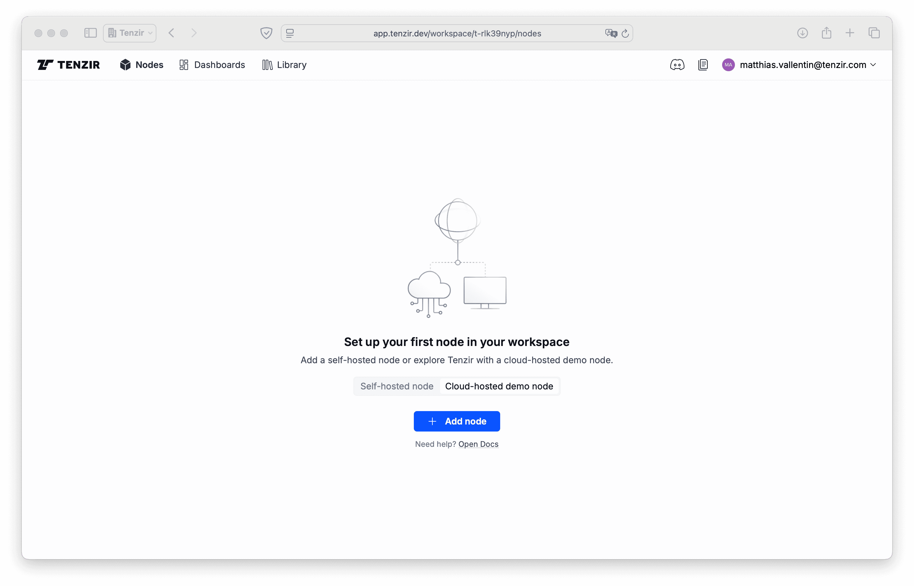

import { Steps } from "@astrojs/starlight/components";

Provisioning a node means creating one in the
[platform](/explanations/architecture/platform) in your workspace. After
provisioning, you can download configuration file with an authentication
token—ready to then deploy the node.

When you start out with a new Tenzir account, you have an empty workspace
without any nodes:

You have two options: either provision a self-hosted node or play with a
cloud-hosted demo with a lifetime of 2 hours.

## Cloud-hosted Demo Node

Provision a cloud-hosted demo node by following these steps:

<Steps>

1. Click **Cloud-hosted demo-node**.
2. Click **Add node**.
3. Click **Get Started**.

</Steps>

🙌 You're good to go. It takes up to 2 minutes for your node to be usable. Upon
provisioning, the documentation pops in automatically so that you can
familiarize yourself with key concepts in the meantime.

## Self-hosted Node

Provision a self-hosted node by following these steps:

<Steps>

1. Click **Self-hosted node**.
2. Click **Add node**.
3. Enter a name for your node.
4. Click **Add node**.

</Steps>

🚢 Your node is ready to be deployed. The easiest way to continue is by spinning
up a node with [Docker](/guides/node-setup/deploy-a-node#docker).

:::tip[Ephemeral Nodes]
Instead of provisioning a node as a above, with a dedicated authentication
token, you can also [configure a workspace-wide
token](/guides/platform-management/use-ephemeral-nodes). Nodes that use this
token are _ephemeral_, i.e., not explicitly managed by the platform and will
vanish once they disconnect.
:::
