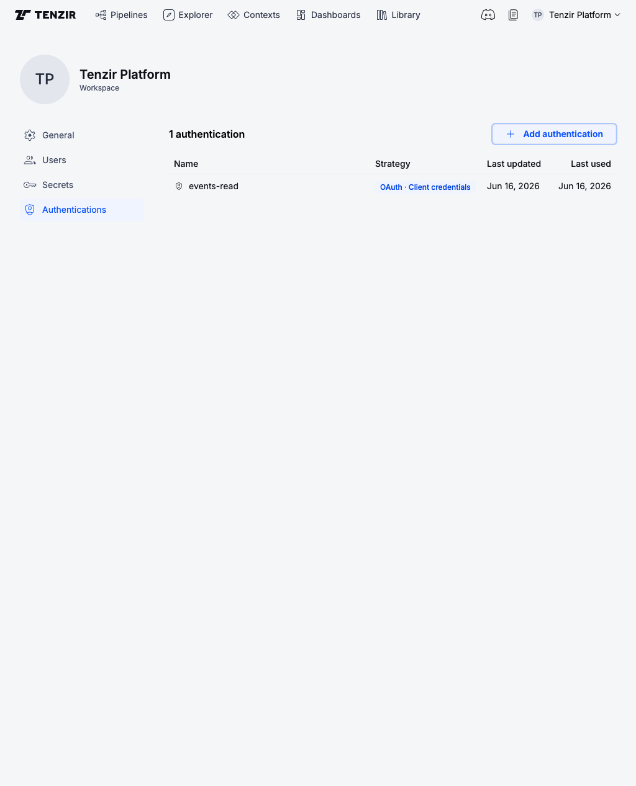
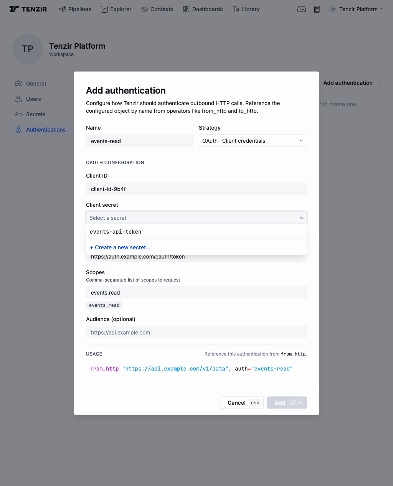

This guide shows you how to configure named HTTP authentication recipes in the
Tenzir Platform so that pipeline operators like <Op>from_http</Op> and
<Op>to_http</Op> can authenticate outbound requests by name. Each
authentication combines a non-secret configuration (client IDs, token URLs,
scopes, headers) with references to one or more workspace secrets, which the
connected Tenzir Nodes resolve at runtime.

For background on how secret values are stored and resolved, see the
[Secrets explanations page](/explanations/secrets).

:::caution[Built-in secret store required]
Authentications currently require the workspace to use the platform's built-in
secret store. Workspaces whose default store is AWS Secrets Manager or
HashiCorp Vault can't create authentications yet.
:::

## Add an authentication

Open the workspace settings by clicking the gear icon in the workspace
selector, then switch to the **Authentications** tab:



Click **Add authentication** and pick one of the supported strategies:

| Strategy                       | Public configuration                  | Secret reference |
| ------------------------------ | ------------------------------------- | ---------------- |
| **OAuth · client credentials** | client ID, token URL, scopes, audience | client secret    |
| **Basic auth**                 | username                              | password         |
| **API key**                    | header name (defaults to `X-Api-Key`) | API key value    |
| **Bearer token**               | none                                  | token            |

For the secret field, pick an existing workspace secret from the picker rather
than typing a value. The picker also offers an inline
**+ Create a new secret…** entry that opens the secret modal and binds the
new entry to the field after you save it.



## Use an authentication in a pipeline

After you save the authentication, reference it by name from a pipeline
operator:

```tql
from_http "https://api.example.com/v1/data", auth="events-read"
```

When the operator runs, the node resolves the name in two places, in order:
first under [`tenzir.auth`](/reference/node/configuration) in the local
`tenzir.yaml`, then in the connected platform's authentication store. The
first match wins. The node resolves the referenced secret through the same
encrypted channel it uses for standalone secrets, then applies the
strategy-specific headers (`Authorization: Bearer …`,
`Authorization: Basic …`, a custom header for API keys, or an OAuth token-fetch
loop for client credentials).

## Edit or rotate an authentication

In edit mode you can only change the secret reference. The non-secret fields
and the strategy are locked, because nodes cache them per `(workspace, name)`
until they restart. Changing those fields without a restart would leave the
node out of sync with the platform's view of the authentication.

You have two safe ways to rotate a credential:

- **Replace the secret value in place.** Update the referenced secret in
  **Settings > Secrets** (same name, new value). Nodes pick up the new value
  on the next pipeline run without an authentication edit.
- **Rebind the authentication to a different secret.** Open the authentication
  in edit mode and pick a different workspace secret in the picker.

## Recover from a missing secret

If you delete a secret that an authentication still references, the platform
keeps the authentication and flags the list row with a **missing secret**
warning. The picker shows the same warning in edit mode. To clear it, bind the
authentication to an existing secret or create a new secret inline.

## See Also

- <Op>from_http</Op>
- <Op>to_http</Op>
- <Explanation>secrets</Explanation>
- <Guide>platform-setup/configure-secret-store</Guide>
