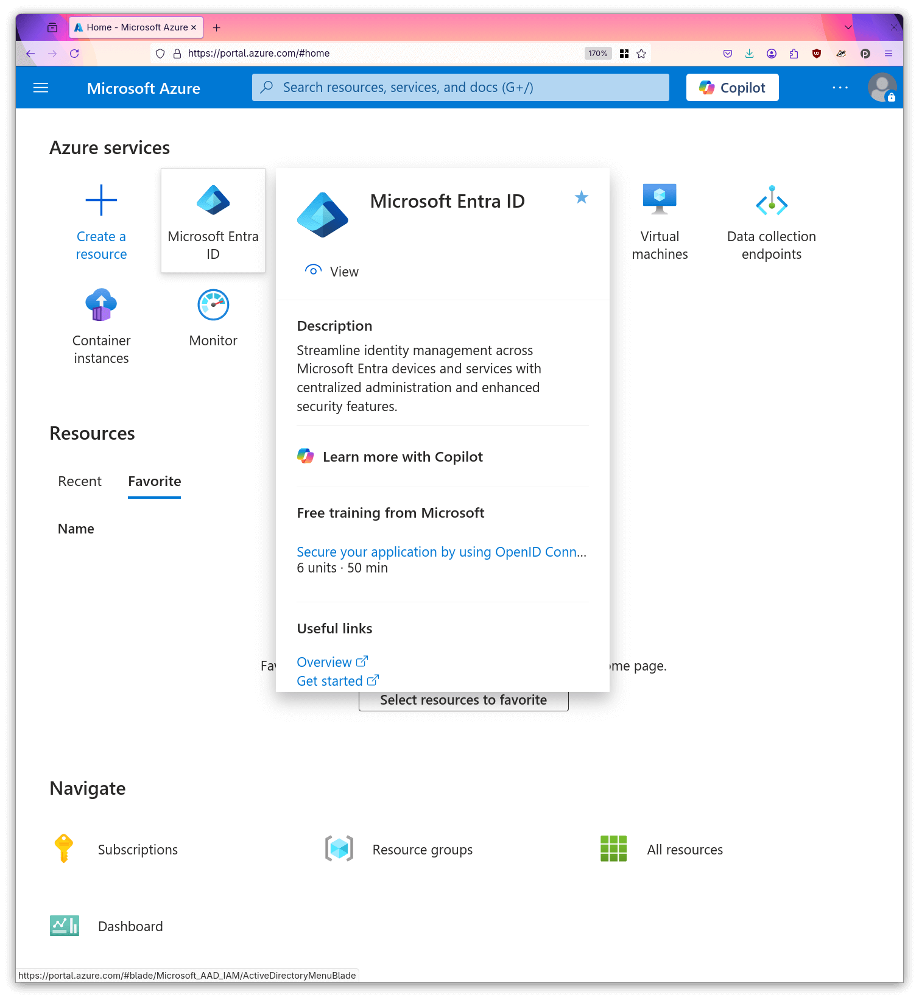
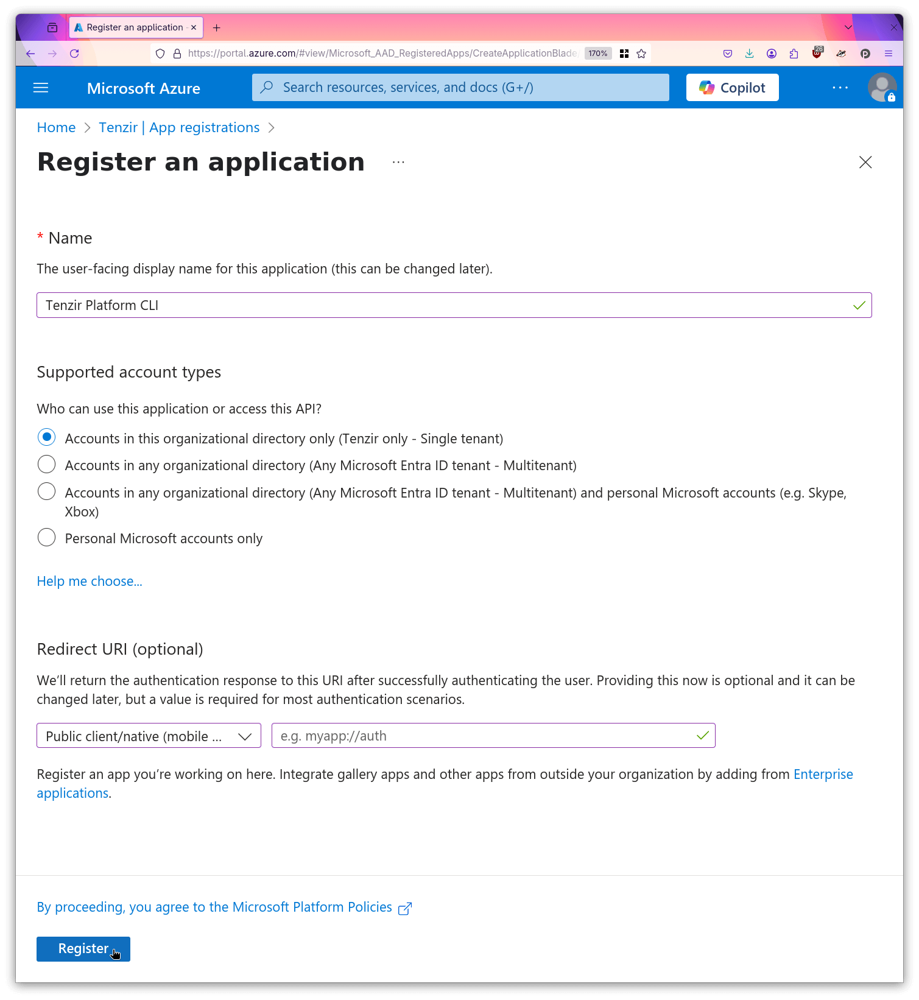
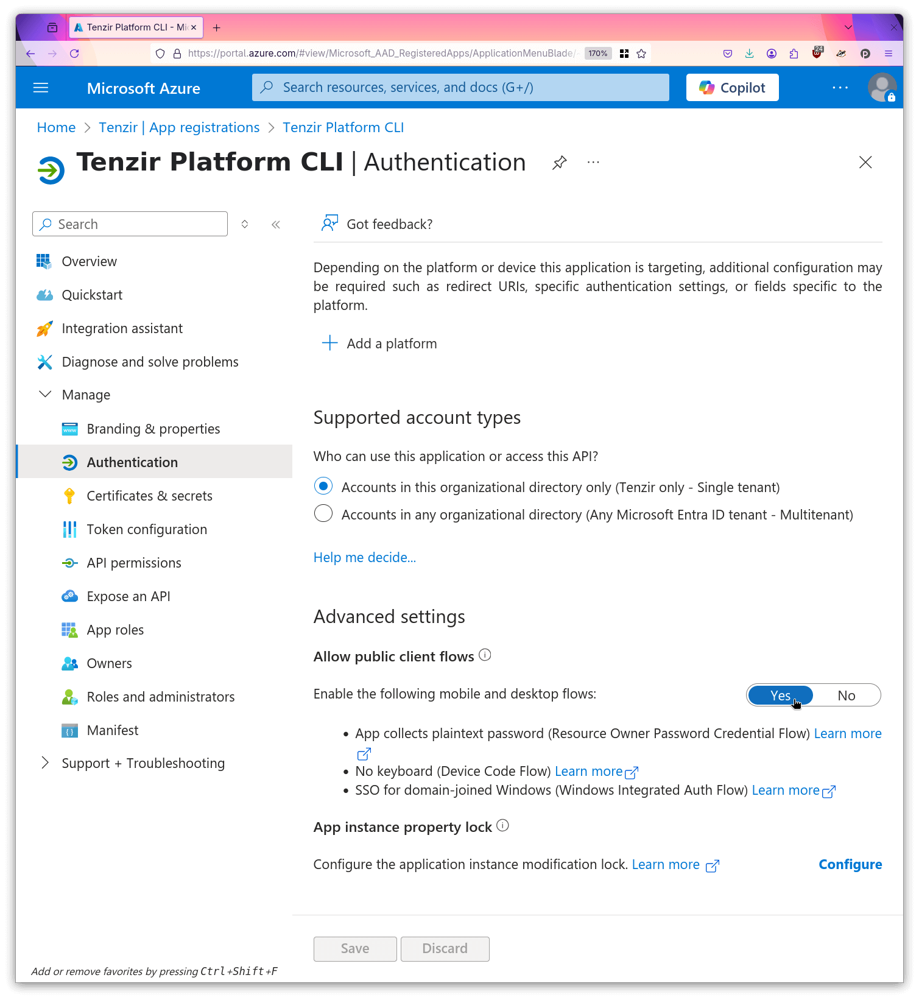
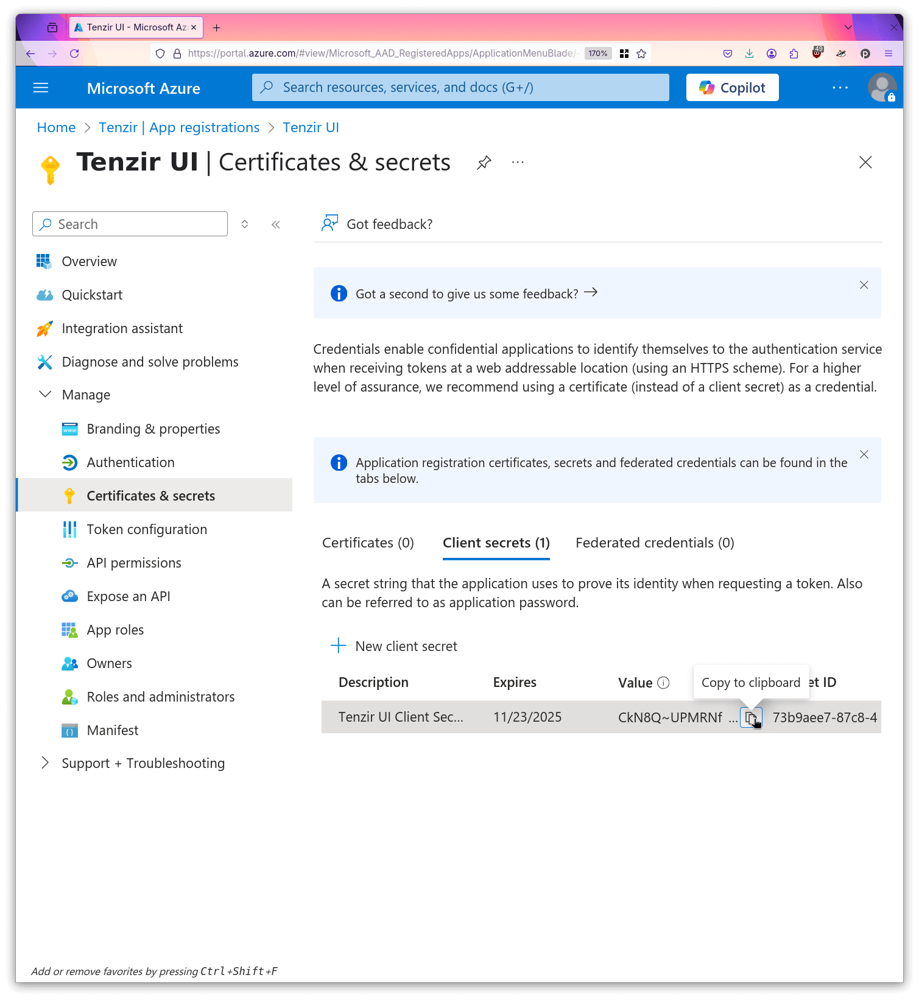
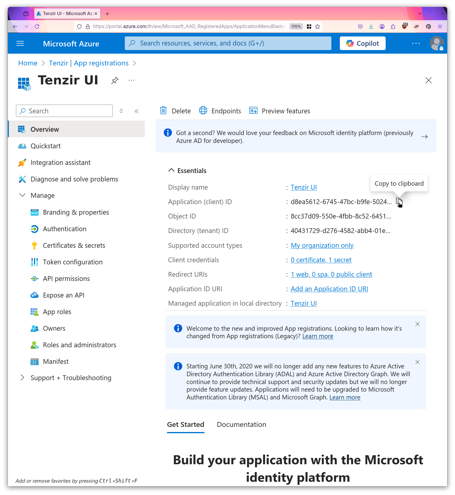
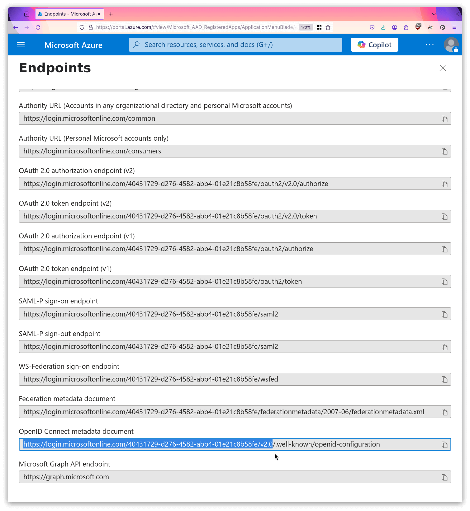

To use an external identity provider (IdP), ensure it supports the OIDC
protocol, including the OIDC Discovery extension, and configure it to provide
valid RS256 ID tokens.

Set up the external identity provider by creating two clients (also called
Applications in Auth0 or App Registrations in Microsoft Entra) named
`tenzir-app` and `tenzir-cli`.

The `tenzir-app` client is used for logging into the Tenzir Platform in the web
browser.

- The **Authorization Code** flow must be enabled.
- The allowed redirect URLs must include
  `https://app.platform.example/login/oauth/callback`.
- The client secret should be noted down so it can be added to the configuration
  of the Tenzir Platform in the next step.

The `tenzir-cli` client is used to authenticate with the `tenzir-platform` CLI.

- The **Device Code** flow must be enabled.
- If the identity provider does not return an `id_token` for the device code
  flow, then the returned `access_token` must be in JWT format.

You may want to to run CLI commands in environments where no user
is available to perform the device code authorization flow, for example
when running CLI commands as part of a CI job.

In this case, you can set up another client with the **Client Credentials** flow
enabled. The `access_token` obtained from this client must be in JWT format. The
CLI can make use of the client credentials flow by using the `tenzir-platform
auth login --non-interactive` option.

You must provide the following environment variables for the OIDC provider
configuration used for logging into the platform:

```sh
TENZIR_PLATFORM_OIDC_PROVIDER_NAME=example-idp
TENZIR_PLATFORM_OIDC_PROVIDER_ISSUER_URL=https://my.idp.example

TENZIR_PLATFORM_OIDC_CLI_CLIENT_ID=tenzir-cli

TENZIR_PLATFORM_OIDC_APP_CLIENT_ID=tenzir-app
TENZIR_PLATFORM_OIDC_APP_CLIENT_SECRET=xxxxxxxxxxxxxxxxxxxxxxxx
```

You must provide the following environment variable containing a JSON object
with the OIDC issuer and audiences that should be accepted by the
platform.

```sh
TENZIR_PLATFORM_OIDC_TRUSTED_AUDIENCES='{"https://my.idp.example": ["tenzir-cli", "tenzir-app"]}'
```

You must configure the set of `admin` users in your platform instance. An admin
user is a user who is permitted to run the `tenzir-platform admin` CLI command.

The `TENZIR_PLATFORM_OIDC_ADMIN_RULES` setting contains a JSON list of access
rules that determine who is considered an admin for this platform instance. If
any of the provided rules match, the user is considered to be an admin. The
example rule grants admin access to all users with a valid and signed `id_token`
containing the fields `{"tenzir/org": "TenzirPlatformAdmins"}`.

```sh
TENZIR_PLATFORM_OIDC_ADMIN_RULES='[{"organization_claim": "tenzir/org", "organization": "TenzirPlatformAdmins", "auth_fn": "auth_organization"}]'
```

See the documentation on [Access Rules](/platform-cli#configure-access-rules)
for more information about the possible types of rules and their syntax. Use the
`-d` option of the CLI to generate valid JSON objects that you can enter here.

## Keycloak

:::caution[WIP]
This section still needs to be written.
:::

## Microsoft Entra Identity

### Connect the Tenzir Platform to Microsoft Entra Identity

To use Entra as an OIDC provider, you need to create two App registrations in Entra ID and configure them to use with the Tenzir UI and the Tenzir Platform CLI.
Follow these steps to create the required resources:

1. Navigate to `portal.azure.com` and open the page for "Microsoft Entra ID".



2. Open the "App registrations" sub page.


3. Create a new registration named `Tenzir Platform CLI`.



4. Enable the public client flows for this app.



5. Create a second registration named `Tenzir UI`.


6. For this registration, open "Ceritificates & Secrets".


7. Create a new secret and give it a descriptive name.


8. Make a local copy of the secret value.



9. Copy the client id to your local machine.



9. Copy the issuer url to your local machine.




Now you can supply the created resources and values to the stack by setting editing the `.env` file in your compose folder:

```sh
TENZIR_PLATFORM_LOGIN_ENDPOINT=https://login.microsoftonline.com/40431729-d276-4582-abb4-01e21c8b58fe/v2.0
TENZIR_PLATFORM_OIDC_PROVIDER_ISSUER_URL=https://login.microsoftonline.com/40431729-d276-4582-abb4-01e21c8b58fe/v2.0

TENZIR_PLATFORM_OIDC_PROVIDER_NAME="Entra ID"
TENZIR_PLATFORM_OIDC_TRUSTED_AUDIENCES='{"issuer": "https://login.microsoftonline.com/40431729-d276-4582-abb4-01e21c8b58fe/v2.0","audiences": ["d8ea5612-6745-47bc-b9fe-5024b1ca18fe"]}'
TENZIR_PLATFORM_OIDC_ADMIN_RULES='[{"auth_fn":"auth_user","user_id":"00000000-0000-0000-0000-000000000000"}]'

TENZIR_PLATFORM_OIDC_CLI_CLIENT_ID=082a9391-b645-4278-a16e-3cf54fb1bcf0
TENZIR_PLATFORM_OIDC_APP_CLIENT_ID=d8ea5612-6745-47bc-b9fe-5024b1ca18fe
TENZIR_PLATFORM_OIDC_APP_CLIENT_SECRET=xxxxxxxxxxxxxxxxxxxxxxxxxxxxxxxxxxxxxxxx
```

Now you can restart your Tenzir Platform stack and you will be redirected to a Microsoft login page when you next login to the Tenzir UI.
