To use an external identity provider (IdP), ensure it supports the OIDC
protocol, including the OIDC Discovery extension, and configure it to provide
valid RS256 ID tokens.

Set up the external identity provider by creating two clients (also called
Applications in Auth0 or App Registrations in Microsoft Entra) named
`tenzir-app` and `tenzir-cli`.

The `tenzir-app` client is used for logging into the Tenzir Platform in the web
browser.

- The **Authorization Code** flow must be enabled.
- The allowed redirect URLs must include
  `https://app.platform.example/login/oauth/callback`.
- The client secret should be noted down so it can be added to the configuration
  of the Tenzir Platform in the next step.

The `tenzir-cli` client is used to authenticate with the `tenzir-platform` CLI.

- The **Device Code** flow must be enabled.
- The identity provider must either return an `id_token` for the device code
  flow, or an `access_token` in JWT format.

You may want to to run CLI commands in environments where no user
is available to perform the device code authorization flow, for example
when running CLI commands as part of a CI job.

In this case, you can set up another client with the **Client Credentials** flow
enabled. The `access_token` obtained from this client must be in JWT format. The
CLI will automatically attempt to use the client credentials flow if
the `TENZIR_PLATFORM_CLI_CLIENT_SECRET` environment variable is set. You can
also force the use of the client credentials flow by using the
`tenzir-platform auth login --non-interactive` option.

You must provide the following environment variables for the OIDC provider
configuration used for logging into the platform:

```sh
TENZIR_PLATFORM_OIDC_PROVIDER_NAME=example-idp
TENZIR_PLATFORM_OIDC_PROVIDER_ISSUER_URL=https://my.idp.example

TENZIR_PLATFORM_OIDC_CLI_CLIENT_ID=tenzir-cli

TENZIR_PLATFORM_OIDC_APP_CLIENT_ID=tenzir-app
TENZIR_PLATFORM_OIDC_APP_CLIENT_SECRET=xxxxxxxxxxxxxxxxxxxxxxxx
```

You must provide the following environment variable containing a JSON object
with the OIDC issuer and audiences that should be accepted by the
platform.

```sh
TENZIR_PLATFORM_OIDC_TRUSTED_AUDIENCES='{"https://my.idp.example": ["tenzir-cli", "tenzir-app"]}'
```

You must configure the set of `admin` users in your platform instance. An admin
user is a user who is permitted to run the `tenzir-platform admin` CLI command.

The `TENZIR_PLATFORM_OIDC_ADMIN_RULES` setting contains a JSON list of access
rules that determine who is considered an admin for this platform instance. If
any of the provided rules match, the user is considered to be an admin. The
example rule grants admin access to all users with a valid and signed `id_token`
containing the fields `{"tenzir/org": "TenzirPlatformAdmins"}`.

```sh
TENZIR_PLATFORM_OIDC_ADMIN_RULES='[{"organization_claim": "tenzir/org", "organization": "TenzirPlatformAdmins", "auth_fn": "auth_organization"}]'
```

See the documentation on [Access Rules](/reference/platform-cli#configure-access-rules)
for more information about the possible types of rules and their syntax. Use the
`tenzir-platform tools` subcommand of the CLI to generate valid JSON objects that
you can enter here.

## Keycloak

This section explains how to configure Keycloak as an external Identity Provider
for use with the Tenzir Platform.

We assume that you already have a Keycloak instance up and running that is
reachable with a browser.
We provide an example stack of the Tenzir Platform with a bundled Keycloak
instance [here](https://github.com/tenzir/platform/tree/main/examples/keycloak).
The remainder of this section assumes you're running this example stack, but
the setup is the same for any other Keycloak instance.

### Setting up the Keycloak Instance

#### Admin Login

Navigate to the Keycloak instance and log in as a user with admin permissions.
If you use the bundled Keycloak instance, the initial username is `admin`
and password is `changeme`.

Remember to change the default password after logging in for the first time,
and to set up 2-factor authentication for your admin user.

#### Create a new `tenzir` realm (optional)

Keycloak defaults to the `master` realm and the bundled Docker Compose
stack is configured to use this realm.

If you want to use a different realm, or already have an existing one,
update the `TENZIR_PLATFORM_OIDC_ISSUER_URL` variable to point to the
new realm instead.

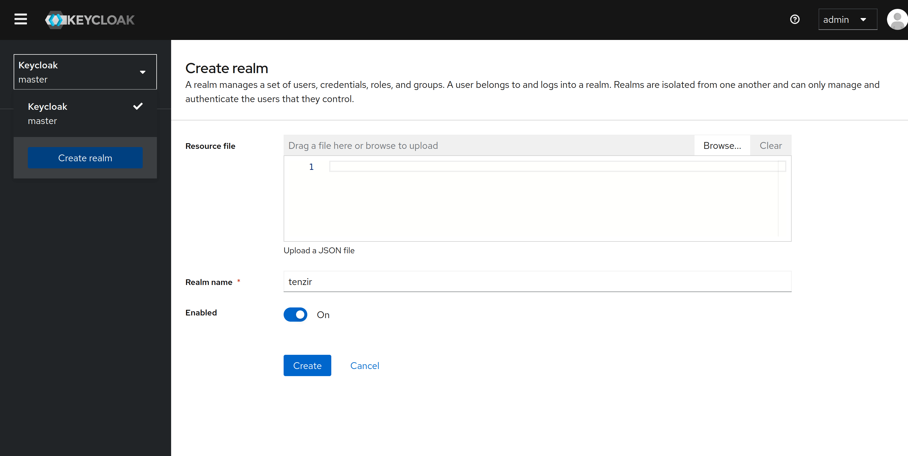

#### Create a Client for the App

Use the `Add Client` button in the `Clients` menu on the left. The new
client should be configured as follows:

Under _General settings_, set the client type to _OpenID Connect_ and the
client id to `tenzir-app`. If you use a different client id,
remember to update the `TENZIR_PLATFORM_OIDC_PROVIDER_CLIENT_ID` variable
in your Tenzir Platform configuration accordingly.

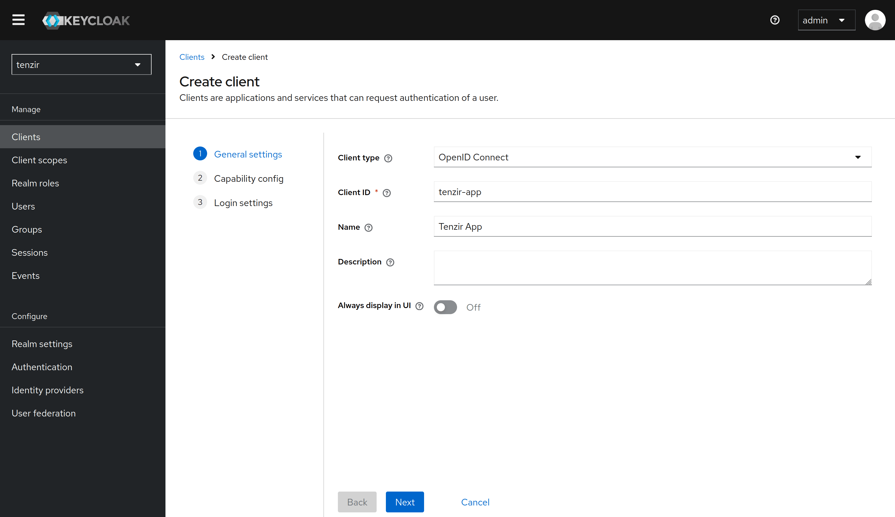

Under _Capability config_, enable client authentication and the _Standard flow_
access method.

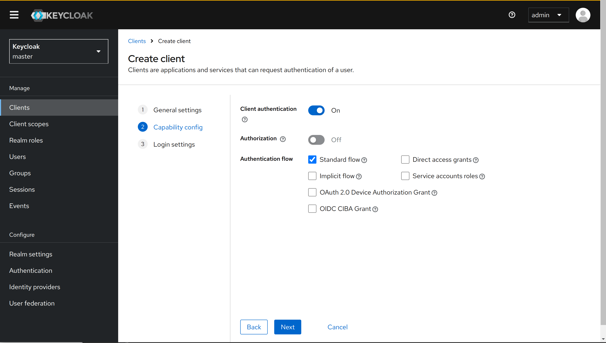

Under _Login settings_, enter a redirect URL that points to `${TENZIR_PLATFORM_DOMAIN}/login/oauth/callback`,
where `TENZIR_PLATFORM_DOMAIN` is the domain that is configured in your Tenzir Platform configuration.
For example, if the app is running under `https://tenzir-app.example.org` then this should be
`https://tenzir-app.example.org/login/oauth/callback`.

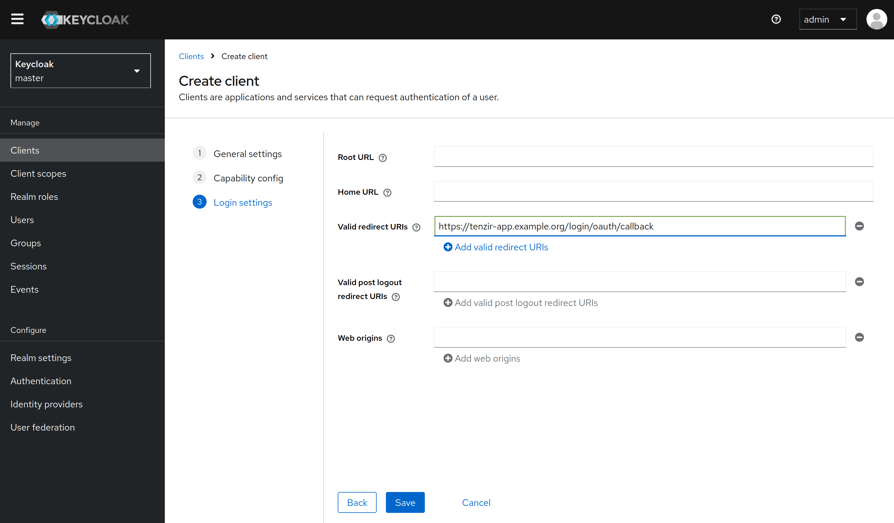

Finally, in the client view, go to the Credentials tab and copy the value of
the generated client secret. This must be added to the Tenzir Platform configuration
under `TENZIR_PLATFORM_OIDC_PROVIDER_CLIENT_SECRET`.

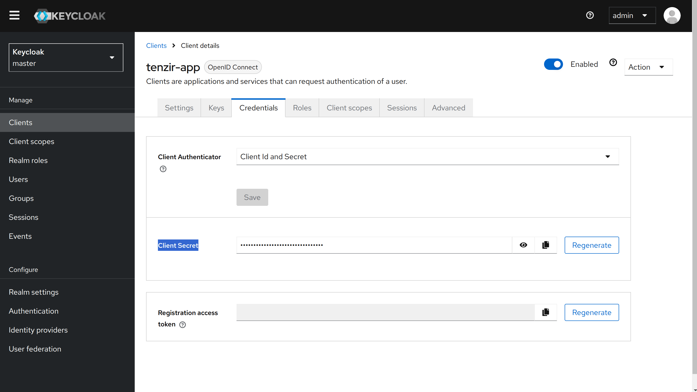

### Create a Client for the CLI

In order to use the `tenzir-platform` CLI we need to set up an additional
client that supports device code authentication. (It is possible but not
recommended to use the same client for both Tenzir UI and Tenzir Platform CLI)

To do this, proceed exactly as above, but use `tenzir-cli` as
the client id and under _Capability config_ disable the _Client authentication_
setting and enable the _OAuth 2.0 Device Authorization Grant_ authentication flow.

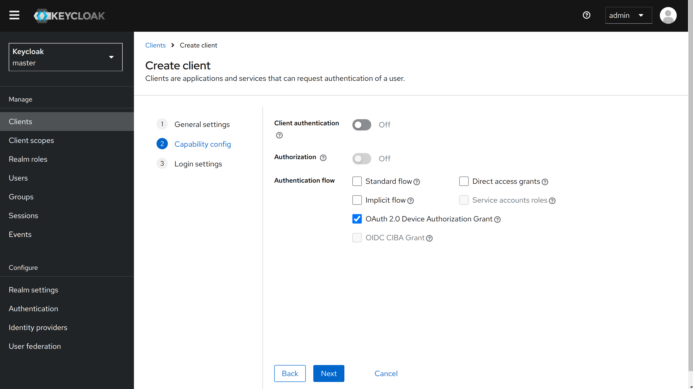

## Microsoft Entra Identity

To use Microsoft Entra Identity as an OIDC provider, you need to create two App
registrations in Entra ID and configure them to use with the Tenzir UI and the
Tenzir Platform CLI.

Follow these steps to create the required resources:

1. Navigate to `portal.azure.com` and open the page for "Microsoft Entra ID".

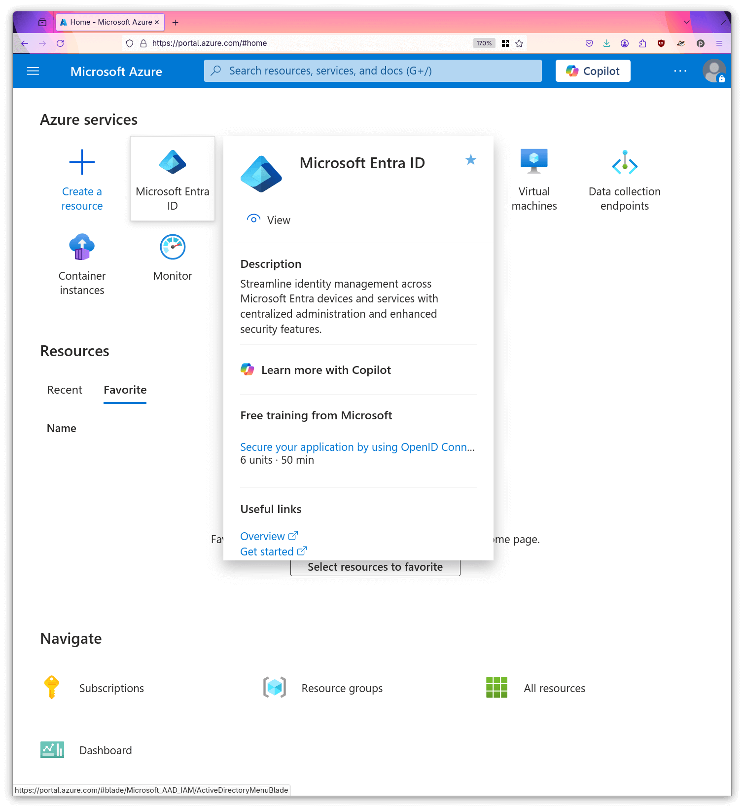

2. Open the "App registrations" sub page.

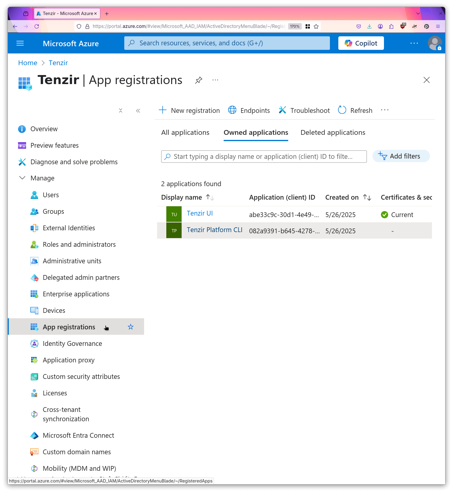

3. Create a new registration named `Tenzir Platform CLI`.

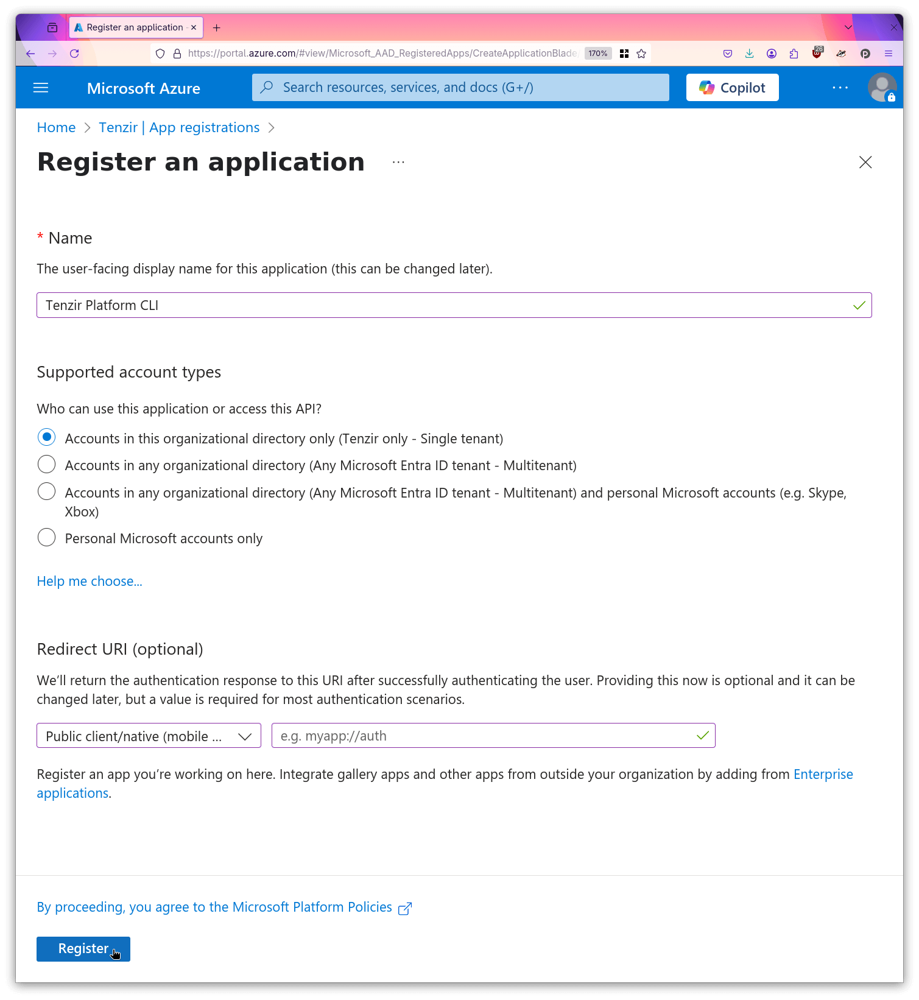

4. Enable the public client flows for this app.

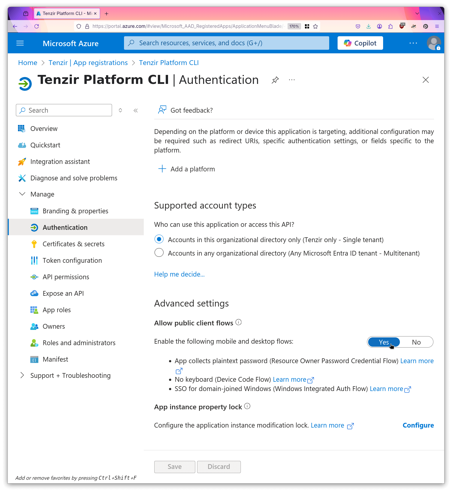

5. Create a second registration named `Tenzir UI`.

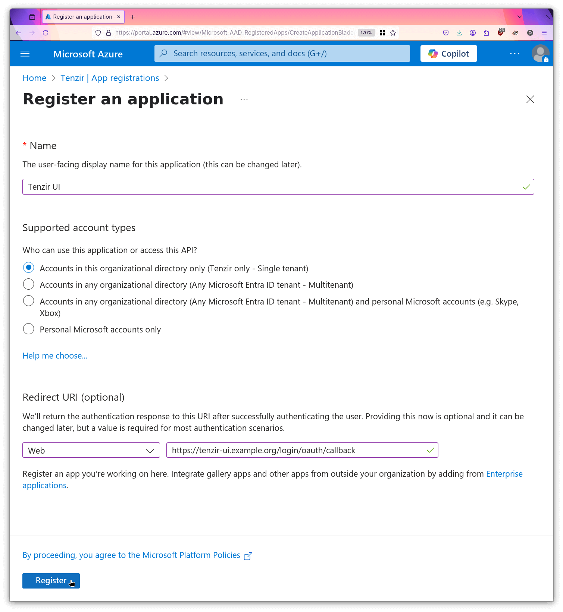

6. For this registration, open "Certificates & Secrets".

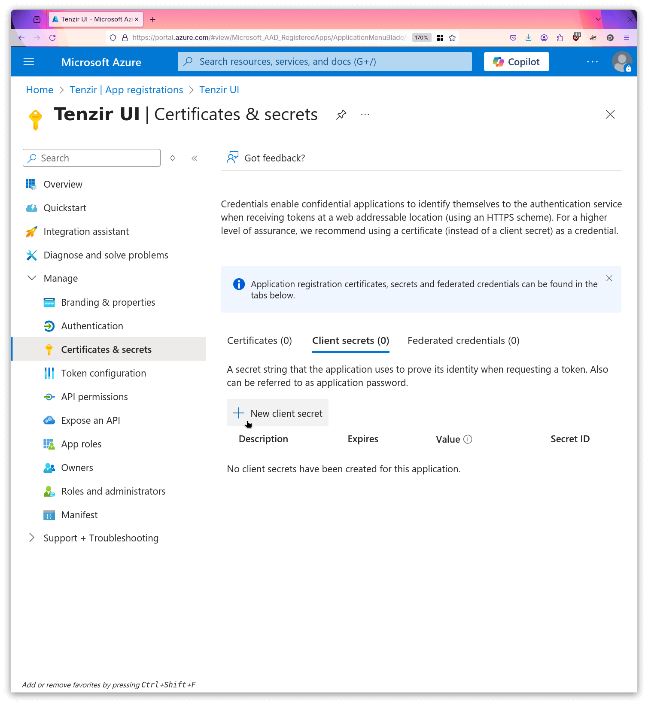

7. Create a new secret and give it a descriptive name.

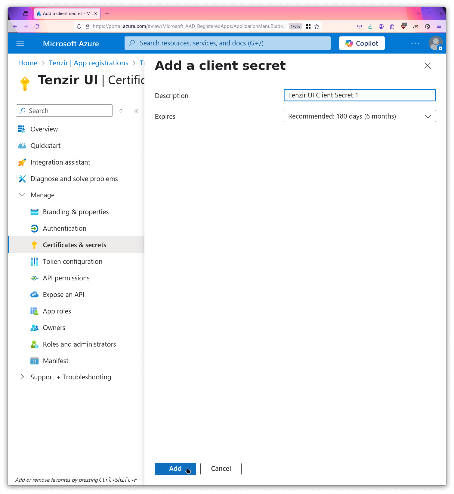

8. Make a local copy of the secret value.


9. Copy the client id to your local machine.


10. Copy the issuer url to your local machine.


Now you can supply the created resources and values to the stack by setting
editing the `.env` file in your compose folder:

```sh
TENZIR_PLATFORM_OIDC_PROVIDER_NAME="Entra ID"

# The client id of the registration created in step 3.
TENZIR_PLATFORM_OIDC_CLI_CLIENT_ID=082a9391-b645-4278-a16e-3cf54fb1bcf0

# The client id and secret created in steps 8 and 9.
TENZIR_PLATFORM_OIDC_APP_CLIENT_SECRET=xxxxxxxxxxxxxxxxxxxxxxxxxxxxxxxxxxxxxxxx
TENZIR_PLATFORM_OIDC_APP_CLIENT_ID=d8ea5612-6745-47bc-b9fe-5024b1ca18fe

# The issuer url copied in step 10.
TENZIR_PLATFORM_OIDC_PROVIDER_ISSUER_URL=https://login.microsoftonline.com/40431729-d276-4582-abb4-01e21c8b58fe/v2.0
TENZIR_PLATFORM_OIDC_TRUSTED_AUDIENCES='{"issuer": "https://login.microsoftonline.com/40431729-d276-4582-abb4-01e21c8b58fe/v2.0","audiences": ["d8ea5612-6745-47bc-b9fe-5024b1ca18fe", "082a9391-b645-4278-a16e-3cf54fb1bcf0"]}'
```

Now you can restart your Tenzir Platform stack and you will be redirected to a Microsoft login page when you next login to the Tenzir UI.

## Advanced Topics

### Custom Scopes

By default, the Tenzir Platform requests the `profile email openid offline_access` scopes
when logging in. To adjust this, set the `PUBLIC_OIDC_SCOPES` environment variable
to a space-separated list of scope names.

### Profile Pictures

To include custom profile pictures, include a `picture` claim in the returned
ID token containing an URL to the image file.

The Tenzir Platform will read that claim and use it as the profile picture in
the top right corner of user interface, or fall back to a default image if the
claim is not present.

### Refresh Tokens

The Tenzir Platform supports the use of refresh tokens and will by default request
the `offline_access` scope to automatically refresh sessions after the initial
id token has expired. To this end, the `offline_access` scope is requested by
default.

Unfortunately, the OIDC spec is ambiguous on the precise semantics of
the `offline_access` scope, and Keycloak's interpretation is different
from most other OIDC providers: It always includes refresh tokens by default,
and adds additional permissions to the token when the `offline_access` scope
is requested.

Therefore, some organizations forbid the use of tokens with `offline_access`
permissions for security reasons. In that case, add an environment variable
`PUBLIC_OIDC_SCOPES=profile email oidc` to the `app` environment in order to explicitly
remove the scope request. The bundled Docker Compose file in this directory does this
by default.
