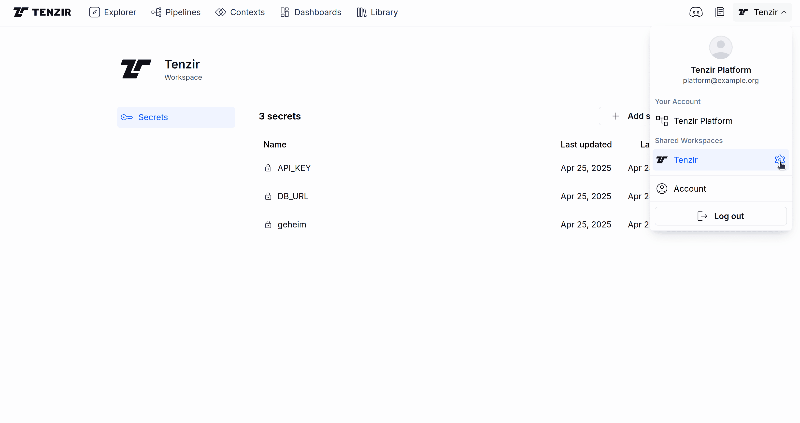

The Tenzir Platform provides a secret store for each workspace. All Tenzir Nodes
connected to the workspace can access its secrets. You can manage secrets using
the CLI or the web interface. Alternatively, you can use an external secret store.

Read more about how secrets work in our [explanations page](/explanations/secrets).

## Configuring the platform secret store

### Managing Secrets via the CLI

To add a new secret to the Platform's secret store:

```sh title="Add value to the Platform's secret store"
tenzir-platform secret add geheim --value=1528F9F3-FAFA-45B4-BC3C-B755D0E0D9C2
```

Refer to the [CLI reference](/reference/platform/command-line-interface#manage-secrets)
for more details on updating or deleting secrets.

### Managing Secrets via Web Interface

To manage secrets from the web interface, go to the `Workspace Settings` screen
by clicking the gear icon in the workspace selector.



## Configuring External Secret Stores

You can configure the Tenzir Platform to provide access to secrets stored in an
external secret store instead of using it own store. This access is read-only.

### AWS Secrets Manager

To add AWS Secrets Manager as an external secret store, use the CLI:

```sh title="Add AWS Secrets Manager as external secret store"
tenzir-platform secret store add aws \
  --region='eu-west-1' \
  --assumed-role-arn='arn:aws:iam::1234567890:role/tenzir-platform-secrets-access' \
  --prefix=tenzir/
```

- The Tenzir Platform must have permissions to read secrets under the specified
  prefix from the external store.
- The platform must be able to assume the specified role in AWS.

See the [CLI reference](/reference/platform/command-line-interface#manage-external-secret-stores)
for more details.

### HashiCorp Vault

To add HashiCorp Vault as an external secret store, use the CLI with either
token or AppRole authentication:

```sh title="Add Vault with token authentication"
tenzir-platform secret store add vault \
  --address=https://vault.example.com:8200 \
  --mount=secret \
  --token=hvs.CAESxxxxxxx
```

```sh title="Add Vault with AppRole authentication"
tenzir-platform secret store add vault \
  --address=https://vault.example.com:8200 \
  --mount=secret \
  --role-id=xxxxxxxx-xxxx-xxxx-xxxx-xxxxxxxxxxxx \
  --secret-id=xxxxxxxx-xxxx-xxxx-xxxx-xxxxxxxxxxxx
```

- The `--mount` parameter specifies the path to a Vault [KV version 2][kv-v2] secrets engine.

[kv-v2]: https://developer.hashicorp.com/vault/docs/secrets/kv/kv-v2

- For Vault Enterprise, use `--namespace` to specify the namespace.
- The Tenzir Platform must have read permissions for secrets under the mount.
- Secrets with multiple keys can be accessed using a `:key` suffix (e.g.,
  `database:password` returns only the `password` field from the `database`
  secret).

See the [CLI reference](/reference/platform/command-line-interface#manage-external-secret-stores)
for more details.
