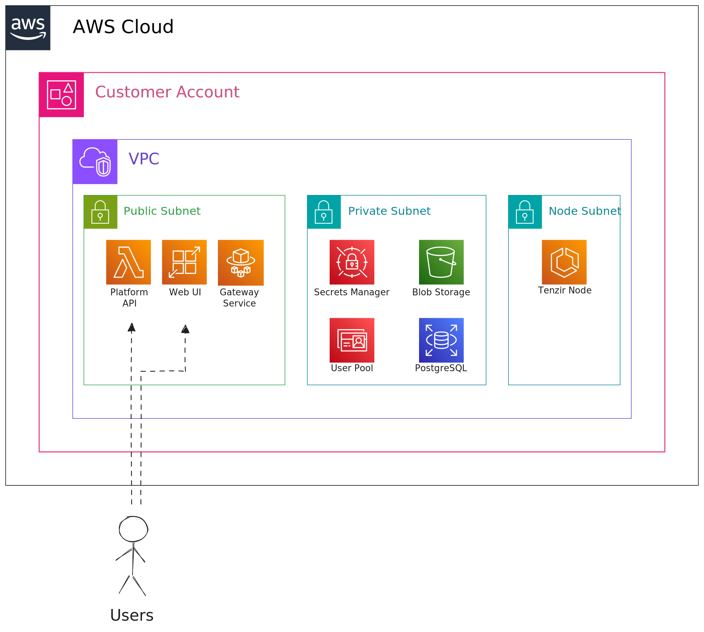

import { Tabs, TabItem } from '@astrojs/starlight/components';

This guide shows you how to deploy the Tenzir Platform Sovereign Edition on AWS
using a CloudFormation template. The deployment automates the setup of all
required infrastructure components.

:::tip[AWS Marketplace]
You need a subscription to the [Tenzir Platform - Sovereign
Edition](https://aws.amazon.com/marketplace/pp?sku=59c6z7kbdidospdl2al3f8i5e) in
the AWS Marketplace.
:::

## Architecture overview

The deployment creates a complete platform infrastructure with the following components:



The architecture consists of:

- **Frontend services**: Web UI (App Runner), Platform API (Lambda), and API
  Gateway for custom domains
- **Gateway service**: ECS Fargate tasks behind an Application Load Balancer for
  node connections
- **Data layer**: RDS PostgreSQL for platform state, S3 buckets for blob and
  sidepath data
- **Security**: Cognito for authentication, Secrets Manager for credentials, ACM
  for TLS certificates
- **Networking**: VPC with public/private subnets, NAT Gateway for outbound
  connectivity
- **DNS**: Route53 for domain management with automatic subdomain creation

:::note[Deployment architecture]
This deployment mirrors our setup at [app.tenzir.com](https://app.tenzir.com)
and includes publicly-accessible UI and nodes endpoints. OIDC login protects
these endpoints. For a fully VPC-private deployment, contact us—we'll help you
set it up.
:::

## Prerequisites

Before you begin, you need:

1. **AWS Account**: An AWS account with permissions to create CloudFormation
   stacks, VPCs, ECS services, Lambda functions, RDS databases, and other
   resources.
2. **Domain in Route53**: A registered domain name with a Route53 hosted zone in
   your AWS account. The deployment automatically discovers your hosted zone and
   creates DNS records for the platform services.
3. **Marketplace Subscription**: Subscribe to the Tenzir Platform - Sovereign
   Edition in the [AWS Marketplace](https://aws.amazon.com/marketplace).
4. **AWS CLI** (optional): Install and configure the [AWS
   CLI](https://aws.amazon.com/cli/) if you prefer CLI-based deployment.

## Step 1: Configure your domain

The platform requires a custom domain. Create a Route53 hosted zone for your
domain if you don't have one.

<Tabs syncKey="aws-deployment">
<TabItem value="console" label="AWS Console">

1. Open the [Route53 console](https://console.aws.amazon.com/route53/)
2. Click **Create hosted zone**
3. Enter your domain name (e.g., `example.org`)
4. Select **Public hosted zone**
5. Click **Create hosted zone**
6. Update your domain's nameservers at your domain registrar with the Route53
   nameservers that appear in the hosted zone

</TabItem>
<TabItem value="cli" label="AWS CLI">

Create a hosted zone for your domain:

```bash
aws route53 create-hosted-zone \
  --name example.org \
  --caller-reference $(date +%s)
```

Retrieve the nameservers for your hosted zone:

```bash
aws route53 list-resource-record-sets \
  --hosted-zone-id $(aws route53 list-hosted-zones-by-name \
    --dns-name example.org \
    --query 'HostedZones[0].Id' \
    --output text) \
  --query "ResourceRecordSets[?Type=='NS'].ResourceRecords[*].Value" \
  --output text
```

Update your domain's nameservers at your domain registrar with the Route53
nameservers that this command returns.

</TabItem>
</Tabs>

The CloudFormation template automatically discovers the hosted zone based on the
domain name you provide.

## Step 2: Prepare container images

The platform requires three core service images (UI, API, and Gateway) in your
AWS account. You must copy the container images from the AWS Marketplace to your
ECR repositories before deploying the CloudFormation stack.

:::note[Why copy images?]
AWS Marketplace vendors store container images in their own ECR repositories.
Your AWS services (ECS, Lambda, App Runner) cannot directly pull from these
cross-account repositories. Copying the images to your ECR gives your services
the necessary access permissions to run the platform components.
:::

:::caution[Check your version]
Replace `VERSION` with the version you subscribed to in AWS Marketplace. Using
an incorrect version will cause the image pull to fail. Check your marketplace
subscription or contact Tenzir support to confirm the latest version.
:::

<Tabs syncKey="aws-deployment">
<TabItem value="script" label="Automated script">

Use this script to create the ECR repositories and copy the container images
from the AWS Marketplace to your ECR repositories:

```bash
#!/bin/bash
set -e

# IMPORTANT: Set this to your Marketplace subscription version
VERSION="${VERSION:-REPLACE_WITH_YOUR_VERSION}"  # e.g., v1.0.0, v1.1.0, etc.
AWS_REGION="${AWS_REGION:-$(aws configure get region)}"
AWS_ACCOUNT=$(aws sts get-caller-identity --query Account --output text)

# Verify VERSION is set
if [ "$VERSION" = "REPLACE_WITH_YOUR_VERSION" ]; then
  echo "ERROR: You must set VERSION to match your Marketplace subscription"
  echo "Example: VERSION=v1.0.0 ./copy-images.sh"
  exit 1
fi

MARKETPLACE_REGISTRY="709825985650.dkr.ecr.us-east-1.amazonaws.com"
LOCAL_REGISTRY="$AWS_ACCOUNT.dkr.ecr.$AWS_REGION.amazonaws.com"

IMAGES=(
  "tenzir/se-platform-ui"
  "tenzir/se-platform-api"
  "tenzir/se-platform-gateway"
)

echo "Creating ECR repositories..."
for IMAGE in "${IMAGES[@]}"; do
  aws ecr create-repository --repository-name "$IMAGE" 2>/dev/null || echo "Repository $IMAGE already exists"
done

echo "Copying Tenzir Platform images version $VERSION to $LOCAL_REGISTRY"

# Login to marketplace ECR
aws ecr get-login-password --region us-east-1 | docker login --username AWS --password-stdin $MARKETPLACE_REGISTRY

# Login to local ECR
aws ecr get-login-password --region $AWS_REGION | docker login --username AWS --password-stdin $LOCAL_REGISTRY

# Copy each image
for IMAGE in "${IMAGES[@]}"; do
  echo "Copying $IMAGE:$VERSION..."
  SOURCE_IMAGE="$MARKETPLACE_REGISTRY/$IMAGE:$VERSION"
  TARGET_IMAGE="$LOCAL_REGISTRY/$IMAGE:$VERSION"
  LATEST_IMAGE="$LOCAL_REGISTRY/$IMAGE:latest"

  docker pull "$SOURCE_IMAGE"
  docker tag "$SOURCE_IMAGE" "$TARGET_IMAGE"
  docker push "$TARGET_IMAGE"
  docker tag "$TARGET_IMAGE" "$LATEST_IMAGE"
  docker push "$LATEST_IMAGE"
done

echo "Successfully copied all images!"
```

Save this script to a file (e.g., `copy-images.sh`), make it executable, and run it with your version:

```bash
chmod +x copy-images.sh
VERSION=v1.0.0 ./copy-images.sh  # Replace v1.0.0 with your subscription version
```

The script copies the three core service container images to your ECR
repositories. This process typically takes 10-15 minutes depending on your
network speed.

</TabItem>
<TabItem value="manual" label="Manual steps">

Follow these steps to manually create the ECR repositories and copy the images.

### Create ECR repositories

Create three ECR repositories using the AWS Console:

1. Open the [Amazon ECR console](https://console.aws.amazon.com/ecr/)
2. Click **Create repository**
3. Enter the repository name: `tenzir/se-platform-ui`
4. Leave other settings as default
5. Click **Create repository**
6. Repeat for the remaining repositories:
   - `tenzir/se-platform-api`
   - `tenzir/se-platform-gateway`

### Copy images from Marketplace

After creating the repositories, copy the images using Docker:

```bash
# IMPORTANT: Replace with your Marketplace subscription version
export VERSION=REPLACE_WITH_YOUR_VERSION  # e.g., v1.0.0
export AWS_REGION=$(aws configure get region)
export AWS_ACCOUNT=$(aws sts get-caller-identity --query Account --output text)

# Login to Marketplace ECR
aws ecr get-login-password --region us-east-1 | \
  docker login --username AWS --password-stdin \
  709825985650.dkr.ecr.us-east-1.amazonaws.com

# Login to your ECR
aws ecr get-login-password --region $AWS_REGION | \
  docker login --username AWS --password-stdin \
  $AWS_ACCOUNT.dkr.ecr.$AWS_REGION.amazonaws.com

# Copy each image
for IMAGE in ui api gateway; do
  docker pull 709825985650.dkr.ecr.us-east-1.amazonaws.com/tenzir/se-platform-$IMAGE:$VERSION
  docker tag 709825985650.dkr.ecr.us-east-1.amazonaws.com/tenzir/se-platform-$IMAGE:$VERSION \
    $AWS_ACCOUNT.dkr.ecr.$AWS_REGION.amazonaws.com/tenzir/se-platform-$IMAGE:$VERSION
  docker push $AWS_ACCOUNT.dkr.ecr.$AWS_REGION.amazonaws.com/tenzir/se-platform-$IMAGE:$VERSION
  docker tag $AWS_ACCOUNT.dkr.ecr.$AWS_REGION.amazonaws.com/tenzir/se-platform-$IMAGE:$VERSION \
    $AWS_ACCOUNT.dkr.ecr.$AWS_REGION.amazonaws.com/tenzir/se-platform-$IMAGE:latest
  docker push $AWS_ACCOUNT.dkr.ecr.$AWS_REGION.amazonaws.com/tenzir/se-platform-$IMAGE:latest
done
```

This process typically takes 10-15 minutes depending on your network speed.

</TabItem>
</Tabs>

## Step 3: Deploy the CloudFormation stack

After copying the images, deploy the CloudFormation stack using our publicly
hosted template.

<Tabs syncKey="aws-deployment">
<TabItem value="console" label="AWS Console">

1. Open the [CloudFormation console](https://console.aws.amazon.com/cloudformation/)
2. Click **Create stack** → **With new resources**
3. Select **Amazon S3 URL** and enter:
   ```
   https://tenzir-marketplace-resources.s3.eu-west-1.amazonaws.com/tenzir-platform.yml
   ```
4. Click **Next**
5. Enter a stack name (e.g., `tenzir-platform`)
6. Configure the parameters:
   - **Domain Name**: Your domain (e.g., `example.org`)
   - **Use Random Subdomain**: Whether to add a random subdomain prefix
     (`false` for production)
   - **UI Container Image**: Full image URI with the `latest` tag you pushed in Step 2
     (e.g., `123456789012.dkr.ecr.us-east-1.amazonaws.com/tenzir/se-platform-ui:latest`)
   - **API Container Image**: Full image URI with the `latest` tag you pushed in Step 2
     (e.g., `123456789012.dkr.ecr.us-east-1.amazonaws.com/tenzir/se-platform-api:latest`)
   - **Gateway Container Image**: Full image URI with the `latest` tag you pushed in Step 2
     (e.g., `123456789012.dkr.ecr.us-east-1.amazonaws.com/tenzir/se-platform-gateway:latest`)
   - **Demo Node Container Image**: (Optional) Full image URI. Leave as default to use the public demo node image.
   - **Use External OIDC Provider**: Whether to use an external identity
     provider instead of [AWS Cognito](https://aws.amazon.com/cognito/) (`false`
     to use Cognito)
7. Click **Next** through the remaining screens
8. On the final screen, check the box to acknowledge that CloudFormation will
   create IAM resources
9. Click **Create stack**

The `latest` tags resolve to the Marketplace version you copied in Step 2.
Re-run the copy step whenever you update to a newer release.

The stack creation takes approximately 15-20 minutes.

</TabItem>
<TabItem value="cli" label="AWS CLI">

Create the stack with your configuration:

```bash
# Use the tag you pushed in Step 2 (default: latest)
IMAGE_TAG=latest
AWS_REGION=$(aws configure get region)
AWS_ACCOUNT=$(aws sts get-caller-identity --query Account --output text)

aws cloudformation create-stack \
  --stack-name tenzir-platform \
  --template-url https://tenzir-marketplace-resources.s3.eu-west-1.amazonaws.com/tenzir-platform.yml \
  --parameters \
    ParameterKey=DomainName,ParameterValue=example.org \
    ParameterKey=RandomSubdomain,ParameterValue=false \
    ParameterKey=UseExternalOIDC,ParameterValue=false \
    ParameterKey=ContainerImageUI,ParameterValue=$AWS_ACCOUNT.dkr.ecr.$AWS_REGION.amazonaws.com/tenzir/se-platform-ui:$IMAGE_TAG \
    ParameterKey=ContainerImageAPI,ParameterValue=$AWS_ACCOUNT.dkr.ecr.$AWS_REGION.amazonaws.com/tenzir/se-platform-api:$IMAGE_TAG \
    ParameterKey=ContainerImageGateway,ParameterValue=$AWS_ACCOUNT.dkr.ecr.$AWS_REGION.amazonaws.com/tenzir/se-platform-gateway:$IMAGE_TAG \
  --capabilities CAPABILITY_NAMED_IAM
```

Update these values:

- Set `example.org` to your domain name.
- Set `IMAGE_TAG` to a specific version tag if you prefer to pin the deployment.

The stack creation takes approximately 15-20 minutes.

</TabItem>
</Tabs>

### Parameter details

The template accepts these key parameters:

- **Domain Configuration**:
  - `DomainName`: Your base domain name (required)
  - `RandomSubdomain`: Add a random subdomain prefix. For example, with
    `example.org`, this creates `ui.abc123.example.org` instead of
    `ui.example.org` (default: `false`)

- **Container Images**:
  - `ContainerImageUI`: Full URI for the UI container image (required)
  - `ContainerImageAPI`: Full URI for the API container image (required)
  - `ContainerImageGateway`: Full URI for the Gateway container image (required)
  - `ContainerImageNode`: Full URI for the Demo Node container image (optional,
    defaults to public ghcr.io image)

- **Authentication Configuration**:
  - `UseExternalOIDC`: Use external OIDC instead of Cognito (default: `false`)
  - External OIDC requires these additional parameters:
    - `ExternalOIDCIssuerURL`: OIDC issuer URL
    - `ExternalOIDCClientID`: OIDC client ID
    - `ExternalOIDCClientSecret`: OIDC client secret

### What gets deployed

The CloudFormation template creates a complete platform infrastructure:

#### Networking

- VPC with public and private subnets across multiple availability zones
- Internet Gateway and NAT Gateway for outbound connectivity
- Security groups for each service
- VPC endpoints for AWS services (Secrets Manager, ECR, S3, STS)

#### Compute

- **ECS Cluster**: Runs the gateway service as a Fargate task
- **Lambda Function**: Hosts the platform API
- **App Runner Service**: Hosts the web UI
- **Application Load Balancer**: Routes traffic to the gateway service

#### Storage

- **RDS PostgreSQL Database**: Stores platform state and metadata
- **S3 Buckets**: Store blob data and sidepath data

#### Security & Authentication

- **AWS Cognito User Pool** (optional): Provides authentication with a default
  admin user
- **Secrets Manager**: Stores database credentials and encryption keys
- **IAM Roles**: Provide least-privilege access for each service
- **ACM Certificates**: Automatically provision SSL/TLS certificates for your
  domain

#### DNS & Routing

- **Route53 DNS Records**: Create `api.`, `ui.`, and `nodes.` subdomains
- **API Gateway**: Provides a custom domain for the Lambda-based API

## Step 4: Access the platform

Once the stack creation completes, retrieve the platform URLs and credentials
from the CloudFormation outputs:

```bash
aws cloudformation describe-stacks \
  --stack-name tenzir-platform \
  --query 'Stacks[0].Outputs'
```

The outputs include:

- **UIDomain**: The web UI URL (e.g., `https://ui.example.org`)
- **APIDomain**: The API URL (e.g., `https://api.example.org`)
- **AdminUsername**: Default admin username (when using Cognito)
- **AdminInitialPassword**: Initial admin password (when using Cognito, stored
  in Secrets Manager)
- **OIDCProviderType**: The authentication provider type (`cognito` or
  `external`)

### Access the web UI

1. Navigate to the UI URL in your browser
2. Log in with the admin credentials (if using Cognito)
3. If using Cognito, the system prompts you to change your password on first login

### Retrieve the admin password

If using Cognito, retrieve the admin password from the CloudFormation outputs:

```bash
aws cloudformation describe-stacks \
  --stack-name tenzir-platform \
  --query 'Stacks[0].Outputs[?OutputKey==`AdminInitialPassword`].OutputValue' \
  --output text
```

## Next steps

After deploying the platform:

1. **Change the admin password**: If using Cognito, change the default admin
   password on first login
2. **Configure users**: Add additional users through the Cognito User Pool or
   your external OIDC provider
3. **Connect nodes**: Deploy Tenzir Nodes and connect them to the platform using
   the gateway endpoint
4. **Configure workspaces**: Organize your nodes and pipelines into workspaces

## Troubleshooting

### Certificate validation

ACM certificates require DNS validation. The template automatically creates the
necessary DNS records in Route53, but validation can take 5-30 minutes. Monitor
the certificate status in the [ACM
console](https://console.aws.amazon.com/acm/).

### Service health

Monitor service health in the AWS Console:

- **ECS**: Check the gateway service status
- **Lambda**: Check the API function logs in CloudWatch
- **App Runner**: Check the UI service status and logs
- **RDS**: Verify database connectivity

### Stack deletion

To delete the stack and all resources:

```bash
aws cloudformation delete-stack --stack-name tenzir-platform
```

:::caution
Empty the S3 buckets before deleting the stack. CloudFormation cannot delete
buckets that contain data. Manually empty the blobs and sidepath buckets first.
:::

## Cost considerations

The deployed infrastructure incurs AWS costs. Key cost factors include:

- **RDS Database**: db.t3.micro instance (adjustable in the template)
- **NAT Gateway**: Data processing charges apply
- **App Runner**: Pay-per-use based on compute and memory
- **Lambda**: Pay-per-invocation
- **ECS Fargate**: Pay-per-task
- **Data Transfer**: Outbound data transfer charges

For production deployments, consider reserved instances or savings plans to
reduce costs.
