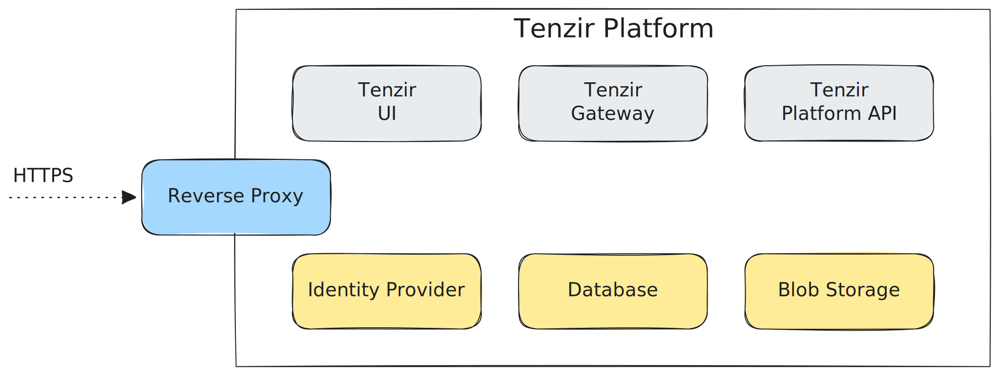

The **Tenzir Platform** acts as a fleet management control plane for Tenzir
Nodes. Use its web interface to explore data, create pipelines, and build
dashboards.

:::tip[Sovereign Edition required]
This guide shows you how to set up the platform on your own premises with the
[Sovereign Edition](https://tenzir.com/pricing). We also offer a hosted cloud
version of the platform at [app.tenzir.com](https://app.tenzir.com).
:::

## Services

The platform integrates three types of services, as the diagram below illustrates:

1. **Internal**: Tenzir provides the (gray) internal services. They are core to the platform's operation.
2. **External**: You provide the (blue) external services. We do not ship these, so you must bring your own.
3. **Configurable**: You can use our bundled (yellow) configurable services or provide your own.

## Get Started

Follow these steps to set up the platform:

import { Steps } from "@astrojs/starlight/components";

<Steps>

1. [Choose a scenario](/guides/platform-setup/choose-a-scenario): First, choose
   a deployment scenario that best fits your use case. We provide several
   options that match common deployments.

2. Configure the services: Next, configure the platform's services. You must set
   up the external endpoints so nodes and browsers can interact with the
   platform.

   - [Configure reverse proxy](/guides/platform-setup/configure-reverse-proxy)
   - [Configure internal services](/guides/platform-setup/configure-internal-services)
   - [Configure identity provider](/guides/platform-setup/configure-identity-provider)
   - [Configure database](/guides/platform-setup/configure-database)
   - [Configure blob storage](/guides/platform-setup/configure-blob-storage)

   You may skip some steps depending on your chosen scenario.

3. [Run the platform](/guides/platform-setup/run-the-platform): After you create
   a configuration, start the platform. This can be as simple as running `docker
   compose up`.

</Steps>

:::note[Usage guides]
The guides above cover platform deployment. For platform management, see our
user-centric guides:

1. [Configure workspaces](/guides/platform-management/configure-workspaces)
2. [Configure dashboards](/guides/platform-management/configure-dashboards)
3. [Use ephemeral nodes](/guides/platform-management/use-ephemeral-nodes)
:::
