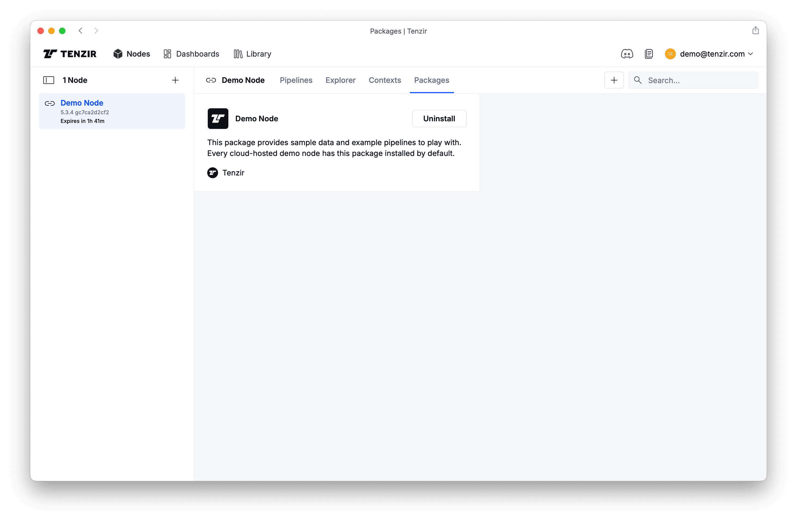

import { Steps, Tabs, TabItem } from '@astrojs/starlight/components';

Drowning in logs, alerts, and rigid tools? Meet **Tenzir**—your engine for
taming security data. In just a few minutes, you'll be ingesting, transforming,
and enriching data on your terms, with full control.
Here's what you'll accomplish:

<Steps>

1. Use Tenzir instantly
2. Deploy your first pipeline
3. See results in action

</Steps>

## Prerequisites

You need zero infrastructure to get started—just a browser and access to
[app.tenzir.com](https://app.tenzir.com).

It helps if you have basic familiarity with logs or security telemetry, but it's
not required.

:::tip[Prefer the command line?]
Run pipelines directly on your machine with `uvx tenzir 'your pipeline'`.
See [Install Tenzir](/guides/installation) for details.
:::

## Setup & deploy a demo node

Visit [app.tenzir.com](https://app.tenzir.com), sign in to [create a free
account](/guides/installation/create-account), and you'll see this page:


Begin with deploying a node:

<Steps>

1. Select the **Cloud-hosted demo-node** tab.
2. Click **Add node**.
3. Click **Get Started**.

</Steps>

Spinning up a demo node can take up to 2 minutes. Sorry for the wait, we'll cut
down this time soon! Grab a coffee or learn more about the [key Tenzir
concepts](/explanations/deployment) while we get everything set up.

## Get started with demo data

Our demo nodes have the Demo Node [package](/explanations/packages)
pre-installed, giving you sample pipelines that fetch data from a public cloud
bucket and [store it into the node's edge
storage](/guides/edge-storage/import-into-a-node). Once you have the sample data
in the node, it will be simpler to work with it.

The **Packages** tab shows that the demo node package is installed:



When you go back to the **Pipelines** tab, you see the pipelines churning away:


Note the two new pipelines that import data into our demo node. If you click on
them, a context pane opens on the right and you'll see details about their
activity as well as the their definition.

:::tip[Tenzir Query Language (TQL)]
One major difference to other pipeline tools is that Tenzir comes with a
full-fledged streaming execution engine and domain-specific language to process
data. TQL is a powerful dataflow language similar to Splunk's SPL or Microsoft's
KQL, just with a lot more power when it comes to transforming data.

Also check out our [FAQ
entry](/explanations/faqs/#why-did-you-create-a-new-query-language-why-not-sql)
for why we did not opt for SQL.
:::

## Explore the demo data

The first step in understanding new data sources is getting a sense of their
structural complexlity, or simply put, how messy or clean the data is. Let's
take a taste of the demo data. Click the **Explorer** tab and
[run](/guides/basic-usage/run-pipelines) this pipeline:

```tql
export
taste
```

This pipelines does the following: [`export`](/reference/operators/export)
references all data in the node's edge storage, and
[`taste`](/reference/operators/taste) samples 10 events of every unique schema.
You'll now see Explorer filling up with events.


:::note[Auto-completion of pipelines]
If you look carefully, you'll note that the above pipeline doesn't end with an
_output operator_. Just an input (`export`) and a transformation (`taste`). But
for a [pipeline](/explanations/pipeline) to be well-formed, it must
have at least one input and one output. Otherwise data would leak somewhere! So
what's happening?

If you don't write an output operator in the Explorer, the platform
auto-completes the [`serve`](/reference/operators/serve) operator, turning your
pipeline into a tiny REST API, so that platform can extract events from it and
show them to you in the browser.
:::

Also note the **Schemas** pane. It gives you an overview of how heterogeneous
the data is. Click on a schema to zoom into all events having the same shape.
Later, you'll learn to normalize the data to make it more homogeneous by
reducing the number of unique schemas.

Now click on a row in the results table. The **Inspector** pops up for a
vertical view of the event, which can be helpful for seeing the full structure
of an event, especially for wide schemas with many fields.

One more detail: you can **uncollapse nested records** in the results table by
clicking on the column name. This switches from the record-style display to more
of a data-frame-style view, allowing you to see more data at once.

## Reshape data at ease

Now that you have a rough understanding of our cockpit, let's wrangle that data.
This is what we've designed TQL for, so it should be fun—or at least more fun
compared to other tools.

Begin with selecting a subset of available schemas:

```tql
export
where @name.starts_with("zeek")
```

Here we filter on event metadata, starting with `@`. The special `@name` field
is a string that contains the name of the event. Actually, let's hone in on the
connection logs only, once for [Zeek](https://zeek.org) and once for
[Suricata](https://suricata.io):

<Tabs>
<TabItem label="Zeek">

```tql
export
where @name == "zeek.conn"
set src_endpoint = {
  ip: id.orig_h,
  port: id.orig_p,
}
set dst_endpoint = {
  ip: id.resp_h,
  port: id.resp_p,
}
select src_endpoint, dst_endpoint, protocol=proto
set @name = "flow"
```

```tql
{
  src_endpoint: {
    ip: 89.248.165.145,
    port: 43831
  },
  dst_endpoint: {
    ip: 198.71.247.91,
    port: 52806
  },
  protocol: "tcp"
}
```

</TabItem>

<TabItem label="Suricata">

```tql
export
where @name == "suricata.flow"
set src_endpoint = {
  ip: src_ip,
  port: src_port,
}
set dst_endpoint = {
  ip: dest_ip,
  port: dest_port,
}
select src_endpoint, dst_endpoint, protocol=proto.to_lower()
set @name = "flow"
```

```tql
{
  src_endpoint: {
    ip: 10.0.0.167,
    port: 51666
  },
  dst_endpoint: {
    ip: 97.74.135.10,
    port: 993
  },
  protocol: "tcp"
}
```

</TabItem>
</Tabs>

A few notes:

- The [`set`](/reference/operators/set) operator performs an assignment and
  creates new fields.
- Because `set` is _the_ most frequently used operator, it is "implied" and you
  just write `x = y` instead of `set x = y`. We generally recommend doing so and
  write it out only out for didactic reasons.
- You can use `set` to assign schema names, e.g., `@name = "new-schema-name"`.
- [`select`](/reference/operators/select) selects the fields to keep, but also
  supports an assignment to rename the new field in one shot.
- As you can see in the `select` operator (Suricata tab) above, TQL
  expressions have [functions](/reference/functions) like
  [`to_lower`](/reference/functions/to_lower), which makes working with values a
  breeze.


Now what do you do with this normalized data from these two data sources? It just
has a new shape, so what? Read on, we'll show you next.

## Composing pipelines via publish/subscribe

The above example starts with a specific input operator (`export`) and no output
operator (we used the Explorer). This is useful for explorative data analysis,
but in practice you'd want these sorts of transformations to run continuously.
In fact, what you really want is a streaming pipeline that accepts data,
potentially from multiple sources, and exposes its results in a way so that you
can route it to multiple destinations.

To this end, nodes have a publish/subscribe feature, allowing you to efficiently
connect pipelines using static topics (and very soon dynamic routes). The
[`publish`](/reference/operators/publish) and
[`subscribe`](/reference/operators/subscribe) operators are all you need for
this. The typical pipeline pattern for composable pipelines looks like this:

```tql
subscribe "in"
// transformations go here
publish "out"
```

Let's adapt our transformation pipelines from above:

<Tabs>
<TabItem label="Zeek">
```tql
subscribe "zeek"
where @name == "zeek.conn"
set src_endpoint = {
  ip: id.orig_h,
  port: id.orig_p,
}
set dst_endpoint = {
  ip: id.resp_h,
  port: id.resp_p,
}
select src_endpoint, dst_endpoint, protocol=proto
publish "flow"
```
</TabItem>
<TabItem label="Suricata">
```tql
subscribe "suricata"
where @name == "suricata.flow"
set src_endpoint = {
  ip: src_ip,
  port: src_port,
}
set dst_endpoint = {
  ip: dest_ip,
  port: dest_port,
}
select src_endpoint, dst_endpoint, protocol=proto.to_lower()
publish "flow"
```
</TabItem>
</Tabs>

When clicking the **Run** button for these pipeline, the events will _not_ show
up in the Explorer because we now use `publish` as output operator. Instead,
you'll see this deployment modal:


After you give the pipeline a name (or leave it blank for a dummy name), click
**Confirm** to deploy the pipeline. You'll see it popping up on the
**Pipelines** tab:


Now that you've deployed one pipeline with two topics as its "interface," you
can direct data to it from other pipelines. For example, you can create a
pipeline that accepts logs via [Syslog](/integrations/syslog) and forwards them
to the transformation pipeline. Then you can write two more pipelines that each
take a subset to implement split-routing scenario.

:::tip[Data fabric as network of pipelines]
You've probably heard the buzzy term _data fabric_ before. With Tenzir, you
implement a data fabric as a network of pipelines, potentially distributed over
multiple nodes. With our growing library of [packages](/explanations/packages)
to 1-click-deploy pre-packaged pipelines, and of course AI to generate
pipelines, you can roll out sophisticated use cases without the need for
dedicated data engineers.
:::

## What's Next?

You've just scratched the surface. Here's where to go next:

1. Explore the [Library](https://app.tenzir.com/library) and browse through
   packages of pre-built pipelines.
2. [Visualize pipeline insights and build dashboards](/tutorials/plot-data-with-charts)
3. [Map your logs to OCSF](/tutorials/map-data-to-ocsf)
4. Send events to your data lake, such as [Amazon Security
   Lake](/integrations/amazon/security-lake)

Curious how it all fits together? Brush up on the [Tenzir
architecture](/explanations/deployment) to learn more about all moving parts.
We're here to help. Join us at our friendly [Tenzir Discord](/discord) if you
have any questions.
