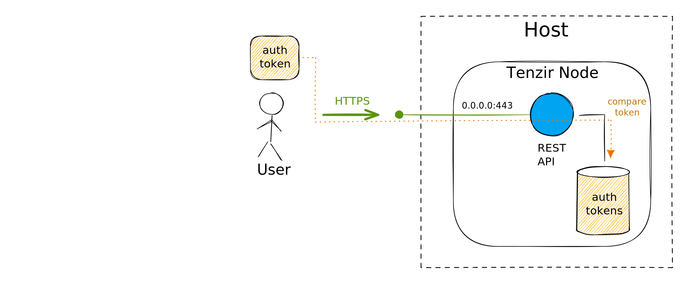
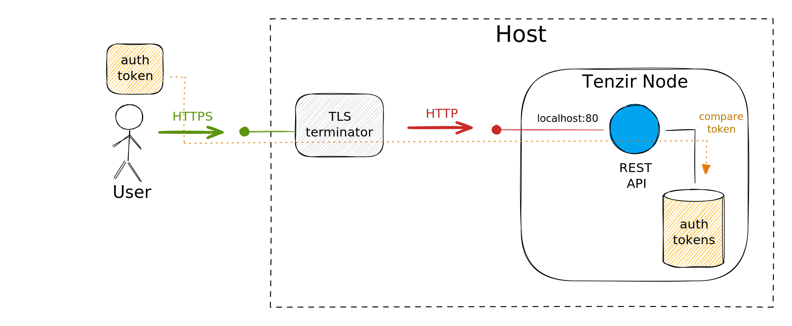
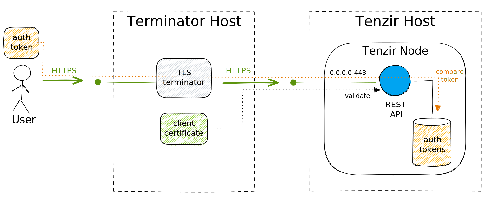

The node offers a [REST API](../../api/node) for CRUD-style pipeline management.
By default, the API is not accessible from the outside. Only the platform can
access it internaly through the existing node-to-platform connection. To enable
the API for direct access, you need to configure the built in web server that
exposes the API.

## Expose the REST API

To expose the REST API, start the web server component by adding the following
to your configuration:

```yaml title="tenzir.yaml"
tenzir:
  start:
    commands:
     - web server \
       --certfile=/path/to/server.certificate \
       --keyfile=/path/to/private.key
       --mode=MODE
```

Replace `MODE` with the TLS mode that best suits your deployement, as [explained
below](#choose-a-tls-deployment-mode).

The YAML configuration is equivalent to the following command-line invocation:

```bash
tenzir-node --commands="web server [...]"
```

The server will only accept TLS requests by default. To allow clients to connect
successfully, you need to pass a valid certificate and corresponding private key
with the `--certfile` and `--keyfile` arguments.

## Generate an authentication token

Clients must authenticate all requests with a valid token. The token is a short
string that clients put in the `X-Tenzir-Token` request header. You can generate
a valid token on the command line:

```bash
tenzir-ctl web generate-token
```

For local testing and development, generating suitable certificates and tokens
can be a hassle. For this scenario, you can start the server in [developer
mode](#developer-mode) where it accepts plain HTTP connections are does not
perform token authentication.

## Choose a TLS deployment mode

There exist four modes to start the REST API, each of which suits a slightly different use case.

### Developer mode

The developer mode bypasses encryption and authentication token verification.


Pass `--mode=dev` to start the REST API in developer mode.

### Server mode

The server mode reflects the "traditional" mode of operation where the server
binds to a network interface. This mode only accepts HTTPS connections and
requires a valid authentication token for every request. This is the default
mode of operation.



Pass `--mode=server` to start the REST API in server mode.

### Upstream TLS mode

The upstream TLS mode is suitable when Tenzir sits upstream of a separate
TLS terminator that is running on the same machine. This kind of setup
is commonly encountered when running nginx as a reverse proxy.



Tenzir only listens on localhost addresses, accepts plain HTTP but still
checks authentication tokens.

Pass `--mode=upstream` to start the REST API in server mode.

### Mutual TLS (mTLS) mode

The mutual TLS mode is suitable when Tenzir sits upstream of a separate TLS
terminator that may be running on a different machine. This setup is commonly
encountered when running [nginx](https://nginx.org) as a load balancer. Tenzir
would typically be configured to use a self-signed certificate in this setup.

Tenzir only accepts HTTPS requests, requires TLS client certificates for incoming
connections, and requires valid authentication tokens for any authenticated
endpoints.



Pass `--mode=mtls` to start the REST API in server mode.