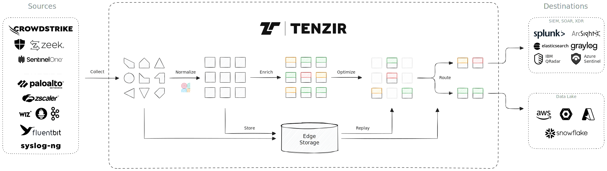
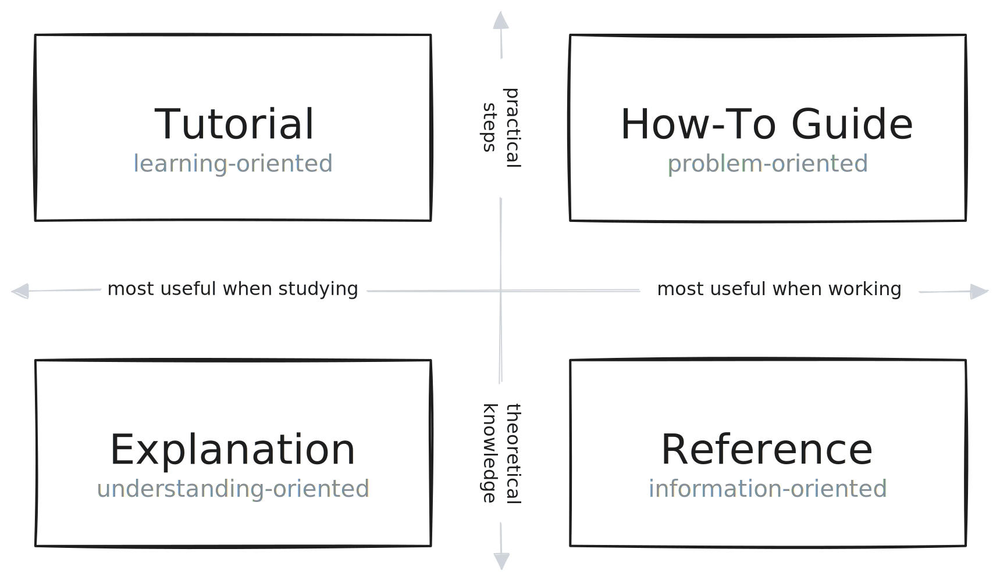

## What is Tenzir?

**Tenzir** is security data pipeline engine for security teams. Pipelines
collect, shape, normalize, optimize, enrich, store, replay, and route your
telemetry data.

## How are the docs organized?

The Tenzir documentation consists of four different types of materials:

- **How-To Guide**: Practical step-by-step explanation to help you achieve a
  specific goal. Most useful when you're trying to get something done.
- **Reference**: Nitty-gritty technical descriptions of how Tenzir works. Most
  useful when you need detailed information about Tenzir's building blocks.
- **Explanation**: Big-picture explanations of higher-level Tenzir concepts.
  Most useful for building understanding of a particular topic.
- **Tutorial**: Learning-oriented lesson that take you through a series of steps
  to complete a project. Most useful when you want to get started with Tenzir.

## How do I start?

import { Card, CardGrid, Aside } from '@astrojs/starlight/components';
import { LinkButton } from '@astrojs/starlight/components';

<CardGrid>
  <Card title="Ready to dive in?" icon="pencil">
    Get your fingers dirty and explore the demo node with just a few clicks and
    a guided tour. Security data has never been easier.

    <LinkButton href="guides/quickstart">Quickstart</LinkButton>
  </Card>
  <Card title="New to Tenzir?" icon="add-document">
    Learn the basics of pipelines and get familiar with the Tenzir Query
    Language (TQL). You'll master security data in no time.

    <LinkButton href="explanations/architecture/pipeline">Learn about pipelines</LinkButton>
  </Card>
</CardGrid>
<Card title="More questions? Need answers?" icon="discord">
  Tenzir is a community-driven open-source project. Join our friendly
  Discord server to chat with security data enthusiasts and the Tenzir team.

  <LinkButton href="/discord" icon="external">Join Discord</LinkButton>
</Card>