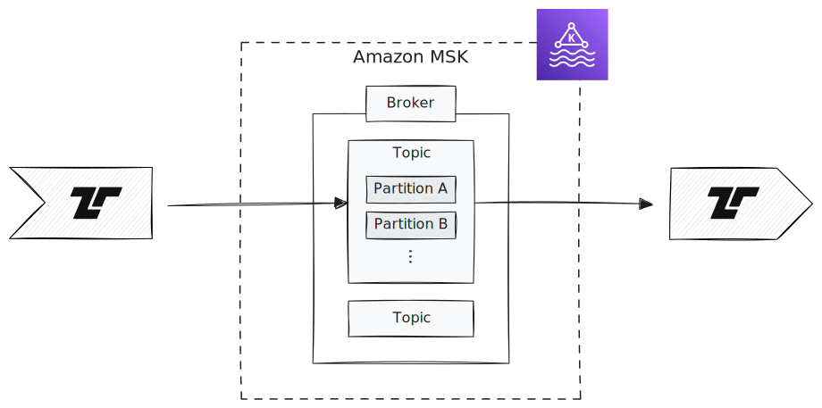

[Amazon Managed Streaming for Apache Kafka (Amazon
MSK)](https://aws.amazon.com/msk/) is a streaming data service that manages
Apache Kafka infrastructure and operations, making it easier for developers and
DevOps managers to run Apache Kafka applications and Apache Kafka Connect
connectors on AWS without becoming experts in operating Apache Kafka.



## Sending and Receiving

Tenzir's Kafka operators
[`from_kafka`](/reference/operators/from_kafka) and
[`to_kafka`](/reference/operators/to_kafka) can send and receive
events from Amazon MSK Clusters.

## Authentication

Provisioned MSK Clusters support different authentication mechanisms such as
mTLS, SASL/SCRAM, IAM etc. However Serverless MSK instances currently only
support IAM Authentication.

The [`from_kafka`](/reference/operators/from_kafka) and
[`to_kafka`](/reference/operators/to_kafka) operators can
authenticate with MSK using AWS IAM by simply specifying the `aws_iam` option
with a record of configuration values such as:

```tql
from_kafka "kafkaesque-data", aws_iam={region: "eu-west-1"}, options={
  "bootstrap.servers": "b-2-public.democluster1.92lhjd.c6.kafka.eu-west-1.amazonaws.com:9198",
  "security.protocol": "SASL_SSL",
}
this = message.parse_json()
```

The above pipeline will try to fetch credentials from [various different
locations](/reference/operators/from_kafka#aws_iam--record-optional)
including the Instance Metadata Services. This means you can attach a role with
the necessary permissions directly to an EC2 instance and Tenzir will
automatically
pick it up.

:::tip[Other Authentication methods]
Tenzir relies on [librdkafka](https://github.com/confluentinc/librdkafka) for
the Kafka client protocol and all other mechanisms supported by librdkafka can
be used by specifying respective configuration values, e.g.,
[mTLS](https://github.com/confluentinc/librdkafka/wiki/Using-SSL-with-librdkafka).
:::

### Assuming roles

Roles can also be assumed by giving the `assume_role` parameter to the `aws_iam`
option. For this, you need to create an IAM role with the necessary permission
policy to read or write on the cluster and topic you want to use, as well as the
ability to assume that role from your active residual role (for example the EC2
instance role, or your local SSO developer role) via a trust relationship.
Please refer the [Amazon MSK documentation](https://docs.aws.amazon.com/msk/latest/developerguide/security-iam.html)
for detailed explanations.

```tql
to_kafka "topic", message=this.print_ndjson(), aws_iam={
    region: "eu-west-1",
    assume_role: "arn:aws:iam::1234567890:role/my-msk-role"
  }
```

The above pipeline attempts to fetch temporary credentials from Amazon STS for
the given ARN.

### Example

#### Collecting High Severity OCSF events from MSK

The following pipeline reads OCSF events from MSK, assuming the role referenced by
the provided ARN. The incoming data is then filtered for severity and sent to
Splunk clusters in a load balanced fashion.

```tql
let $endpoints = ["indexer-1-url", "indexer-2-url"]

from_kafka "ocsf-events", aws_iam={
    region: "us-east-2",
    assume_role: "arn:aws:iam::565445594648:role/MSK-dev-access",
  }, options={
    "bootstrap.servers": "b-2-public.democluster1.92lhjd.c6.kafka.us-east-2.amazonaws.com:9198",
    "security.protocol": "SASL_SSL",
  }
this = message.parse_json()
where severity_id >= 4 // High and above
load_balance $endpoints {
    to_splunk $endpoints, hec_token=secret("SPLUNK_TOKEN")
}
```
