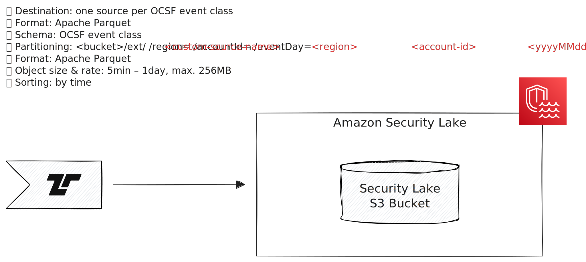

[Amazon Security Lake][asl] is an OCSF event collection service.

[asl]: https://aws.amazon.com/security-lake/



Tenzir can send events to ASL via the
[`to_amazon_security_lake` operator](/reference/operators/to_amazon_security_lake).

## Configuration

Follow the [standard configuration instructions](/integrations/amazon) to
authenticate with your AWS credentials.

Set up a custom source in Amazon Security Lake and use its S3 bucket URI with
the `to_amazon_security_lake` operator.

## Examples

### Send all OCSF Network Activity events from a Kafka topic to ASL

Given a AWS security lake running on `eu-west-2`, a custom source called
`tenzir_network_activity` set up on that lake and an account with id
`123456789012` for it:

```tql
let $s3_uri = "s3://aws-security-data-lake-eu-west-2-lake-abcdefghijklmnopqrstuvwxyz1234/ext/tenzir_network_activity/"

load_kafka "ocsf_events"
read_ndjson
where class_uid == ocsf::class_uid("Network Activity")
to_amazon_security_lake $s3_uri,
  region="eu-west-2",
  accountId="123456789012"
```
