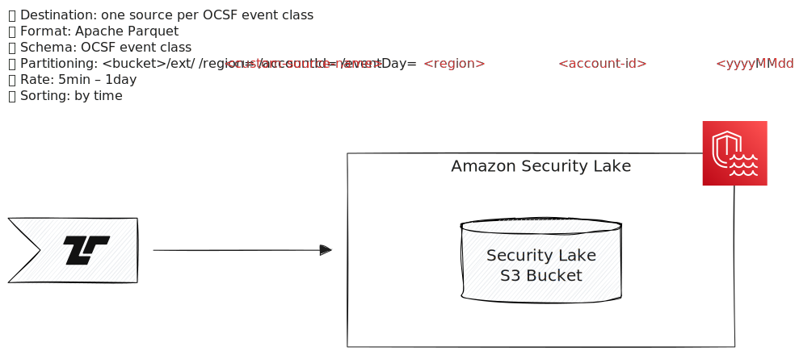
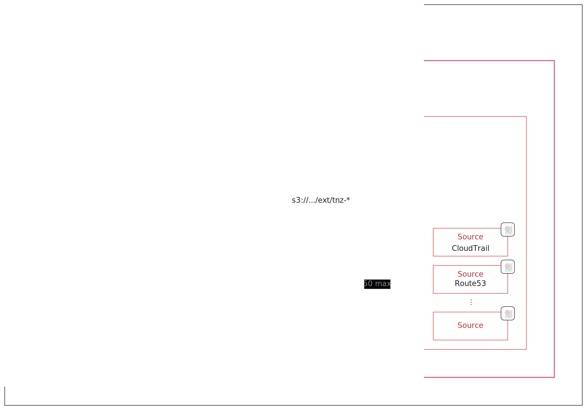

import { Steps } from "@astrojs/starlight/components";

[Amazon Security Lake][asl] is a centralized security data lake service that
collects and stores security data in the Open Cybersecurity Schema Framework
(OCSF) format.

[asl]: https://aws.amazon.com/security-lake/



Tenzir sends events to Amazon Security Lake using the
[`to_amazon_security_lake`](/reference/operators/to_amazon_security_lake)
operator.

## Configuration



The current architectural pattern for Amazon Security Lake requires creating one
custom source per OCSF event class. This design ensures clean data organization,
with each custom source receiving its own dedicated directory under `/ext` in the
S3 bucket. Since each Parquet file must contain records of only one OCSF event
class, this one-to-one mapping between custom sources and event classes is the
most practical approach. The partition path follows this structure:

```
/ext/{custom-source-name}/region={region}/accountId={accountID}/eventDay={YYYYMMDD}/
```

This architecture naturally leads to deploying one Tenzir pipeline per custom
source. The [`to_amazon_security_lake`](/reference/operators/to_amazon_security_lake)
operator handles the partitioning according to this structure automatically.

### Custom Source Setup

:::caution[Limited Custom Sources]
Amazon Security Lake supports a maximum of 50 custom sources, but there are
over 70 [supported event
classes](https://docs.aws.amazon.com/security-lake/latest/userguide/adding-custom-sources.html).
You must choose which event classes to prioritize. Future versions may increase
this limit.
:::

To set up a custom source:

<Steps>

1. Provide a globally unique 20-character source name using the pattern
   `tnz-ocsf-${class_uid}` (for example, `tnz-ocsf-1001` for File System Activity)

2. Select an OCSF event class (for example, "Network Activity" or "DNS Activity")

3. Configure your AWS account ID and external ID

4. Set up a service access role for the AWS Glue crawler

</Steps>

For detailed instructions, refer to the [AWS documentation on adding custom
sources](https://docs.aws.amazon.com/security-lake/latest/userguide/adding-custom-sources.html).

#### Automated Custom Source Creation

For streamlined custom source creation, you can use Tenzir's
[security-lake-tools](https://github.com/tenzir/security-lake-tools)
to automate the setup process. The easiest way to use this tool is with
`uvx` (from the `uv` Python package manager):

```bash
# Create a custom source for Network Activity (class_uid 4001)
uvx security-lake-tools create-source \
  --region eu-west-1 \
  --external-id tenzir \
  --account-id 123456789012 \
  --profile my-aws-profile \
  4001

# List all available OCSF event classes
uvx security-lake-tools create-source --list
```

The tool automates:

- Custom source creation with proper naming (`tnz-ocsf-${class_uid}` pattern)
- IAM role and policy configuration
- S3 bucket permissions
- AWS Glue crawler setup
- OCSF event class validation

This approach is particularly useful when setting up multiple custom sources
across different OCSF event classes.

### Tenzir Setup

To run Tenzir pipelines that send data to Security Lake, you'll need a Tenzir
node running on AWS. See our guide on [how to deploy a node on
AWS](/guides/node-setup/deploy-a-node/#aws) for detailed instructions.

Follow the [standard configuration instructions](/integrations/amazon) to
authenticate with your AWS credentials. Tenzir supports multiple authentication
methods including IAM roles, access keys, and credential profiles.

After deployment, create pipelines using this pattern:

```tql
let $in = ...
let $url = ...
let $region = ...
let $account_id = ...

subscribe $in
where @name == "ocsf.http_activity"
ocsf::apply
to_amazon_security_lake $url, region=$region, account_id=$account_id, timeout=10m
```

:::tip[Available package]
Use the [`amazon-security-lake`](https://github.com/tenzir/library/tree/main/amazon-security-lake)
package from the Tenzir Library, which includes pre-built pipelines for common
event classes.
:::

## Examples

### Send OCSF events from a Kafka topic to Security Lake

This example assumes:

- An Amazon Security Lake instance in the `eu-west-2` region
- A custom source named `tnz-ocsf-4001` (Network Activity class UID)
- An AWS account ID of `123456789012`

```tql
let $s3_uri = "s3://aws-security-data-lake-eu-west-2-lake-abcdefghijklmnopqrstuvwxyz1234/ext/tnz-ocsf-4001/"

load_kafka "ocsf_events"
read_ndjson
where class_uid == ocsf::class_uid("Network Activity")
to_amazon_security_lake $s3_uri,
  region="eu-west-2",
  accountId="123456789012"
```
