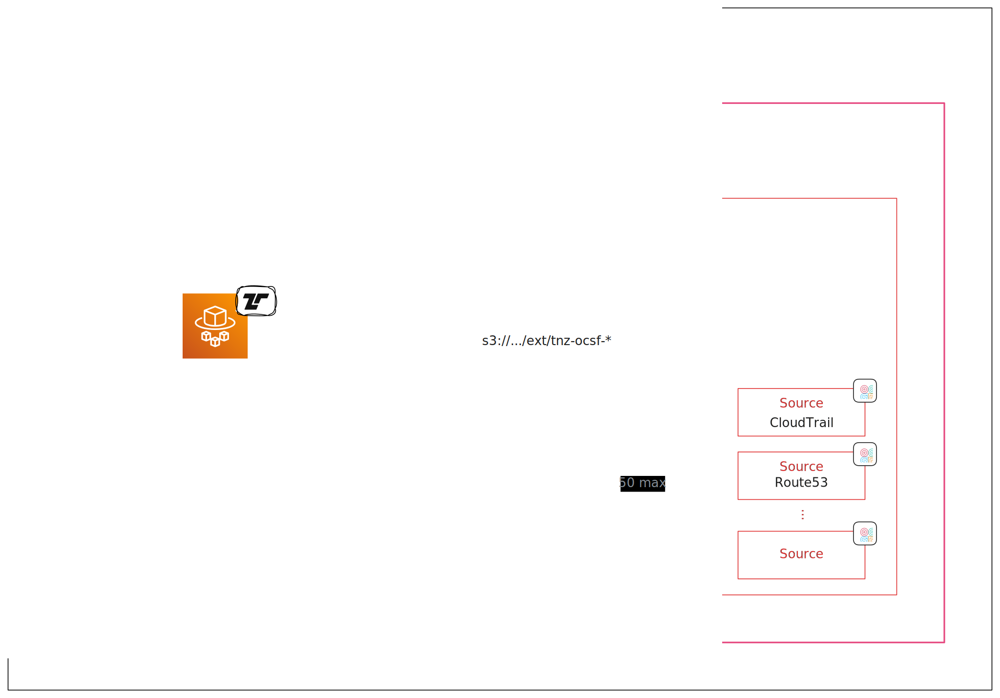

[Amazon Security Lake][asl] is an OCSF event collection service.

[asl]: https://aws.amazon.com/security-lake/


Tenzir can send events to ASL via the
[`to_amazon_security_lake` operator](/reference/operators/to_amazon_security_lake).

## Configuration



The recommended architectural pattern is to create one custom source per OCSF
event class. This approach ensures clean data organization and results in one
dedicated `/ext` directory in the S3 bucket for each custom source. Each Parquet
file within the custom soruce direcotry must contain records of the same OCSF
event class. The partition path follows this structure:

```
/ext/{custom-source-name}/region={region}/accountId={accountID}/eventDay={YYYYMMDD}/
```

In Tenzir, you'll have one dedicated pipeline per custom source. The
[`to_amazon_security_lake`](/reference/operators/to_amazon_security_lake)
operator takes care of partitioning according to this structure.

:::caution[Limited Custom Sources]
The maximum number of custom sources is 50. But there exist over 70 [supported
event
classes](https://docs.aws.amazon.com/security-lake/latest/userguide/adding-custom-sources.html).
This means that you currently must restrict yourself to a subset of possible
event classes. Future versions of Security Lake will support all event classes.
:::

Setting up a custom source involves the following steps:

1. Provide 20-character long globally unique source name, prefixed with
   `tnz-*`
2. Select the appropriate OCSF event class (e.g., "Network Activity", "DNS
   Activity")
3. Configure the AWS account ID and external ID
4. Set up the service access role for AWS Glue crawler

For detailed instructions, refer to the [AWS documentation on adding custom
sources](https://docs.aws.amazon.com/security-lake/latest/userguide/adding-custom-sources.html).

Afterwards, you can deploy the corresponding Tenzir pipeline, which typically
follows this pattern:

```tql
let $in = ...
let $url = ...
let $region = ...
let $account_id = ...

subscribe $in
where @name == "ocsf.http_activity"
ocsf::apply
to_amazon_security_lake $url, region=$region, account_id=$account_id, timeout=10m
```

:::tip[Available package]
We recommend using the
[`amazon-security-lake`](https://github.com/tenzir/library/tree/main/amazon-security-lake)
package in the Tenzir Library that comes with pre-built pipelines for the most
frequently used event classes.
:::

## Examples

Follow the [standard configuration instructions](/integrations/amazon) to
authenticate with your AWS credentials.

### Send all OCSF Network Activity events from a Kafka topic to ASL

Given a AWS security lake running on `eu-west-2`, a custom source called
`tenzir_network_activity` set up on that lake and an account with id
`123456789012` for it:

```tql
let $s3_uri = "s3://aws-security-data-lake-eu-west-2-lake-abcdefghijklmnopqrstuvwxyz1234/ext/tenzir_network_activity/"

load_kafka "ocsf_events"
read_ndjson
where class_uid == ocsf::class_uid("Network Activity")
to_amazon_security_lake $s3_uri,
  region="eu-west-2",
  accountId="123456789012"
```
