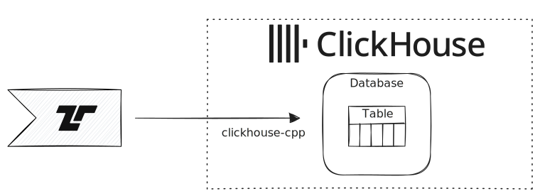

import { Steps } from "@astrojs/starlight/components";

[ClickHouse](https://clickhouse.com/) is an open-source column-oriented database
management system designed for efficient storage and retrieval of large amounts
of data. It is particularly well-suited for real-time analytics and data
warehousing applications.



## How Tenzir Connects to ClickHouse

Tenzir connects to ClickHouse over the network using the native ClickHouse TCP
protocol. Tenzir communicates with ClickHouse via the host and port you specify
in the [`to_clickhouse`](/reference/operators/to_clickhouse) operator. This
means:

- **Network**: Tenzir and ClickHouse can run on the same machine (using
  `localhost`) or on different machines in the same network. Ensure that the
  ClickHouse server is reachable from the Tenzir instance, and that any
  firewalls or security groups allow traffic on the ClickHouse port (default:
  `9000`).
- **IPC**: There is no direct inter-process communication (IPC) mechanism; all
  communication is over the network protocol, even if both run on the same host.
- **Co-deployment**: For best performance and security, deploy Tenzir and
  ClickHouse in the same trusted network or use secure tunnels if needed.

## Setting Up ClickHouse

To get started with ClickHouse, follow the
[official quick start guide](https://clickhouse.com/docs/getting-started/quick-start/oss):

### Native Binary

<Steps>
1. Download the binary:

    ```sh
    curl https://clickhouse.com/ | sh
    ```

2. Start the server:

   ```sh
   ./clickhouse server
   ```

   This downloads the ClickHouse binary and starts the server. You can then
   connect to ClickHouse at `localhost:9000` (native protocol) or
   `localhost:8123` (HTTP interface).

3. (Optionally) Start CLI client:

   ```sh
   ./clickhouse client
   ```

   With this client, you can now run SQL queries on your ClickHouse server.

</Steps>

### Docker

<Steps>

1. Run Docker:

   ```sh
   docker run -d --name clickhouse-server --ulimit nofile=262144:262144 \
     -p 9000:9000 -p 8123:8123 clickhouse/clickhouse-server
   ```

</Steps>

---

You can now connect to ClickHouse at `localhost:9000` (native protocol) or
`localhost:8123` (HTTP interface).

## Usage Examples

These examples assume that the clickhouse server is running on the same host as
Tenzir and that it allows non-TLS connections (hence using `tls=false` in the
pipelines).

You can find out more about how to configure TLS on the
[`to_clickhouse` documentation](/reference/operators/to_clickhouse)
and the
[Clickhouse SSL-TLS configuration guide](https://clickhouse.com/docs/guides/sre/configuring-ssl)

### 1. Easy Mode: Automatic table creation

Tenzir can automatically create tables in ClickHouse based on the incoming data
schema. For example, to ingest OCSF network activity data:

```tql
from "ocsf_network_activity.json"
ocsf::apply
to_clickhouse table="ocsf.network_activity", primary=timestamp, tls=false
```

When creating a table, the [`to_clickhouse`](/reference/operators/to_clickhouse)
operator uses the first event to determine the schema. This means, that there
must not be any untyped nulls in the event, as those cannot be stored in
ClickHouse.

In this example, we use the [`ocsf::apply`](/reference/operators/ocsf/apply)
operator, which will automatically align events with the correct OCSF schema,
giving all fields the correct types and adding all fields that should be in
`ocsf.network_activity`. This ensures that we create a complete table without
missing or incorrectly typed columns.

You can now query the data in ClickHouse, e.g.:

```sql
SELECT median(traffic.bytes_in), median(traffic.bytes_out)
FROM ocsf.network_activity
GROUP BY *
```

### 2. Advanced: Explicit Table Creation

For more control, you can create the table in ClickHouse first. This is
primarily useful when you know the full schema of your table, but not all events
contain all fields and as such the operator would not create the correct table.

<Steps>

1. Create the table in ClickHouse:

   ```sql
   CREATE TABLE my_table (
     id UInt64,
     name String,
     mice_caught Nullable(Uint64)
   ) ENGINE = MergeTree() ORDER BY id;
   ```

2. Ingest data from Tenzir:

   ```csv title="my_file.csv"
   id,name,mice_caught
   0,Tom,
   1,Jerry,0
   ```

   ```tql
   from "my_file.csv"
   to_clickhouse table="my_table", mode="append", tls=false
   ```

   We use the explicit `mode="append"` to ensure that the table already exists.

</Steps>
