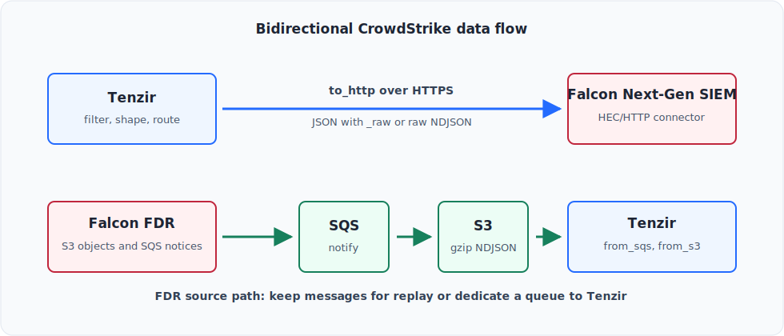

This page shows you how to send events from Tenzir to CrowdStrike Falcon
Next-Gen SIEM and collect CrowdStrike Falcon Data Replicator (FDR) events into
Tenzir through Amazon SQS and Amazon S3.

[CrowdStrike Falcon Next-Gen SIEM][ngsiem] is CrowdStrike's security
information and event management platform. Tenzir can forward events to Falcon
Next-Gen SIEM through its HEC/HTTP connector and can consume Falcon Data
Replicator data from the SQS-to-S3 delivery path used by CrowdStrike and many
SIEM integrations.



:::note[Validate in your Falcon tenant]
The examples use public connector patterns from CrowdStrike and integration
partners. Connector names, available parsers, and generated URLs can differ by
tenant, region, and entitlement. Use the API URL and parser settings shown in
your Falcon console.
:::

## Prerequisites

To send events to Falcon Next-Gen SIEM, you need:

- A Falcon Next-Gen SIEM or Falcon Next-Gen SIEM 10 GB subscription.
- Permission to create a data connection in the Falcon console.
- A HEC/HTTP connector with an assigned parser.
- The API URL and API key generated for the connector.

To collect FDR events, you need:

- An active Falcon Data Replicator feed.
- The notifications URL, which is an SQS queue URL.
- The storage region for the CrowdStrike-managed S3 bucket.
- The FDR client ID and secret. Several vendor UIs label these as AWS access key
  ID and AWS secret access key because the FDR feed exposes AWS-compatible
  credentials.

Store sensitive values as Tenzir <Fn>secret</Fn> values, for example
`crowdstrike-ngsiem-token`, `crowdstrike-fdr-client-id`, and
`crowdstrike-fdr-secret`.

## Send events to Next-Gen SIEM

In the Falcon console, create a data connection under **Next-Gen SIEM > Data
onboarding** and choose the HEC/HTTP connector. Select the parser that matches
the events you send. If no parser matches your source format, create one and
test it with representative event samples before routing production data.

Although CrowdStrike uses HEC terminology, this connector is not the Splunk HEC
contract that <Op>to_splunk</Op> implements. Use <Op>to_http</Op> so the
pipeline controls the generated Falcon API URL, Bearer authorization header, and
parser-specific request body directly.

CrowdStrike integrations commonly use one of two HEC shapes:

- A JSON object sent to the connector URL, usually with the original event in
  `_raw`.
- Raw newline-delimited JSON sent to a raw HEC endpoint, often with `/raw`
  appended to the generated connector URL.

Use the first example when the connector expects JSON HEC events. Use the second
example when the connector documentation or parser expects raw JSON in
`@rawstring`.

### Send JSON HEC events

Many CrowdStrike parser workflows expect the original vendor event in `_raw`.
This keeps the payload small and avoids charging for additional fields that the
parser won't use.

```tql
let $ngsiem_url = "https://cloud-api.us-1.crowdstrike.com/hec/v1/events"
let $ngsiem_headers = {
  "Authorization": f"Bearer {secret("crowdstrike-ngsiem-token")}",
  "Content-Type": "application/json",
}

subscribe "suricata"
where @name == "suricata.alert"
select _raw=this.print_ndjson(strip_null_fields=true)
to_http $ngsiem_url,
  headers=$ngsiem_headers,
  parallel=4,
  max_retry_count=8,
  retry_delay=5s {
  write_json
}
```

Replace `$ngsiem_url` with the API URL from your Falcon connector. If your
parser expects a different field, adapt the `select` statement but keep the
payload limited to the fields the parser needs.

### Send raw JSON events

Some webhook-style connectors require a raw HEC endpoint. In that case, send one
newline-delimited JSON event per request body.

```tql
let $ngsiem_raw_url = "https://cloud-api.us-1.crowdstrike.com/hec/v1/events/raw"
let $ngsiem_headers = {
  "Authorization": f"Bearer {secret("crowdstrike-ngsiem-token")}",
  "Content-Type": "application/json",
}

subscribe "detections"
to_http $ngsiem_raw_url,
  headers=$ngsiem_headers,
  parallel=4,
  max_retry_count=8,
  retry_delay=5s {
  write_ndjson
}
```

Use the raw endpoint only when your connector or parser documentation calls for
it. If CrowdStrike reports an event decoding error for structured HEC events,
check whether the generated URL needs a `/raw` suffix for your connector.

:::tip[Size the connector]
If your sustained event rate exceeds the capacity of one Falcon data connector,
create additional connectors and route separate streams to them. Use Tenzir
pipelines to split the streams by source, tenant, or event type.
:::

## Collect Falcon Data Replicator events

Falcon Data Replicator delivers data as S3 objects and uses SQS notifications to
announce new objects. The SQS message contains the bucket name and object key.
The S3 object is commonly gzip-compressed newline-delimited JSON.

The following pipeline reads SQS notifications without deleting them, fetches
the referenced S3 objects, parses the FDR events, and publishes them into the
`crowdstrike-fdr` topic:

```tql
let $fdr_aws = {
  region: "us-east-1",
  access_key_id: secret("crowdstrike-fdr-client-id"),
  secret_access_key: secret("crowdstrike-fdr-secret"),
}

from_sqs "https://sqs.us-east-1.amazonaws.com/123456789012/crowdstrike-fdr",
  aws_iam=$fdr_aws,
  keep_messages=true,
  poll_time=20s,
  batch_size=10,
  visibility_timeout=300s
notification = message.parse_json()
where notification.Records != null
unroll notification.Records
where notification.Records.eventSource == "aws:s3"
select s3_url=f"s3://{notification.Records.s3.bucket.name}/{notification.Records.s3.object.key.replace("+", "%20").decode_url()}",
       s3_event_time=notification.Records.eventTime,
       s3_event_name=notification.Records.eventName,
       sqs_message_id=message_id
each parallel=4 {
  from_s3 $this.s3_url, aws_iam=$fdr_aws {
    decompress_gzip
    read_ndjson
  }
  crowdstrike.fdr.s3_url = $this.s3_url
  crowdstrike.fdr.s3_event_time = $this.s3_event_time
  crowdstrike.fdr.s3_event_name = $this.s3_event_name
  crowdstrike.fdr.sqs_message_id = $this.sqs_message_id
  publish "crowdstrike-fdr"
}
```

Replace the queue URL and region with the values from your FDR feed. The
pipeline uses `keep_messages=true` so Tenzir doesn't remove notifications from a
queue that another consumer may also use. SQS hides each message for
`visibility_timeout` and then makes it visible again.

This replayable pattern is useful when Tenzir is one consumer among several, or
when you want to test the pipeline against existing notifications. It also means
the same S3 object can be processed more than once. Keep the `s3_url` metadata
so downstream pipelines can deduplicate events by object path, event ID, or the
native FDR timestamp.

### Use a dedicated queue

If Tenzir owns a dedicated FDR feed or SQS queue, you can remove
`keep_messages=true`. In that mode, <Op>from_sqs</Op> deletes notifications
after it emits them. Use this only when this pipeline is the queue owner and
your replay strategy doesn't rely on the same SQS notifications.

For self-managed S3 replication, use the same shape with your own SQS queue and
S3 bucket. Replace the FDR credentials with the AWS IAM configuration for your
bucket, for example an assumed role:

```tql
let $aws = {
  region: "us-east-1",
  assume_role: "arn:aws:iam::123456789012:role/CrowdStrikeFDRRead",
  session_name: "tenzir-fdr",
}
```

## Validate and troubleshoot

Use these checks when the integration doesn't behave as expected:

- **No events in Falcon Next-Gen SIEM:** Confirm the connector is active, the
  API URL matches your region, and outbound HTTPS from the Tenzir node is
  allowed.
- **HTTP 401 or 403:** Confirm the `Authorization` header uses
  `Bearer <API key>` and regenerate the connector key if needed.
- **Events arrive but fields are missing:** Test the selected parser in Falcon
  with the exact `_raw` or raw JSON payload produced by Tenzir.
- **HEC decoding errors:** Switch between the structured JSON endpoint and the
  raw endpoint according to the connector's generated URL and parser guidance.
- **Repeated FDR events:** This is expected when `keep_messages=true`. Deduplicate
  downstream by `crowdstrike.fdr.s3_url`, event ID, or native event time.
- **S3 object read errors:** Check the FDR storage region, credentials, object
  retention, and whether the S3 key was URL-decoded correctly.
- **Gzip or JSON parse errors:** Confirm the FDR feed writes gzip-compressed
  NDJSON. If your replicated bucket uses another format, replace
  `decompress_gzip` or `read_ndjson` accordingly.

## Related vendor documentation

- [Cribl CrowdStrike Falcon Next-Gen SIEM destination][cribl-ngsiem]
- [Cribl CrowdStrike FDR source][cribl-fdr]
- [Elastic CrowdStrike integration][elastic-fdr]
- [Bindplane CrowdStrike FDR source][bindplane-fdr]
- [Panther CrowdStrike Falcon Data Replicator][panther-fdr]
- [Sumo Logic CrowdStrike FDR source][sumo-fdr]
- [AWS CloudWatch pipeline configuration for CrowdStrike][aws-crowdstrike]

## See Also

- <Op>to_http</Op>
- <Op>from_sqs</Op>
- <Op>from_s3</Op>
- <Op>each</Op>
- <Fn>parse_json</Fn>
- <Fn>decode_url</Fn>
- <Guide>collecting/read-from-message-brokers</Guide>
- <Guide>routing/send-to-destinations</Guide>
- <Explanation>secrets</Explanation>
- <Integration>amazon/sqs</Integration>
- <Integration>amazon/s3</Integration>
- <Integration>http</Integration>

[aws-crowdstrike]: https://docs.aws.amazon.com/AmazonCloudWatch/latest/monitoring/crowdstrike-pipeline-setup.html
[bindplane-fdr]: https://docs.bindplane.com/integrations/sources/crowdstrike-fdr
[cribl-fdr]: https://docs.cribl.io/stream/sources-crowdstrike/
[cribl-ngsiem]: https://docs.cribl.io/stream/destinations-crowdstrike-next-gen-siem/
[elastic-fdr]: https://www.elastic.co/guide/en/integrations/current/crowdstrike.html
[ngsiem]: https://www.crowdstrike.com/en-us/platform/next-gen-siem/
[panther-fdr]: https://docs.panther.com/data-onboarding/supported-logs/crowdstrike/falcon-data-replicator
[sumo-fdr]: https://www.sumologic.com/help/docs/send-data/hosted-collectors/cloud-to-cloud-integration-framework/crowdstrike-fdr-source/
