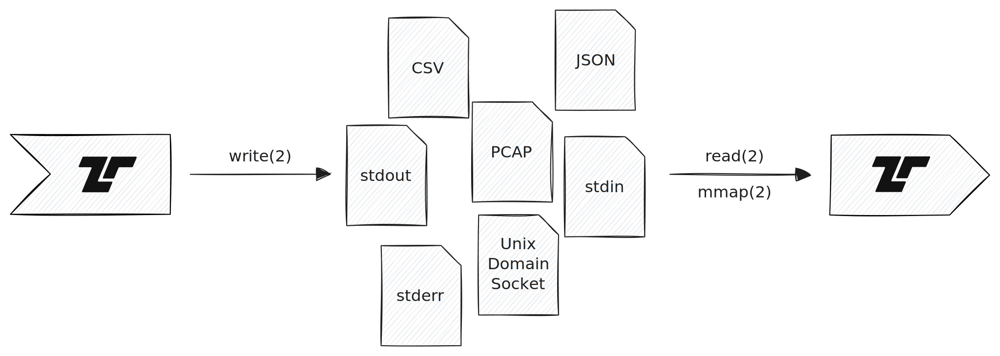

Tenzir supports reading from and writing to files, including non-regular files,
such as [Unix domain sockets](https://en.wikipedia.org/wiki/Unix_domain_socket),
standard input, standard output, and standard error.



When `~` is the first character in the file path, the operator substitutes it
with the `$HOME` environment variable.

Use [`from_file`](/reference/operators/from_file) to read files with glob
patterns, automatic format detection, and file monitoring. For writing, use
[`save_file`](/reference/operators/save_file) with a print operator.

## Examples

### Read a file

Read from a file and parse it in the format implied by the file extension:

```tql
from_file "/tmp/file.json"
```

The operator automatically decompresses the file when the suffix list contains a
supported compression algorithm:

```tql
from_file "/tmp/file.json.gz"
```

### Read multiple files with a glob pattern

```tql
from_file "/var/log/*.json"
```

### Watch a directory for new files

Use `watch=true` to continuously monitor for new files:

```tql
from_file "/var/log/app/*.json", watch=true
```

### Write a file

Write to a file in a specific format:

```tql
version
print_json
save_file "/tmp/tenzir-version.json"
```

With compression:

```tql
version
print_json
compress_bzip2
save_file "/tmp/tenzir-version.json.bz2"
```

### Append to a file

In case the file exists and you do not want to overwrite it, pass `append=true`
as option:

```tql
from {x: 42}
print_csv
save_file "/tmp/event.csv", append=true
```

### Read/write a Unix domain socket

Pass `uds=true` to signal that the file is a Unix domain socket:

```tql
print_ndjson
save_file "/tmp/socket", uds=true
```

When reading from a Unix domain socket, use
[`from_file`](/reference/operators/from_file) with a parsing pipeline:

```tql
from_file "/tmp/socket" {
  read_ndjson
}
```
