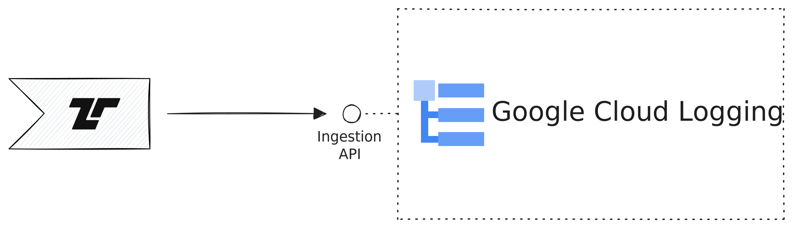

[Google Cloud Logging](https://cloud.google.com/logging) is Google's log
management solution. Tenzir can send events to Google Cloud Logging.



## Examples

### Send an event to Google Cloud Logging

The easiest way to send data to Cloud Logging is via Google [Applciation Default
Credentials
(ADC)](https://cloud.google.com/docs/authentication/application-default-credentials).
Assuming you have configured your node so that it finds the credentials, you can
pipe any data to the
[`to_google_cloud_logging`](../../../reference/operators/to_google_cloud_logging)
operator:

```tql
from {
  content: "log message",
  timestamp: now(),
}
to_google_cloud_logging name="projects/PROJECT_ID/logs/LOG_ID",
  resource_type="global"
```
