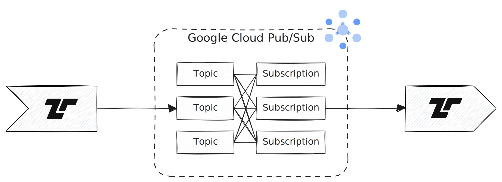

[Google Cloud Pub/Sub](https://cloud.google.com/pubsub) ingests events for
streaming into BigQuery, data lakes, or operational databases. Tenzir can act as
a publisher that sends messages to a topic, and as a subscriber that receives
messages from a subscription.



## Examples

### Publish a message to a topic

```tql
from {foo: 42}
to_google_cloud_pubsub project_id="my-project",
  topic_id="my-topic",
  message = this.print_ndjson()
```

### Receive messages from a subscription

Assuming a connection between `my-topic` and `my-subscription`:

```tql
from_google_cloud_pubsub project_id="my-project",
  subscription_id="my-subscription"
parsed = message.parse_json() // The `message` field is a string
```
```tql
{
  message: "{\"foo\": 42}"
  parsed: {foo: 42}
}
```
