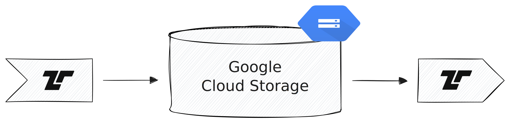

[Cloud Storage](https://cloud.google.com/storage) is Google's object storage
service. Tenzir can treat it like a local filesystem to read and write files.



## Configuration

You need to configure appropriate credentials using Google's [Application
Default Credentials](https://google.aip.dev/auth/4110).

## Examples

Use [`from_gcs`](/reference/operators/from_gcs) to read files from Cloud
Storage. It supports glob patterns and automatic format detection. For writing,
use [`save_gcs`](/reference/operators/save_gcs) with a print operator.

### Read events from a file in a bucket

```tql
from_gcs "gs://bucket/path/to/file.json"
```

### Read all JSON files from a bucket

```tql
from_gcs "gs://bucket/logs/**.json"
```

### Write an event to a file in a bucket

```tql
from {foo: 42}
print_json
save_gcs "gs://bucket/path/to/file.json"
```
