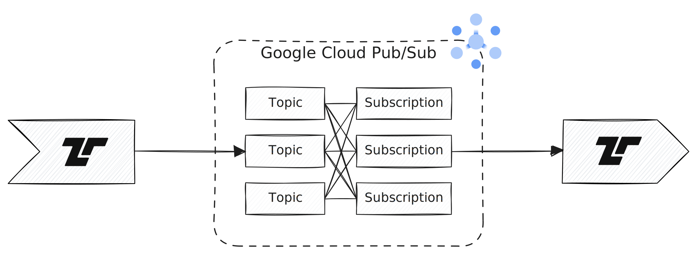

[Google Cloud Pub/Sub](https://cloud.google.com/pubsub) ingest events for
streaming into BigQuery, data lakes, or operational databases. Tenzir can act as
a publisher that sends messages to a topic, and as a subscriber that receives
messages from a subscription.



:::tip[URL Support]
The URL scheme `gcps://` dispatches to
[`load_google_cloud_pubsub`](/references/operators/load_google_cloud_pubsub)
and
[`save_google_cloud_pubsub`](/references/operators/save_google_cloud_pubsub)
for seamless URL-style use via [`from`](/references/operators/from) and
[`to`](/references/operators/to).
:::

## Examples

### Publish a message to a topic

```tql
from {foo: 42}
to "gcps://my-project/my-topic" {
  write_json
}
```

### Receive messages from a subscription

```tql
from "gcps://my-project/my-topic" {
  read_json
}
```
