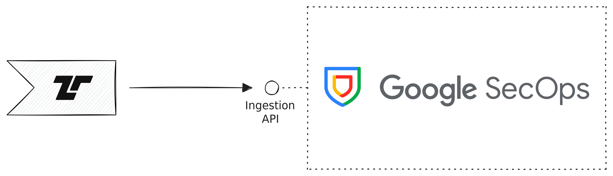

[Google Security Operations
(SecOps)](https://cloud.google.com/security/products/security-operations) is
Google's security operations platform. Tenzir can send raw logs, UDM events, and
entity records to Google SecOps using Chronicle import APIs.



## UDM mapping

Google SecOps stores normalized security data in the Unified Data Model (UDM).
Use <Guide>normalization/map-to-udm</Guide> to shape parsed events into
API-facing UDM records.

For agent-assisted work, follow
<Guide>ai-workbench/use-agent-skills#use-the-udm-skill</Guide> to use the
`tenzir-udm` skill. The skill helps map logs into UDM API ingestion payloads
with names such as `metadata.eventType`, and write YARA-L or rule field paths
with names such as `metadata.event_type`.

Tenzir's <Op>to_google_secops</Op> operator can send raw logs, UDM events, and
entities. Use `mode="udm_event"` after shaping events into SecOps UDM records.

## Authentication

<Op>to_google_secops</Op> targets a SecOps instance with `project`, `region`, and
`instance`. Provide service-account JSON with `service_credentials`, or omit it
to use Google Application Default Credentials.

## Examples

### Send Raw Logs

```tql
from {log: "31-Mar-2025 01:35:02.187 client 0.0.0.0#4238: query: tenzir.com IN A + (255.255.255.255)"}
to_google_secops \
  mode="raw_log",
  project="my-project",
  region="us",
  instance="my-secops-instance",
  service_credentials=secret("my_secops_service_account"),
  log_text=log,
  log_type="BIND_DNS",
  log_entry_time=2026-01-01T00:00:00,
  collection_time=2026-01-01T00:00:01,
  labels={tenant: {value: "acme", rbac_enabled: true}},
  forwarder="forwarder-1",
  hint="bind-dns",
  source_filename="named.log"
```

### Send UDM Events

```tql
from {
  metadata: {
    eventTimestamp: 2026-01-01T00:00:00,
    collectedTimestamp: 2026-01-01T00:00:01,
    eventType: "NETWORK_CONNECTION",
    vendorName: "Tenzir",
    productName: "Tenzir Pipeline",
    productEventType: "connection",
  },
  principal: {
    hostname: "host.example",
    ip: ["192.0.2.10"],
  },
  target: {
    hostname: "service.example",
    ip: ["198.51.100.20"],
    port: 443,
  },
  network: {
    applicationProtocol: "HTTPS",
    ipProtocol: "TCP",
  },
}
to_google_secops \
  mode="udm_event",
  project="my-project",
  region="us",
  instance="my-secops-instance",
  service_credentials=secret("my_secops_service_account")
```

### Send Entities

```tql
from {
  metadata: {
    collectedTimestamp: 2026-01-01T00:00:01,
    vendorName: "Tenzir",
    productName: "Tenzir Pipeline",
    entityType: "USER",
  },
  entity: {
    user: {
      userid: "alice@example.com",
      productObjectId: "alice-0001",
      userDisplayName: "Alice Example",
      emailAddresses: ["alice@example.com"],
    },
  },
}
to_google_secops \
  mode="udm_entity",
  project="my-project",
  region="us",
  instance="my-secops-instance",
  service_credentials=secret("my_secops_service_account"),
  log_type="AZURE_AD_CONTEXT"
```
