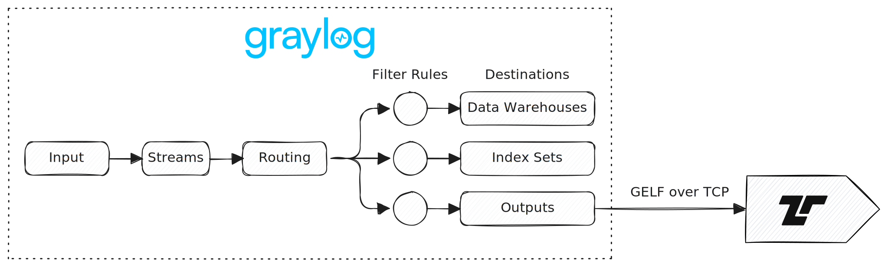

[Graylog](https://graylog.org/) is a log management and SIEM platform that
routes messages through inputs, streams, processing pipelines, index sets,
destinations, and outputs. Tenzir can receive GELF streams from Graylog, send
GELF into Graylog inputs, and access the OpenSearch or Elasticsearch search
backend when you need backend-level queries.



## Choose an integration path

Use GELF when Graylog should ingest, route, index, and alert on the events. Use
direct backend access only when you intentionally want to bypass Graylog's
ingestion path.

| Goal                 | Graylog side                                            | Tenzir path                                                        |
| -------------------- | ------------------------------------------------------- | ------------------------------------------------------------------ |
| Receive messages     | [GELF output][graylog-gelf-output] attached to a stream | <Op>accept_tcp</Op> + <Op>read_gelf</Op>                           |
| Receive over TLS     | GELF output with protocol `TCP+TLS`                     | <Op>accept_tcp</Op> with `tls` + <Op>read_gelf</Op>                |
| Send over TCP or TLS | [GELF TCP input][graylog-gelf-inputs]                   | <Op>to_tcp</Op> + <Op>write_delimited</Op> + <Fn>print_ndjson</Fn> |
| Send over UDP        | GELF UDP input                                          | <Op>to_udp</Op> + <Fn>print_ndjson</Fn>                            |
| Send HTTP batches    | GELF HTTP input                                         | <Op>every</Op> + <Op>to_http</Op> + <Op>write_ndjson</Op>          |
| Query stored events  | OpenSearch or Elasticsearch search backend              | <Op>from_http</Op>                                                 |
| Write backend data   | OpenSearch or Elasticsearch search backend              | <Op>to_opensearch</Op> or <Op>to_elasticsearch</Op>                |

## GELF message format

GELF is a JSON message format with transport-specific framing. A
[GELF message][graylog-gelf-format] must include `version`, `host`, and
`short_message`. The `timestamp` field, when present, is a Unix timestamp in
seconds. Custom fields must start with `_`.

TQL can build the GELF record directly:

```tql
gelf_timestamp = (timestamp? else now()).since_epoch().count_seconds()
this = {
  version: "1.1",
  host: source_host? else host? else "tenzir-node",
  short_message: message? else event_name? else "Tenzir event",
  timestamp: gelf_timestamp,
  level: syslog_level? else 6,
  _tenzir_topic: "detections",
}
```

Use <Fn>print_ndjson</Fn> to serialize the record as compact JSON. For transport
framing, use <Op>write_delimited</Op> when a transport requires a delimiter
after each message.

## Receive messages from Graylog

Use a Graylog GELF output when you want Graylog to forward messages from one or
more streams to a Tenzir pipeline.

:::caution
Graylog documents that the classic GELF output does not use the Enterprise
Output Framework. If the configured receiver is unavailable, messages can build
up in the Graylog output buffer and block writes to the indexer. Keep the Tenzir
listener available, or use a journaled Enterprise output with the GELF outbound
payload format when that option is available in your Graylog deployment.
:::

### Configure the Graylog output

1. In Graylog, go to **System > Outputs**.
2. Select **GELF Output** as the output type.
3. Configure the output host and port to point at the Tenzir node.
4. Select `TCP` as the protocol. Use `TCP+TLS` if the Tenzir listener requires
   TLS.
5. Save the output.
6. In **Streams**, attach the output to the stream that should forward messages
   to Tenzir.

The output sends messages only after you attach it to a stream.

### Start the Tenzir receiver

Deploy a pipeline that listens on the host and port configured in the Graylog
output. This example accepts GELF over TCP on all interfaces and publishes the
parsed events to the `graylog` topic:

```tql
accept_tcp "0.0.0.0:12201" {
  read_gelf
}
publish "graylog"
```

If you selected `TCP+TLS` in Graylog, configure TLS on the Tenzir listener:

```tql
accept_tcp "0.0.0.0:12201",
           tls={certfile: "server.pem", keyfile: "server-key.pem"} {
  read_gelf
}
publish "graylog"
```

Replace the certificate paths with files that match the trust configuration of
your Graylog output.

## Send events to Graylog

Use a Graylog GELF input when Graylog should index, search, alert on, or route
events produced by a Tenzir pipeline.

1. In Graylog, go to **System > Inputs**.
2. Select a GELF input type, such as **GELF TCP**, **GELF UDP**, or
   **GELF HTTP**.
3. Configure the bind address and port. The default GELF port is `12201`.
4. For GELF TCP, enable null-frame delimiting if your Graylog input exposes that
   option. If you keep newline delimiting, use `"\n"` instead of `"\x00"` in the
   TCP examples below.
5. Start the input.

### Send GELF over TCP

Graylog GELF over TCP expects one compact GELF JSON object followed by a null
byte. Build the GELF record in TQL, serialize it with <Fn>print_ndjson</Fn>, and
use <Op>write_delimited</Op> to append the null-byte frame delimiter.

```tql
subscribe "detections"
gelf_timestamp = (timestamp? else now()).since_epoch().count_seconds()
this = {
  version: "1.1",
  host: source_host? else host? else "tenzir-node",
  short_message: message? else event_name? else "Tenzir event",
  timestamp: gelf_timestamp,
  level: syslog_level? else 6,
  _tenzir_topic: "detections",
}
to_tcp "graylog.example.com:12201" {
  write_delimited this.print_ndjson(strip_null_fields=true), "\x00"
}
```

Replace `graylog.example.com` with the Graylog node or load balancer that hosts
the GELF TCP input.

If the Graylog input expects TLS, add TLS options to <Op>to_tcp</Op>:

```tql
to_tcp "graylog.example.com:12201", tls={} {
  write_delimited this.print_ndjson(strip_null_fields=true), "\x00"
}
```

### Send GELF over UDP

Graylog GELF over UDP expects one GELF message per datagram. Use <Op>to_udp</Op>
when each serialized event fits into one datagram:

```tql
subscribe "detections"
gelf_timestamp = (timestamp? else now()).since_epoch().count_seconds()
this = {
  version: "1.1",
  host: source_host? else host? else "tenzir-node",
  short_message: message? else event_name? else "Tenzir event",
  timestamp: gelf_timestamp,
  level: syslog_level? else 6,
  _tenzir_topic: "detections",
}
to_udp "graylog.example.com:12201",
  message=this.print_ndjson(strip_null_fields=true)
```

Prefer TCP for reliable delivery. Use UDP only when datagram loss is acceptable
and messages remain small enough for your network and Graylog input limits.

### Send GELF over HTTP

The GELF HTTP input accepts one JSON message per request, or newline-delimited
JSON when you enable bulk receiving on the Graylog input.

For one HTTP request per event, wrap <Op>to_http</Op> in <Op>each</Op>:

```tql
subscribe "detections"
gelf_timestamp = (timestamp? else now()).since_epoch().count_seconds()
this = {
  version: "1.1",
  host: source_host? else host? else "tenzir-node",
  short_message: message? else event_name? else "Tenzir event",
  timestamp: gelf_timestamp,
  level: syslog_level? else 6,
  _tenzir_topic: "detections",
}
each {
  from $this
  to_http "http://graylog.example.com:12201/gelf",
    headers={"Content-Type": "application/json"} {
    write_json strip_null_fields=true
  }
}
```

For bulk receiving, group events into time-based batches with <Op>every</Op> and
send newline-delimited GELF JSON:

```tql
subscribe "detections"
gelf_timestamp = (timestamp? else now()).since_epoch().count_seconds()
this = {
  version: "1.1",
  host: source_host? else host? else "tenzir-node",
  short_message: message? else event_name? else "Tenzir event",
  timestamp: gelf_timestamp,
  level: syslog_level? else 6,
  _tenzir_topic: "detections",
}
every 30s {
  to_http "http://graylog.example.com:12201/gelf",
    headers={"Content-Type": "application/json"} {
    write_ndjson strip_null_fields=true
  }
}
```

Use `https://` and configure TLS options on <Op>to_http</Op> when the input
expects TLS.

## Work with the search backend

Graylog stores searchable messages in index sets backed by OpenSearch or
Elasticsearch. You can query those indices with <Op>from_http</Op> when you need
backfill, historical enrichment, or ad hoc exports.

Use direct writes with <Op>to_opensearch</Op> or <Op>to_elasticsearch</Op> only
for custom indices that you manage outside Graylog's ingestion path. Direct
writes don't pass through Graylog inputs, stream routing, processing pipelines,
or destination rules.

[graylog-gelf-format]: https://go2docs.graylog.org/current/getting_in_log_data/gelf_format.html
[graylog-gelf-inputs]: https://go2docs.graylog.org/current/getting_in_log_data/gelf.html
[graylog-gelf-output]: https://go2docs.graylog.org/current/interacting_with_your_log_data/gelf_outputs.htm

## See Also

- <Op>accept_tcp</Op>
- <Op>each</Op>
- <Op>every</Op>
- <Op>from_http</Op>
- <Op>read_gelf</Op>
- <Op>to_elasticsearch</Op>
- <Op>to_http</Op>
- <Op>to_opensearch</Op>
- <Op>to_tcp</Op>
- <Op>to_udp</Op>
- <Op>write_delimited</Op>
- <Op>write_json</Op>
- <Op>write_ndjson</Op>
- <Fn>print_ndjson</Fn>
- <Integration>elasticsearch</Integration>
- <Integration>opensearch</Integration>
- <Integration>tcp</Integration>
- <Integration>udp</Integration>
