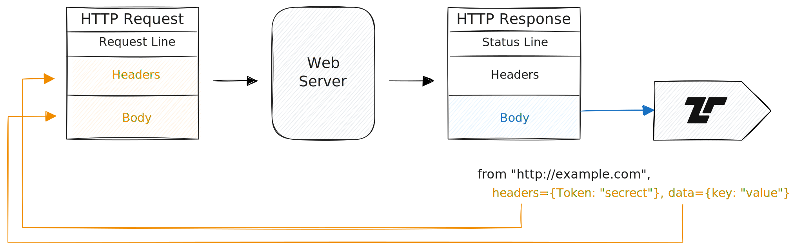
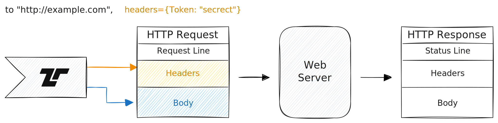

Tenzir supports HTTP and HTTPS, both as sender and receiver.

When retrieving data from an API or website, you prepare your HTTP request and
get back the HTTP response body as your pipeline data:



When sending data from a pipeline to an API or website, the events in the
pipeline make up the HTTP request body. If the HTTP status code is not 2\*\*,
you will get a warning.



In both cases, you can only provide static header data.

Use [`from_http`](/reference/operators/from_http) to perform HTTP requests or
run an HTTP server. This operator automatically infers the format from the
`Content-Type` header, defaulting to JSON. For sending, use
[`save_http`](/reference/operators/save_http) with a print operator.

## Examples

### Perform a GET request with URL parameters

```tql
from_http "http://example.com:8888/api?query=tenzir"
```

### Perform a POST request with JSON body

```tql
from_http "http://example.com:8888/api", method="post", body={query: "tenzir"}
```

### Call a webhook API with pipeline data

```tql
from {
  x: 42,
  y: "foo",
}
print_json
save_http "http://example.com:8888/api", method="POST"
```
