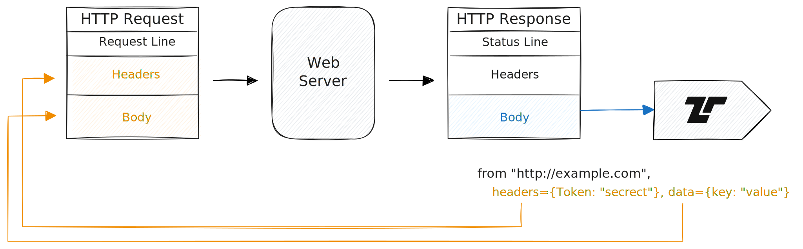
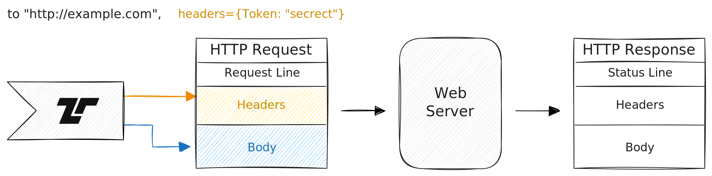

[HTTP](https://en.wikipedia.org/wiki/HTTP) is the foundation of data exchange
on the web. Tenzir provides operators for all sides of an HTTP conversation:
fetching data from APIs, sending events to webhooks, streaming pipeline output
to clients, and accepting incoming requests.

## Fetching data from APIs

When retrieving data from an API or website, you prepare your HTTP request and
get back the HTTP response body as your pipeline data:

Use [`from_http`](/reference/operators/from_http) to issue a one-shot HTTP
request, or [`http`](/reference/operators/http) to enrich events flowing through
a pipeline with HTTP responses. Both operators automatically infer the response
format from the URL extension or `Content-Type` header.

See the [Fetch via HTTP and APIs](/guides/collecting/fetch-via-http-and-apis)
guide for practical examples covering authentication, pagination, error
handling, and data enrichment.

## Sending data to webhooks and APIs

Use [`to_http`](/reference/operators/to_http) to send events as HTTP requests to
a webhook or API endpoint. Each input event is sent as a separate request, with
the event JSON-encoded as the body by default. This is useful for pushing alerts
to webhooks, forwarding events to SIEMs, or calling external APIs for each
event.

## Streaming data to HTTP clients

Use <Op>serve_http</Op> to start an HTTP server that streams the bytes produced
by a nested pipeline to connected clients. For example, use
<Op>write_ndjson</Op> when you want NDJSON over HTTP or <Op>write_lines</Op>
when you want plain text.

See the <Guide>routing/expose-data-as-server</Guide> guide for practical
examples covering serialization, connection limits, and TLS.

## Accepting incoming requests

Use [`accept_http`](/reference/operators/accept_http) to spin up an HTTP server
that turns incoming requests into pipeline events. This is useful for receiving
webhooks, building custom API endpoints, or ingesting data pushed by external
systems.

## SSL/TLS

All HTTP operators support TLS. Pass `tls={}` to enable TLS with defaults, or
provide a record with specific options like `certfile` and `keyfile`.
