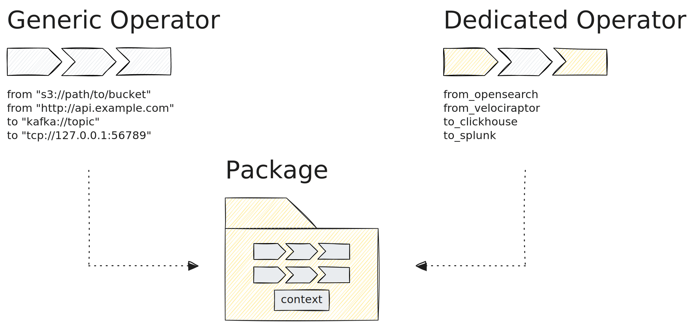

Tenzir offers a layered integration architecture, from turn-key packages at the
top to native protocol connectors at the core.

## Packages

[Packages](/explanations/packages) are 1-click deployable integrations that deliver instant value.
They bundle pipelines, [enrichment contexts](/explanations/enrichment/), and
configurations for common security tools like Splunk, CrowdStrike, Elastic,
SentinelOne, Palo Alto, and many more.

Browse our freely available [package library on
GitHub](https://github.com/tenzir/library). You can also use our [MCP
server](/guides/mcp-usage/install-mcp-server) to generate custom packages with
AI assistance.

## Core Integrations

Core integrations are native connectors to the ecosystem, enabling
communication over numerous protocols and APIs:

- **Cloud storage**: [S3](/integrations/amazon/s3),
  [GCS](/integrations/google/cloud-storage),
  [Azure Blob Storage](/integrations/microsoft/azure-blob-storage)
- **Message queues**: [Kafka](/integrations/kafka),
  [SQS](/integrations/amazon/sqs), [AMQP](/integrations/amqp)
- **Databases**: [Snowflake](/integrations/snowflake),
  [ClickHouse](/integrations/clickhouse)
- **Network protocols**: [TCP](/integrations/tcp), [UDP](/integrations/udp),
  [HTTP](/integrations/http), [Syslog](/integrations/syslog)

Under the hood, core integrations use a C++ plugin abstraction to provide an
[operator](/reference/operators/), [function](/reference/functions/), or
[context](/explanations/enrichment/) that you can use in TQL to directly
interface with the respective resource, such as a TCP socket or cloud storage
bucket. We typically implement this functionality using the respective SDK, such as the
[AWS SDK](https://aws.amazon.com/sdk-for-cpp/), [Google Cloud
SDK](https://cloud.google.com/cpp), or
[librdkafka](https://github.com/confluentinc/librdkafka), though some
integrations require a custom implementation.

:::note[Dedicated Operators]
For some applications, we provide a **dedicated operator** that dramatically
simplifies the user experience. For example,
[`to_splunk`](/reference/operators/to_splunk) and
[`from_opensearch`](/reference/operators/from_opensearch) offer a
streamlined interface compared to composing generic HTTP or protocol operators.
:::
