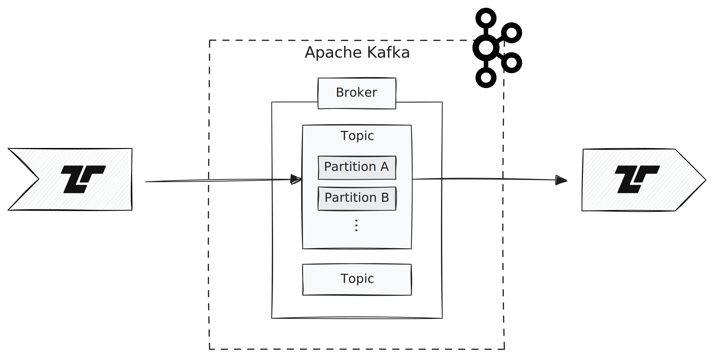

[Apache Kafka](https://kafka.apache.org) is a distributed open-source message
broker. The Tenzir integration can publish (send messages to a topic) or
subscribe (receive) messages from a topic.



Internally, we use Confluent's official
[librdkafka](https://github.com/confluentinc/librdkafka) library, which gives us
full control in passing options.

## Examples

Use [`from_kafka`](/reference/operators/from_kafka) and
[`to_kafka`](/reference/operators/to_kafka) to receive and send messages.

### Subscribe to a topic

The `offset` option controls where to start reading:

```tql
from_kafka "topic", offset="beginning"
this = message.parse_json()
```

Additional offset values are `"end"` to read from the last offset, `"stored"` to
read from the stored offset, a positive integer representing an absolute offset,
or a negative integer representing a relative offset counting from the end.

### Send events to a Kafka topic

Send a static record as JSON to a Kafka topic:

```tql
from {
  x: 42,
  y: "foo",
}
to_kafka "topic"
```

You can control the message encoding with the `message` argument in
[`to_kafka`](/reference/operators/to_kafka) that defaults to
`this.print_ndjson()`.
