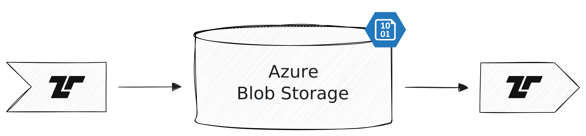

[Azure Blob Storage](https://azure.microsoft.com/en-us/products/storage/blobs)
is Azure's object storage service. Tenzir can treat it like a local filesystem
to read and write files.



## Examples

Use [`from_azure_blob_storage`](/reference/operators/from_azure_blob_storage) to
read files from Azure Blob Storage. It supports glob patterns and automatic
format detection. For writing, use
[`save_azure_blob_storage`](/reference/operators/save_azure_blob_storage) with a
print operator.

### Read events from a file in a container

```tql
from_azure_blob_storage "abfs://container/path/to/file.json"
```

### Read all JSON files from a container

```tql
from_azure_blob_storage "abfs://container/logs/**.json"
```

### Write an event to a file in a container

```tql
from {foo: 42}
print_json
save_azure_blob_storage "abfs://container/path/to/file.json"
```
