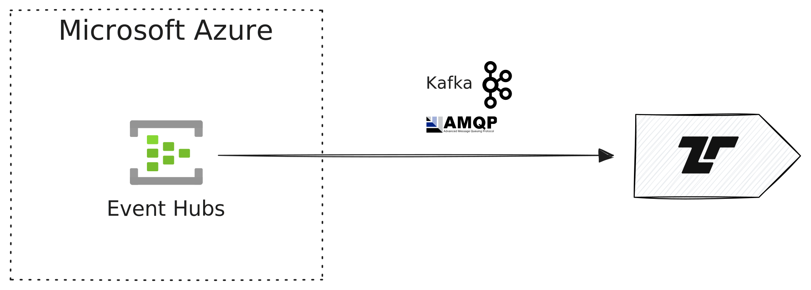

[Azure Event Hubs][event-hubs] is a real-time data streaming platform and event
ingestion service that can receive and process millions of events per second.
Event Hubs provides a Kafka endpoint, allowing you to stream events from various
Microsoft services to Tenzir.

[event-hubs]: https://learn.microsoft.com/en-us/azure/event-hubs/event-hubs-about



Many Microsoft security services can stream events in real time to Tenzir using
Azure Event Hubs, including [Microsoft Defender](/integrations/microsoft/defender),
[Microsoft Sentinel](https://learn.microsoft.com/en-us/azure/sentinel/overview),
and other Azure services.

## Requirements and Setup

### Azure Event Hub & Kafka

To stream events from Microsoft services in real time, you can use Azure Event
Hub, which provides a Kafka endpoint starting at the Standard tier. Make sure to
enable _Kafka Surface_ after the Event Hub setup.

### Service Configuration

Configure your Microsoft service (such as Defender XDR, Sentinel, or other Azure
services) to stream events to your Event Hub. The specific configuration steps
vary by service, but generally involve:

1. Creating an Event Hub namespace and Event Hub instance
2. Configuring the source service to stream to the Event Hub
3. Obtaining connection credentials from the Event Hub's shared access policies

## Examples

You can process Event Hub events with our [Kafka](/integrations/kafka) and
[AMQP](/integrations/amqp) integrations.

### Process Event Hub events with Kafka

Tenzir's [Kafka integration](/integrations/kafka) allows for seamless
consumption of Event Hub events. You need to map these parameters:

| Kafka                | Event Hubs                                |
| -------------------- | ----------------------------------------- |
| **Topic**            | Event Hub instance name                   |
| **Bootstrap server** | `<namespace>.servicebus.windows.net:9093` |
| **SASL password**    | Primary connection string                 |

Use the pipeline below and replace the three placeholders in angle brackets:

- `<topic>`: Your Event Hub instance name
- `<namespace>`: Your Event Hub namespace
- `<connection-string>`: Find this in Azure under:
  1. Event Hub Namespace
  2. Settings
  3. Shared access policies
  4. (Your policy)
  5. Primary connection string

```tql
let $options = {
  "bootstrap.servers": "<namespace>.servicebus.windows.net:9093",
  "security.protocol": "SASL_SSL",
  "sasl.mechanism": "PLAIN",
  "sasl.username": "$ConnectionString",
  "sasl.password": "<connection-string>",
}
from_kafka "<topic>", options=$options
this = message.parse_json()
```

After substitution, your pipeline looks like this:

```tql
let $options = {
  "bootstrap.servers": "tenzir-event-hub.servicebus.windows.net:9093",
  "security.protocol": "SASL_SSL",
  "sasl.mechanism": "PLAIN",
  "sasl.username": "$ConnectionString",
  "sasl.password": "Endpoint=sb://tenzir-event-hub.servicebus.windows.net/;SharedAccessKeyName=RootManageSharedAccessKey;SharedAccessKey=SECRET123456",
}
from_kafka "tenzir-event-hub", options=$options
this = message.parse_json()
```

The events you receive will vary depending on the source service. For example,
events from Microsoft Defender look like this:

```tql
{
  records: [
    {
      time: "2024-12-04T13:38:20.360851",
      tenantId: "40431729-d276-4582-abb4-01e21c8b58fe",
      operationName: "Publish",
      category: "AdvancedHunting-IdentityLogonEvents",
      _TimeReceivedBySvc: "2024-12-04T13:36:26.632556",
      properties: {
        ActionType: "LogonFailed",
        LogonType: "Failed logon",
        Protocol: "Ntlm",
        AccountDisplayName: null,
        AccountUpn: null,
        AccountName: "elias",
        AccountDomain: "tenzir.com",
        AccountSid: null,
        AccountObjectId: null,
        IPAddress: null,
        Location: null,
        DeviceName: "WIN-P3MCS4024KP",
        OSPlatform: null,
        DeviceType: null,
        ISP: null,
        DestinationDeviceName: "ad-test.tenzir.com",
        TargetDeviceName: null,
        FailureReason: "UnknownUser",
        Port: null,
        DestinationPort: null,
        DestinationIPAddress: null,
        TargetAccountDisplayName: null,
        AdditionalFields: {
          Count: "1",
          Category: "Initial Access",
          AttackTechniques: "Valid Accounts (T1078), Domain Accounts (T1078.002)",
          SourceAccountName: "tenzir.com\\elias",
          SourceComputerOperatingSystemType: "unknown",
          DestinationComputerObjectGuid: "793e9b90-9eef-4620-aaa2-442a22f81321",
          DestinationComputerOperatingSystem: "windows server 2022 datacenter",
          DestinationComputerOperatingSystemVersion: "10.0 (20348)",
          DestinationComputerOperatingSystemType: "windows",
          SourceComputerId: "computer win-p3mcs4024kp",
          FROM.DEVICE: "WIN-P3MCS4024KP",
          TO.DEVICE: "ad-test",
          ACTOR.DEVICE: "",
        },
        ReportId: "3d359b95-f8d5-4dbd-a64b-7327c92d32f1",
        Timestamp: "2024-12-04T13:33:19.801823",
        Application: "Active Directory",
      },
      Tenant: "DefaultTenant",
    },
  ]
}
```
