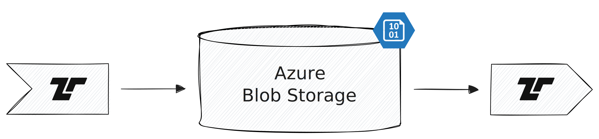

[Azure Blob Storage](https://azure.microsoft.com/en-us/products/storage/blobs)
is Azure's object storage service. Tenzir can treat it like a local filesystem
to read and write files.



:::tip[URL Support]
The URL scheme `abfs[s]://` dispatches to
[`load_azure_blob_storage`](/references/operators/load_azure_blob_storage) and
[`save_azure_blob_storage`](/references/operators/save_azure_blob_storage)
for seamless URL-style use via [`from`](/references/operators/from)
and [`to`](/references/operators/to).
:::

## Examples

### Write an event to a file in a container

```tql
from {foo: 42}
to "abfss://user@container/path/to/file.json"
```

### Read events from a file in a container

```tql
from "abfss://user@container/path/to/file.json"
```

```tql
{foo: 42}
```
