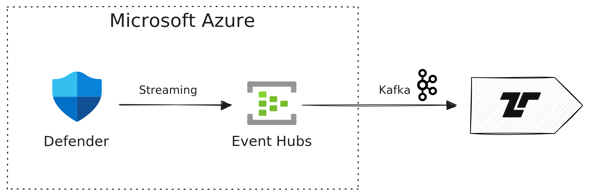

[Microsoft Defender][defender] offers protection, detection, investigation, and
response to threats. Defender comes in multiple editions, [Defender for Office
365][defender-o365], [Defender for Endpoint][defender-endpoint], [Defender for
IoT][defender-iot], [Defender for Identity][defender-identity], and [Defender
for Cloud][defender-cloud]. All Defender products can stream events in real time
to Tenzir using [Azure Event Hubs][event-hubs].

[defender]: https://learn.microsoft.com/en-us/defender-xdr/microsoft-365-defender-portal
[defender-o365]: https://learn.microsoft.com/en-us/defender-office-365/mdo-about
[defender-iot]: https://learn.microsoft.com/en-us/defender-for-iot/microsoft-defender-iot
[defender-endpoint]: https://learn.microsoft.com/en-us/defender-endpoint/
[defender-identity]: https://learn.microsoft.com/en-us/defender-for-identity/what-is
[defender-cloud]: https://learn.microsoft.com/en-us/defender-xdr/microsoft-365-security-center-defender-cloud
[event-hubs]: https://learn.microsoft.com/en-us/azure/event-hubs/event-hubs-about

:::tip[Microsoft Defender Setup]
The following example assumes that you have already set up Microsoft Defender
and Microsoft Defender XDR, for example, by following the [official
documentation](https://learn.microsoft.com/en-us/azure/defender-for-cloud/connect-azure-subscription).
:::

## Setup

### Configure Streaming API

In Microsoft Security Center, configure Streaming under `System -> Settings ->
Microsoft Defender XDR -> General -> Streaming API`. Add a new Streaming API for
the target Event Hub and enable all event types that you want to collect.

For detailed instructions on setting up Azure Event Hubs and consuming events
with Tenzir, see the [Azure Event Hubs integration
documentation](/integrations/microsoft/azure-event-hubs).
