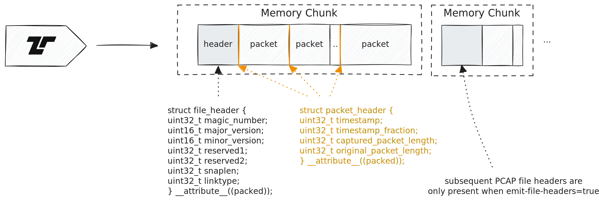

Tenzir supports capturing packets from a network interface card (NIC).

Use <Op>from_nic</Op> to capture live packets as events:



`from_nic` uses <Op>read_pcap</Op> by default.

## Examples

### List active network interfaces

If you don't know what interface to read from, use the
<Op>nics</Op> operator to identify suitable candidates:

```tql
nics
select name, addresses, up
where up
```

```tql
{
  name: "eth0",
  addresses: [
    "169.254.172.2",
    "fe80::6471:53ff:fe5f:a8cc",
  ],
  up: true,
}
{
  name: "eth1",
  addresses: [
    "10.0.101.13",
    "fe80::f7:75ff:fe66:94e5",
  ],
  up: true,
}
{
  name: "lo",
  addresses: [
    "127.0.0.1",
    "::1",
  ],
  up: true,
}
```

### Read packets from a network interface

Capture packets from `eth0`:

```tql
from_nic "eth0"
head 3
```

```tql
{
  linktype: 1,
  timestamp: "2021-11-17T13:32:43.237882",
  captured_packet_length: 74,
  original_packet_length: 74,
  data: "ABY88f1tZJ7zvttmCABFAAA8inQAADQGN+yADoaqxkf3W+B8AFDc3z7hAAAAAKACchATrQAAAgQFtAQCCApMw7SVAAAAAAEDAwc=",
}
{
  linktype: 1,
  timestamp: "2021-11-17T13:32:43.237939",
  captured_packet_length: 74,
  original_packet_length: 74,
  data: "ZJ7zvttmABY88f1tCABFAAA8AABAAEAGdmDGR/dbgA6GqgBQ4HzXXzhD3N8+4qAS/ohsJAAAAgQFtAQCCAqjGGhDTMO0lQEDAwc=",
}
{
  linktype: 1,
  timestamp: "2021-11-17T13:32:43.249425",
  captured_packet_length: 66,
  original_packet_length: 66,
  data: "ABY88f1tZJ7zvttmCABFAAA0inUAADQGN/OADoaqxkf3W+B8AFDc3z7i1184RIAQAOWYkQAAAQEICkzDtJijGGhD",
}
```

### Decapsulate packets

After you have structured data in the form of PCAP events, you can use the
<Fn>decapsulate</Fn> function to decode the
binary `data`:

```tql
from_nic "eth0"
select packet = decapsulate(this)
head 1
```

```tql
{
  packet: {
    ether: {
      src: "64-9E-F3-BE-DB-66",
      dst: "00-16-3C-F1-FD-6D",
      type: 2048,
    },
    ip: {
      src: "128.14.134.170",
      dst: "198.71.247.91",
      type: 6,
    },
    tcp: {
      src_port: 57468,
      dst_port: 80,
    },
    community_id: "1:YXWfTYEyYLKVv5Ge4WqijUnKTrM=",
  }
```

Decapsulation automatically computes a [Community
ID](https://github.com/corelight/community-id-spec) for correlation in the
`community_id` field. You could also use the
<Fn>community_id</Fn> function to compute this
value manually for different events.
